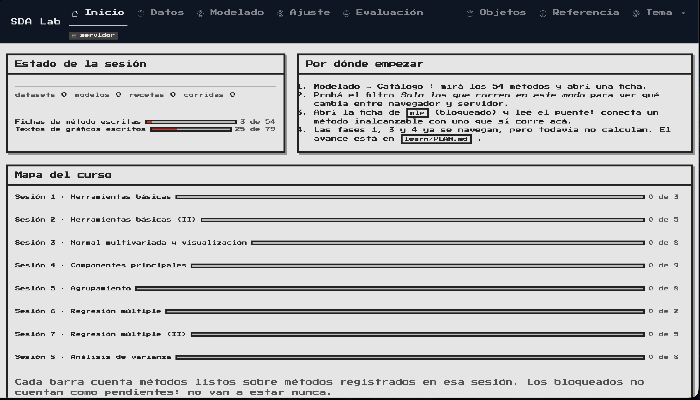

# Análisis Estadístico de Datos

> Repositorio del curso **Análisis Estadístico de Datos** (Universidad del Rosario),
> con el profesor **Andrés Nicolás López López**.

[](https://www.r-project.org/)
[](https://shiny.posit.co/)
[](https://docs.r-wasm.org/webr/latest/)
[](https://rstudio.github.io/renv/)
[](https://over-hcv.github.io/SDA/)
[](https://overhcv-ur-sda.share.connect.posit.cloud)

**SDA Lab, en vivo:**

| | Enlace | Qué corre |
|---|---|---|
| En el navegador | **https://over-hcv.github.io/SDA/** | R compilado a WebAssembly (webR). Cero instalación; tarda en abrir. |
| En un servidor | **https://overhcv-ur-sda.share.connect.posit.cloud** | R completo. Abre rápido; todo el catálogo disponible. |

Es el mismo código con dos salidas. La app sabe dónde está corriendo y lo dice
en la barra superior.

<!-- CAPTURA · pantalla de inicio (descomentar cuando tenga el archivo) -->
<p align="center">
  
</p>


---

## Qué hay acá

El curso son ocho sesiones, tres talleres y un proyecto aplicado — el temario
completo está en [`guide-eda-26A.md`](guide-eda-26A.md). Este repositorio guarda
tres cosas distintas:

1. **Los cuadernos de clase**, en `notes/`, con la teoría y los ejercicios.
2. **Los talleres y el proyecto**, en `workshops/` y `projects/`.
3. **SDA Lab**, en `learn/`: un laboratorio interactivo donde se recorren las
   cuatro fases de un análisis y se ve, en vivo, qué hace cada método y por qué
   hace falta.

Lo demás (`libs/`) es infraestructura compartida: los datos del curso, los temas
de gráficos, y tres aplicaciones que sirvieron para decidir con qué tecnología
construir el laboratorio.

---

## SDA Lab

```
① Datos  →  ② Modelado  →  ③ Ajuste  →  ④ Evaluación
```

La idea es simple: un método estadístico no se aplica a "datos", se aplica a una
matriz con roles definidos, bajo supuestos, con hiperparámetros y con una forma
de evaluarse. El laboratorio separa esas cuatro decisiones en cuatro fases, y
cada resultado que dibuja sabe de dónde salió.

**Qué funciona hoy**

- **Fase 1 · Datos**, completa. Se carga un dataset (del curso, sintético o un
  CSV propio), se declara qué es cada columna, se limpia, se transforma, se
  parte y se balancea. La subsección **▣ Análisis** trae trece gráficos en
  univariado, bivariado y multivariado.
- **Fase 2 · Modelado**: el catálogo real, con 54 métodos filtrables y su ficha.
  Los seis que no se pueden ejecutar aquí siguen visibles, con el motivo y el
  puente hacia el método equivalente que sí corre.
- **Fases 3 y 4**: navegables, todavía sin contenido.

<!-- CAPTURA · fase 1 de punta a punta
<table>
  <tr>
    <td></td>
    <td></td>
  </tr>
  <tr>
    <td align="center"><em>Fuente — nada se lee hasta pulsar Cargar</em></td>
    <td align="center"><em>Diccionario — la escala decide qué se habilita después</em></td>
  </tr>
</table>
-->

<!-- CAPTURA · ▣ Análisis, con el slider de clases movido
<p align="center">
  
</p>
-->

<!-- CAPTURA · catálogo de la fase 2, filtrado
<p align="center">
  
</p>
-->

<!-- Las capturas van en assets/capturas/. La lista de las que faltan, con qué
     mostrar en cada una y a qué resolución tomarlas, está en su LEEME.md. -->

**Dos decisiones que se notan al usarlo**

*La escala de medición manda.* Si marcás una columna como nominal, el histograma
deja de ofrecerse — y dice por qué, en vez de desaparecer. Promediar un código
postal no significa nada, y la app se comporta como si eso importara.

*Muestrear no es truncar en silencio.* Por encima de 5.000 filas los gráficos se
dibujan con una muestra, pero aparece un aviso con el tamaño y la semilla, y las
métricas se siguen calculando sobre el total. Un gráfico recortado sin avisar es
una mentira cómoda.

Cada panel lleva un sello ⓘ con la clave del artefacto y las rutas del código
que lo produjo, y un bloque de contexto pegable en un chat para preguntar por
qué salió ese número. El índice completo está en [`learn/MAPA.md`](learn/MAPA.md):
79 artefactos, cada uno con su gráfico, su lógica y su texto.

### Correrlo en local

```bash
# Desde la raíz del repo
Rscript -e 'shiny::runApp("learn/R/app.R", launch.browser = TRUE)'
```

Con `SDA_TEMA=retro` arranca con el tema 8-bit; con `SDA_MODO=wasm` fuerza el
camino del navegador sin exportar el bundle. Más detalles en
[`learn/README.md`](learn/README.md).

---

## Estructura

```
.
├── learn/            SDA Lab — el laboratorio interactivo
│   ├── R/            núcleo sin Shiny, lógica pura, gráficos, módulos de UI
│   ├── textos/       un .md por gráfico: qué muestra · qué buscar · cuándo engaña
│   ├── fichas/       un .md por método: qué es, por qué, cuándo falla
│   └── MAPA.md       índice generado: clave del artefacto → archivos
│
├── notes/            cuadernos de clase (SDA/NB1…NB6) y el árbol de temas
├── workshops/        talleres entregables
├── projects/         apps por tema y el proyecto final
│
├── libs/
│   ├── _comun/       datos, temas de gráficos, métricas, verificación web
│   ├── shiny/        Shiny sobre servidor · regresión en charcoal
│   ├── quarto/       Quarto + Observable · PCA y clustering precomputados
│   ├── shiny-live/   shinylive · ANOVA con R dentro del navegador
│   ├── sdd.md        invariantes del repo (S1–S8)
│   └── topics-map.md los 33 temas del curso → qué app los cubre
│
├── data/             charcoal.csv · twins.csv · topics-tf.csv
├── app.R             punto de entrada del despliegue en servidor
└── manifest.json     dependencias que instala Posit Connect Cloud
```

Las tres aplicaciones de `libs/` no son ejercicios sueltos: cada una probó una
tecnología distinta (servidor de R, precómputo estático, R en el navegador) y de
esa comparación salió la arquitectura de `learn/`.

---

## Cómo está construido

Un solo `renv.lock` para todo el repositorio, y reglas que se verifican solas en
vez de quedar escritas en un documento que nadie relee. Las del repo están en
[`libs/sdd.md`](libs/sdd.md); las del laboratorio, en
[`learn/CONVENCIONES.md`](learn/CONVENCIONES.md).

Las que más forma le dan al código:

- **La estadística no vive en la UI.** `R/logica/` y `R/graficos/` son funciones
  puras: si borrás Shiny del proyecto, siguen corriendo con `Rscript`.
- **Techo de 300 líneas por archivo**, y lo que agrupa es la carpeta, no un
  prefijo en el nombre.
- **Los textos viven fuera del código**, un markdown por gráfico.
- **Nada de JavaScript propio.** R no puede probarlo.
- **Toda aleatoriedad lleva semilla, y la semilla viaja** al JSON de la corrida.

Y la que más veces salvó el proyecto: **un render limpio y un HTTP 200 no
prueban nada**. Las pruebas de UI abren un navegador de verdad y leen su consola,
porque los bugs que importan solo aparecen ahí.

```bash
Rscript learn/R/pruebas/verificar_loc.R      # 300 LOC por archivo
Rscript learn/R/pruebas/verificar_idioma.R   # identificadores en español ASCII
Rscript learn/R/pruebas/verificar_mapa.R     # el índice de artefactos, al día
Rscript learn/R/pruebas/test_headless.R      # núcleo, sin Shiny
Rscript learn/R/pruebas/test_fase1.R         # lógica y gráficos de la fase 1
Rscript learn/R/pruebas/test_app.R           # UI + consola del navegador
Rscript learn/R/pruebas/verificar_bundle.R   # el bundle wasm arranca de verdad
```

---

## El curso

| Sesión | Tema | Dónde está |
|---|---|---|
| 1–2 | Herramientas estadísticas básicas | `notes/SDA/NB1_*` · `workshops/twins/` |
| 3 | Normal multivariada y visualización | `notes/SDA/NB2_*` |
| 4 | Análisis de componentes principales | `notes/SDA/NB3` · `libs/quarto/` |
| 5 | Agrupamiento | `notes/SDA/NB4_*` · `libs/quarto/` |
| 6–7 | Regresión lineal múltiple | `notes/SDA/NB5_*` · `projects/01-lasso/` |
| 8 | Análisis de varianza a una vía | `notes/SDA/NB6_*` · `libs/shiny-live/` |

La evaluación son tres talleres (25 % cada uno) y un proyecto aplicado (25 %):
un cuaderno RMD y una presentación sobre un método, con video. El exportador a
`.Rmd` del laboratorio apunta justamente ahí — cualquier exploración hecha en la
app sale como cuaderno reproducible.

**Datos del curso**

- `charcoal.csv` — producción y comercio de carbón vegetal por país, año y
  flujo (35.113 filas). El caso grande: es el que obliga a muestrear para
  dibujar.
- `twins.csv` — salarios y educación en gemelos (182 filas, 16 variables).
  El caso chico y con faltantes.
- `topics-tf.csv` — frecuencias de términos por tema, para el routing del
  catálogo.

---

## Estado

El laboratorio se construye por hitos, con las casillas en
[`learn/PLAN.md`](learn/PLAN.md).

| Hito | Qué entrega | Estado |
|---|---|---|
| 1 | Núcleo sin Shiny, catálogo de 54 métodos, bundle wasm | hecho |
| 2 | Fase 1 completa: las 6 subsecciones y ▣ Análisis | hecho |
| 3 | ACP de punta a punta por las cuatro fases | siguiente |
| 4–7 | k-medias, LASSO, evaluación completa, resto del catálogo | pendiente |

---

## Créditos

Curso dictado por **Andrés Nicolás López López** (MSc en Estadística,
Universidad Nacional de Colombia) en la **Universidad del Rosario**.
Bibliografía base: Johnson & Wichern, *Applied Multivariate Statistical
Analysis*; Mendenhall, Beaver & Beaver, *Introducción a la probabilidad y
estadística*.

Trabajo de curso. El código es libre de usar para aprender; los datos son de sus
fuentes originales (UN Energy Statistics para charcoal, Ashenfelter & Krueger
para twins).
