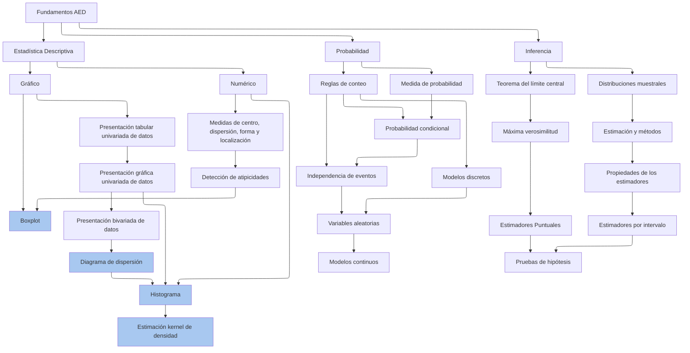
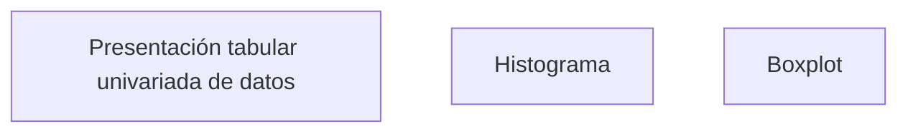

# Fundamentos AED — Diagrama Mermaid navegable

## 1. El diagrama replicado



---

## 2. La parte que realmente buscas: nodos que "abren" otro documento

Buena noticia: **Mermaid ya trae esto de fábrica**, no es una feature que haya que inventar. Se llama la directiva `click`, y tiene dos formas:

### a) Enlazar a una URL o archivo (lo que necesitas)



Sintaxis: `click <id_del_nodo> "<ruta_o_url>" "<tooltip_opcional>"`. Si la ruta es relativa (`./algo.md`) y el visor de Mermaid que uses la resuelve como enlace normal, doble clic en el cuadro te lleva a ese archivo, exactamente el comportamiento que describes.

### b) Ejecutar una función en vez de navegar (para apps más complejas)

```
click NodoId call miFuncion()
```

Esto sirve si en vez de un `.md` quieres, por ejemplo, abrir un modal, cargar contenido dinámicamente, etc. Ya no es "markdown puro" sino que necesitas JS alrededor.

---

## 3. El detalle incómodo: no todos los renderizadores respetan `click`

Aquí está el verdadero cuello de botella, y por eso seguramente nunca lo habías visto funcionar:

| Dónde renderizas | ¿Respeta `click`? |
|---|---|
| **GitHub / GitLab** (vista web de `.md`) | ❌ No. Por seguridad (XSS), el `securityLevel` está fijo en modo estricto y no permite enlaces clicables desde el SVG. |
| **VS Code** (extensión "Markdown Preview Mermaid Support") | ✅ Sí, funciona tal cual. |
| **Obsidian** | ✅ Sí, y además puedes apuntar a notas internas del vault (`[[nota]]` style o rutas relativas). |
| **mkdocs-material / Docusaurus (sitio estático)** | ✅ Sí, pero hay que configurar `securityLevel: 'loose'` explícitamente en la config de Mermaid. |
| **Notion / la mayoría de apps SaaS con "soporte mermaid"** | ❌ Suelen renderizar el SVG pero sin JS interactivo. |
| **Claude / ChatGPT / chats en general** | ❌ Renderizado estático, sin JS. |

Es decir: la sintaxis existe y es estándar, pero el ecosistema donde la vas a *usar de verdad* para navegar (Obsidian, VS Code, o un sitio propio) sí la soporta.

---

## 4. Si quieres ir más allá de "un diagrama con links"

Lo que describes —cuadros que expanden, doble clic para profundizar, un grafo de conceptos navegable— **ya es un problema resuelto**, solo que no vive dentro de un único archivo `.md` sino en herramientas pensadas para esto:

- **Obsidian**: cada nodo del mermaid apunta a una nota (`click Nodo "Nota.md"`), y además tienes la *Graph View* nativa que te muestra el mismo tipo de mapa pero generado automáticamente a partir de los enlaces `[[...]]`, sin que tengas que dibujar el diagrama a mano.
- **Logseq / Foam (VS Code)**: mismo espíritu — markdown plano + backlinks automáticos + grafo visual, cero lock-in.
- **Roam Research / TiddlyWiki**: el concepto de "wiki de zettelkasten" es literalmente esto: bloques que se abren y despliegan más contenido.
- **Construir tu propio visor**: un pequeño sitio con `vis-network` o `d3` que lea una carpeta de `.md` con metadata (frontmatter) y arme el grafo + navegación solo. Es más trabajo, pero si ya tienes cientos de conceptos que quieres versionar en Git como texto plano, es la ruta con más control.

**Mi recomendación práctica**: si tu objetivo es "diagramas de conceptos que se navegan y viven en Git", Obsidian (o Foam si prefieres quedarte 100% en VS Code) te da el 90% de lo que buscas gratis, sin tener que mantener tú la lógica de clicks — y el mismo bloque mermaid con `click` que te dejé arriba funciona ahí sin cambios.