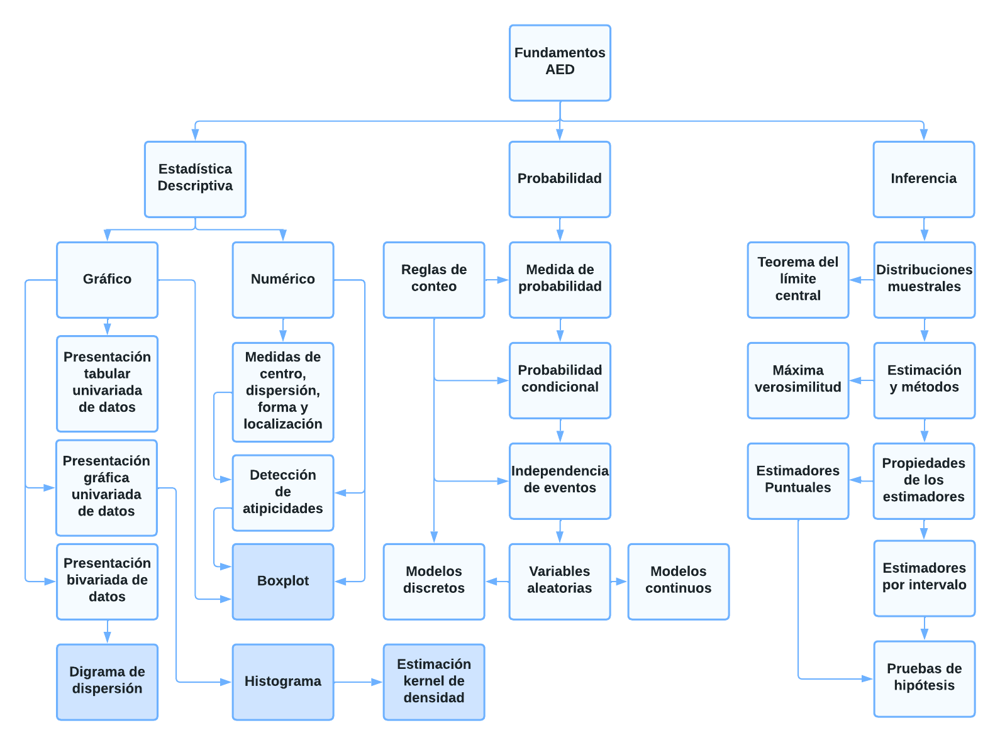
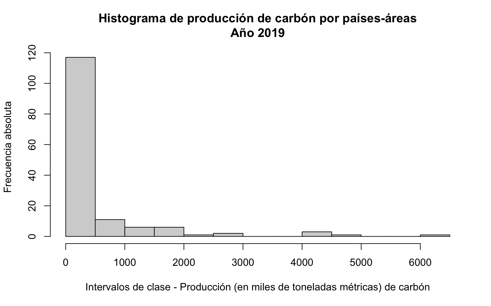
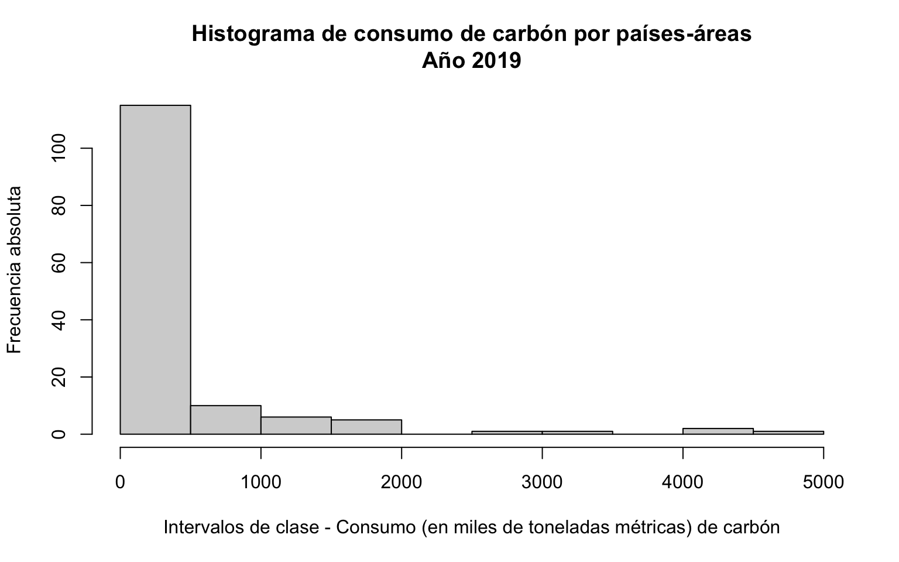
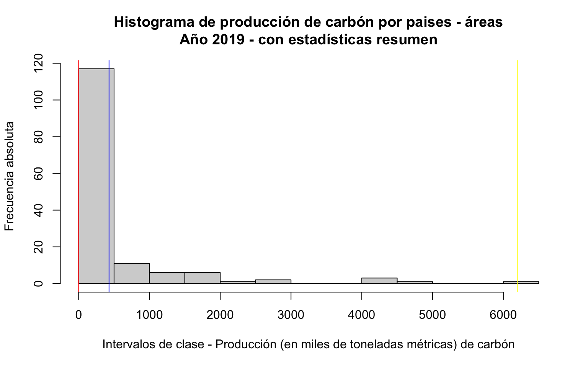
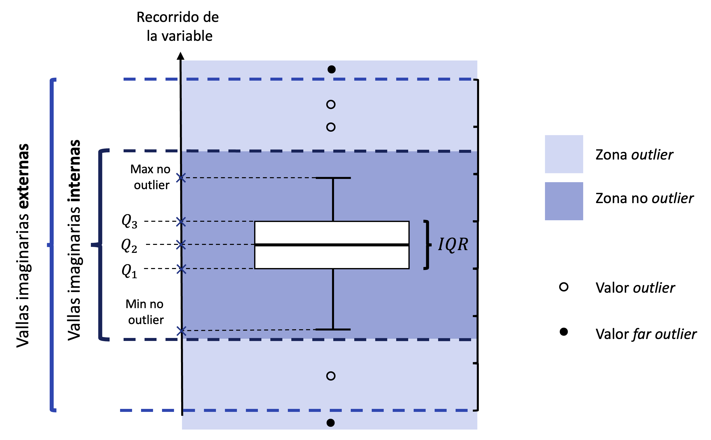
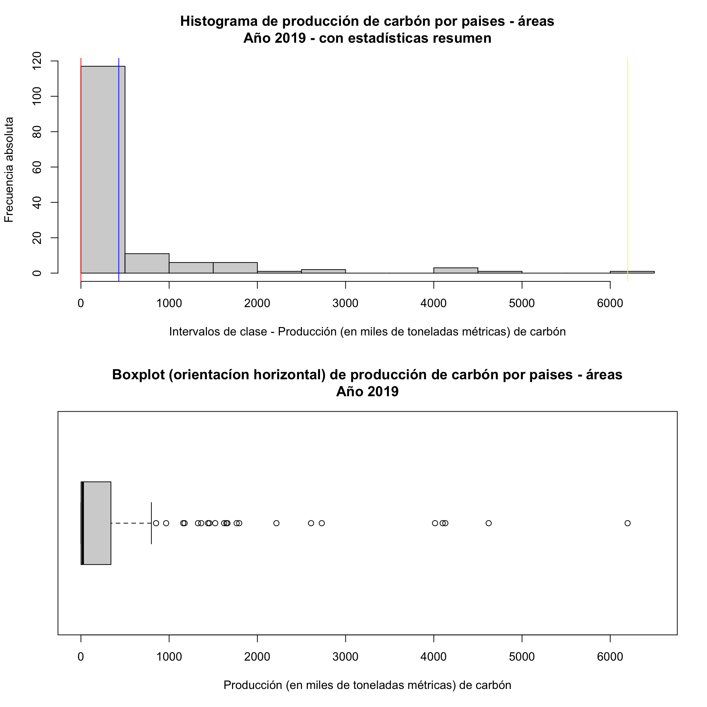
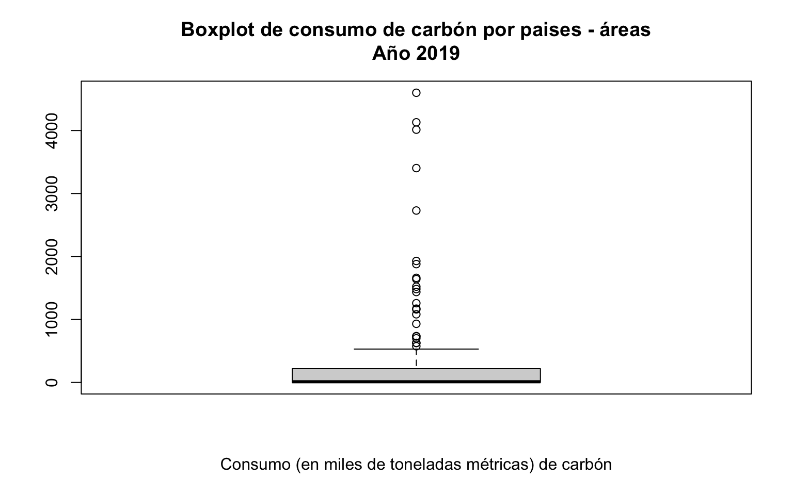

# Análisis Estadístico de Datos

<span class="glyphicon glyphicon-user"></span> Profesor: Nicolás López

<div class="page-content has-page-title">

<div id="dependencias" class="section level1">

# Dependencias

Para la ejecución de este cuaderno, debe instalar con anterioridad los siguientes paquetes desde la consola de R o usando el menú Tools\>Install Packages en RStudio:

- `install.packages("tidyverse")`.
- `install.packages("rmdformats")`.
- `install.packages("ggExtra")`.

</div>

<div id="objetivo-y-alcance" class="section level1">

# Objetivo y alcance

**Objetivo**: este cuaderno presenta un resumen de las herramientas estadísticas básicas necesarias para el desarrollo del curso de Análisis Estadístico de Datos (AED). El objetivo principal es revisar las habilidades estadísticas fundamentales para posteriormente continuar con el entendimiento de las herramientas multivariadas más avanzadas.

**Alcance**: siga el desarrollo del cuaderno, ejecute los comandos contenidos y desarrolle los ejercicios propuestos.

</div>

<div id="r-r-markdown-y-paquetes" class="section level1">

# R, R Markdown y paquetes

El desarrollo del curso a partir del lenguaje de programación en R se presenta como una valiosa oportunidad para aprender un [lenguaje orientado al análisis estadístico](https://www.r-project.org/about.html). Múltiples procedimientos y rutinas estadísticas están listas para ser usadas en este lenguaje, el cual es utilizado frecuentemente tanto en investigación como en la industria. Los comandos R son guardados en **scripts** (formato .r), los cuales son archivos en texto plano (archivo conformado únicamente por caracteres, sin formato de estilo alguno) que contienen una colección de instrucciones a ser interpretadas. A continuación una concatenación de valores junto al cálculo de frecuencias absolutas:

``` r
datos = c(1,3,2,4,5,3,6,8,7)
frq   = table(datos)
```

Puede observarse que el script define al objeto `datos` y mediante la función `table()` se nombra a `frq` como la tabulación de las frecuencias absolutas para `datos`. Esta lista de comandos no es más que texto en el script, es la **consola** de R que lo interpreta y permite imprimir el resultado con la función `print()`

``` r
print(frq)
```

    ## datos
    ## 1 2 3 4 5 6 7 8 
    ## 1 1 2 1 1 1 1 1

Una gran cantidad de manuales y tutoriales de programación en R pueden encontrarse en la web. Invitamos a los estudiantes a reforzar continuamente sus habilidades en el lenguaje. Es importante destacar que R es un software libre que además se mantiene en constante crecimiento a través de [paquetes](https://cran.r-project.org/web/packages/available_packages_by_name.html) desarrollados por sus colaboradores, los cuales básicamente son extensiones opcionales de las funcionalidades base del programa. Una colección particular de paquetes que permite una interacción amigable con el lenguaje de programación R es denominado [tidyverse](https://www.tidyverse.org/). Este conjunto de paquetes está especialmente diseñado para facilitar la realización de tareas diarias en la ciencia de datos, tales como: manipulación y lectura de datos, graficación efectiva, entre otros. Una vez instalado (mediante el comando `install.packages("tidyverse")` en la consola), este es cargado en el ambiente del trabajo mediante:

``` r
library(tidyverse)
```

    ## ── Attaching core tidyverse packages ──────────────────────── tidyverse 2.0.0 ──
    ## ✔ dplyr     1.1.4     ✔ readr     2.1.5
    ## ✔ forcats   1.0.0     ✔ stringr   1.5.1
    ## ✔ ggplot2   3.5.2     ✔ tibble    3.2.1
    ## ✔ lubridate 1.9.4     ✔ tidyr     1.3.1
    ## ✔ purrr     1.0.2     
    ## ── Conflicts ────────────────────────────────────────── tidyverse_conflicts() ──
    ## ✖ dplyr::filter() masks stats::filter()
    ## ✖ dplyr::lag()    masks stats::lag()
    ## ℹ Use the conflicted package (<http://conflicted.r-lib.org/>) to force all conflicts to become errors

------------------------------------------------------------------------

<div id="ejercicio-1" class="section level3">

### Ejercicio 1

> Instale el paquete `ggExtra` desde la consola de R o desde la interfaz de R Studio.

``` r
### Solución
```

------------------------------------------------------------------------

Aunque R es una herramienta poderosa en el análisis de datos, por si sola carece de un ambiente de trabajo para la documentación y presentación efectiva de resultados. Al hacer uso en RStudio de los [R Markdown](http://rmarkdown.rstudio.com) podemos crear documentos técnicos (como el presente documento) junto a la ejecución de scripts de trabajo R en un solo archivo. Por ejemplo, el presente documento es elaborado como una mixtura de comandos en R y sintaxis en lenguaje [markdown](https://www.markdownguide.org/basic-syntax/) (formato .rmd), que una vez compilado, permite una presentación estilizada en formato HTML. Nuevamente, una amplia gama de manuales pueden encontrarse en la web y se motiva a los estudiantes a desarrollar sus habilidades en la elaboración de documentos en R markdown.

</div>

</div>

<div id="datos" class="section level1">

# Datos

Para el desarrollo del siguiente cuaderno, se trabaja con una colección de datos abiertos de las naciones unidas [UNdata](http://data.un.org/Host.aspx?Content=About). Estos datos contienen una gran variedad de información recopilada por agencias internacionales para el uso de la comunidad global. Los datos disponibles cubren una amplia variedad de temáticas, entre estas, el consumo de carbón en hogares y la producción de carbón para múltiples naciones o áreas a nivel mundial.

<div id="lectura-de-datos" class="section level2">

## Lectura de datos

Se definen los datos de consumo de carbón en hogares (`charcoal_chh19`) y de producción de carbón (`charcoal_prd19`) para el año 2019:

``` r
data_charcoal  = read_csv("data/charcoal.csv",show_col_types = FALSE)
charcoal_chh19 = data_charcoal %>% 
                 filter(Year==2019 & Commodity=="Charcoal - Consumption by households") %>% 
                 select(-Commodity)
charcoal_prd19 = data_charcoal %>% 
                 filter(Year==2019 & Commodity=="Charcoal - Production") %>% 
                 select(-Commodity)
```

Usualmente, el primer paso en el análisis es entender qué representa cada una de las filas y columnas del conjunto de datos. Esta información normalmente se alberga en el **diccionario de variables** (de estar este disponible). En este caso, esta descripción se verá desarrollada de manera natural más adelante en el cuaderno, por lo cual no se presenta en este momento.

</div>

</div>

<div id="definiciones-básicas" class="section level1">

# Definiciones básicas

<div id="unidad-estadística-ue" class="section level2">

## Unidad estadística (UE)

Individuo u objeto en el que se mide una variable. Resulta una medición o dato cuando una variable se mide en una unidad experimental. Con las UE entendemos el fenómeno de interés. Para los datos de las naciones unidas, las UE en cada fila albergan un país-área. A continuación los registros para la UE Colombia:

``` r
charcoal_prd19 %>% filter(Country_Area == "Colombia")
```

    ## # A tibble: 1 × 4
    ##   Country_Area  Year Unit                   Quantity
    ##   <chr>        <dbl> <chr>                     <dbl>
    ## 1 Colombia      2019 Metric tons,  thousand     11.9

------------------------------------------------------------------------

<div id="ejercicio-2" class="section level3">

### Ejercicio 2

> Determine el número total de UE en el conjunto de datos `charcoal_chh19` y `charcoal_prd19`.

``` r
print(paste0('Número de UE para charcoal_chh19 es ', nrow(charcoal_chh19)))
```

    ## [1] "Número de UE para charcoal_chh19 es 141"

``` r
print(paste0('Número de UE para charcoal_prd19 es ',nrow(charcoal_prd19)))
```

    ## [1] "Número de UE para charcoal_prd19 es 148"

> ¿Cuántos países-areas se encuentran en ambos conjuntos de datos?

``` r
### Solución
inter_pais = intersect(charcoal_prd19$Country_Area,
                       charcoal_chh19$Country_Area)
length(inter_pais)
```

    ## [1] 121

------------------------------------------------------------------------

</div>

</div>

<div id="variable-dato-y-medición" class="section level2">

## Variable, dato y medición

***Variable***. Característica que cambia o varía con el tiempo y/o para las diferentes UE. Para los datos `charcoal_prd19`, se tienen las siguientes variables:

- Country_Area. País o área en la que se mide la producción de carbón.
- Year. Año de medición.
- Unit. Unidad de medición en la que se mide la producción de carbón.
- Quantity. Cantidad total de producción de carbón.

***Dato u observación***. Cuando una variable se **mide** en un conjunto de UE, resulta un conjunto de observaciones o de datos. Usualmente configuramos los datos en tablas, dónde las filas corresponden a las UE y las columnas corresponden a las variables medidas (como en `charcoal_prd19` y `charcoal_chh19`).

***Medición***. Es un proceso de asignación de un valor a las características de interés de las UE. Esta medición puede ser bastante concreta (como la producción de carbón en toneladas métricas de un país) o bastante abstracta (como el coeficiente intelectual de un país).

------------------------------------------------------------------------

<div id="ejercicio-3" class="section level3">

### Ejercicio 3

> Diga si la columna `Unit` es una variable o una constante para los dos conjuntos de datos.

``` r
### Solución
print(paste0('El número de valores diferentes de Unit para charcoal_chh19 es ',length(unique(charcoal_prd19$Unit))))
```

    ## [1] "El número de valores diferentes de Unit para charcoal_chh19 es 1"

``` r
print(paste0('El número de valores diferentes de Unit para charcoal_prd19 es ',length(unique(charcoal_chh19$Unit))))
```

    ## [1] "El número de valores diferentes de Unit para charcoal_prd19 es 1"

------------------------------------------------------------------------

</div>

</div>

<div id="clasificación-de-variables" class="section level2">

## Clasificación de variables

<div id="escala" class="section level3">

### Escala

En general, al medir una variable, los datos observados pueden clasificarse en dos clases: variables de tipo cualitativo (mide atributos o cualidades y se representa mediante *categorías*) o cuantitativo (mide cantidades y se representa mediante *números*). Esta primera clasificación intuitiva puede refinarse mediante la clasificación por escala de las variables. En esta, se nota que al observar una variable, podemos encontrar una diferenciación en la ‘’forma’’ en la cual la medimos (más allá de ser de tipo cualitativo o cuantitativo). Esta clasificación induce un mayor nivel de sofisticación en la medición y define cuatro categorías de variables:

- Nominal (cualitativa). Ej: Unidad de masa en la que se mide la producción de carbón.

  - Relación de **igualdad - desigualdad**: Dos países con producción de carbón en toneladas tienen *la misma* unidad de masa en la medición. Un país con producción de carbón en kilogramos y otro en toneladas tienen *diferente* unidad de masa.

- Ordinal (cualitativa). Ej: Categorías de consumo de electricidad en hogares (alto, medio, bajo).

  - Relación de igualdad - desigualdad + **Orden**. Además de la relación de igualdad y desigualdad entre los valores alto, medio y bajo de las categorías de consumo de energía, se tiene que un hogar con categoría de consumo alto de energía tiene *mayor* categoría de consumo que un hogar de categoría de consumo bajo. Además, un hogar con categoría de consumo medio de energía tiene *menor* categoría de consumo que un hogar de categoría de consumo alto.

- Intervalo (cuantitativa). Ej: Temperatura en grados centígrados luego de la instalación de turbinas eólicas.

  - Relación de igualdad - desigualdad + Orden + **Cero relativo**. Además de las relaciones anteriores, se tiene que los intervalos en cualquier punto de la escala tienen el mismo significado. Si en tres zonas A, B y C el aumento de temperatura fue de 15°C, 13°C y 11°C respectivamente, la diferencia en temperatura entre las zonas A y B es la misma que la diferencia entre las zonas B y C. La particularidad de esta escala es que asigna el valor 0 sin ausencia de la característica, es decir, tiene *cero relativo* (por ejemplo puede verse una temperatura de 0°C, que no implica ausencia de temperatura), y aún así cumplir la equidistancia entre intervalos.

- Razón (cuantitativa). Ej: Cantidad total de producción de carbón en toneladas métricas.

  - Relación de igualdad - desigualdad + Orden **+ Cero absoluto**. Además de las relaciones anteriores, se tiene que las razones en cualquier punto de la escala tienen el mismo significado. Si en tres zonas X, Y y Z la cantidad total de producción de carbón en toneladas métricas es de 40, 20 y 10 respectivamente, la zona X produjo el doble de la zona Y, mientras que la zona Z produjo la mitad de lo que produjo la zona Y. La particularidad de esta escala es que asigna el valor 0 con ausencia de la característica, es decir, tiene *cero absoluto* (por ejemplo una producción 0 toneladas métricas implica ausencia de producción), esta propiedad permite la comparación de razones.

</div>

<div id="clase" class="section level3">

### Clase

Las variables cuantitativas pueden subdividirse en dos clases, dependiendo del **recorrido** de la variable:

- Discreta. Toma valores en un conjunto discreto, que no necesariamente es finito:

  - Número de turbinas eólicas instaladas en el país (valor finito).
  - Número de exploraciones de campo necesarias para ubicar una turbina eólica que produzca mas de 10 millones de kWh anuales (posible valor infinito).

- Continua. Toma valores en un conjunto continuo, que puede ser un subconjunto de los números reales:

  - Tiempo de funcionamiento de una turbinas eólica (valor real positivo).

A su vez, las variables cualitativas pueden subdividirse en dos clases, dependiendo también del **recorrido** de la variable:

- Dicotómicas o binarias: toman dos posibles valores.

  - Presencia de turbinas eólicas en el pais - área (posibles valores {Si,No}).

- Politómicas: toman más de dos posibles valores

  - Principal fuente de energía renovable utilizada en el país -área (posibles valores {Solar,Eólica,Biomasa,Geotermal,Otra,Ninguna}).

</div>

<div id="dimensión" class="section level3">

### Dimensión

Resultan datos **unidimensionales** cuando se mide una sola variable para cada UE. Resultan datos **bidimensionales** cuando se miden dos variables por unidad experimental. Resultan datos **multidimensionales** cuando se miden más de dos variables en las UE. Para el análisis de datos multidimensionales, una variedad de herramientas estadísticas básicas se encuentran de manera recurrente. Esta colección de temáticas se resume de manera gráfica en el diagrama a continuación:

<div id="id" class="float">



<div class="figcaption">

Diagrama detallado de contenidos fundamentales para el desarrollo del curso

</div>

</div>

Se destacan por su relevancia en azul oscuro cuatro temas del módulo de estadística descriptiva desarrollados brevemente en las siguientes subsecciones. Dos de ellos en esta primera clase:

</div>

</div>

<div id="histograma" class="section level2">

## Histograma

Esta herramienta ampliamente utilizada en el análisis descriptivo de datos univariados permite una representación sucinta de la variable de interés. Es utilizado para analizar la distribución univariada de datos cuantitativos (tanto en escala de intervalo como de razón). El histograma no es mas que una versión continua del conocido diagrama de barras, con dos grandes diferencias:

- Las barras adyacentes se tocan entre ellas (para enfatizar la continuidad de la escala de medida).

- La variable subyacente, al ser cuantitativa (y no cualitativa como en el diagrama de barras) necesita ser **discretizada**. Esto, en resumen, significa dividir el recorrido de la variable en intervalos, llamados **intervalos de clase**, y caracterizar cada observación, no por su valor observado, sino por el intervalo al que la observación pertenece.

Una vez discretizada la variable, la frecuencia absoluta o relativa es medida para cada intervalo de clase de la variable. El gráfico consiste en ubicar en el eje <span class="math inline">\\x\\</span> el recorrido de la variable y en el eje <span class="math inline">\\y\\</span> la frecuencia observada para cada una de las clases. En la figura se presenta el histograma para la cantidad total de producción de carbón en el año 2019:

``` r
hist(charcoal_prd19$Quantity,
     main = 'Histograma de producción de carbón por países-áreas\nAño 2019',
     xlab = 'Intervalos de clase - Producción (en miles de toneladas métricas) de carbón',
     ylab = 'Frecuencia absoluta')
```



Se puede apreciar con el gráfico que la distribución de los datos está caracterizada por bajos valores para la variable. Es decir, la producción de carbón para los diferentes países considerados tiende a ser baja (es importante recordar que la variable está medida en miles de toneladas métricas). Adicionalmente, esta presenta una alta dispersión respecto al centro de la distribución (ubicado aproximadamente entre 0 y 500 mil toneladas métricas, de acuerdo con el gráfico). Existen zonas con una producción atípicamente alta de carbón, particularmente a la derecha de la distribución, por lo que dicha variable presenta un claro sesgo a la derecha. Esta primera descripción general es muy valiosa y fácilmente interpretable a partir del gráfico: al sacrificar la individualidad de cada dato continuo y discretizarlo en su intervalo de clase correspondiente, podemos ganar interpretabilidad en la distribución de los datos mediante el gráfico de histograma. Sin embargo, este presenta al menos dos problemas importantes:

- No es claro cuál es el valor máximo de la variable, tampoco el mínimo. La centralidad de los datos con la descripción dada es demasiado gruesa (el intervalo de 0 a 500 toneladas métricas) y la dispersión tampoco es clara. Finalmente, se sabe que hay valores atípicamente altos, pero no existe un criterio alguno para definir atipicidades. **Estas características resultan en estadísticas resumen, las cuales se pierden al elaborar el histograma**, lo cual es desafortunado al ser de gran importancia para entender la distribución de los datos.

- **La discretización mencionada requiere decidir el número <span class="math inline">\\k\\</span> de intervalos de clase y el histograma es sensible al valor de <span class="math inline">\\k\\</span>**. En este caso, R decide por nosotros el número de clases del gráfico a partir de una regla determinística (llamada regla de Sturges), y se espera que dentro de cada intervalo el comportamiento de la variable sea aproximadamente homogéneo. Sin embargo:

  - No existe una única regla para obtener el número de clases, y cada una puede resultar en diferentes valores de <span class="math inline">\\k\\</span>.
  - Ninguna de estas reglas asegura un comportamiento homogéneo en cada uno de los intervalos de clase.

------------------------------------------------------------------------

<div id="ejercicio-4" class="section level3">

### Ejercicio 4

> Para el conjunto de datos de consumo de carbón (`charcoal_chh19`), elabore un histograma para la variable `Quantity` mediante la regla de Sturges (indique claramente los ejes y el título del gráfico).

``` r
### Solución
h_freq = hist(charcoal_chh19$Quantity,
              main = 'Histograma de consumo de carbón por países-áreas\nAño 2019',
              xlab = 'Intervalos de clase - Consumo (en miles de toneladas métricas) de carbón',
              ylab = 'Frecuencia absoluta')
```



> Visualmente, ¿cuál es la marca de clase del intervalo modal?. A forma de reto, ¿puede encontrarlo programando en la consola?

``` r
conteos_histograma = h_freq$counts
id_moda_conteo     = which.max(conteos_histograma)
marcas_clase       = h_freq$mids
marca_clase_modal  = marcas_clase[id_moda_conteo]
paste0('La marca de clase del intervalo modal es ', marca_clase_modal)
```

    ## [1] "La marca de clase del intervalo modal es 250"

------------------------------------------------------------------------

</div>

</div>

<div id="boxplot" class="section level2">

## Boxplot

Para el primer problema, podríamos solucionarlo parcialmente identificando las estadísticas resumen y agregarlas como líneas verticales en el gráfico:

``` r
hist(charcoal_prd19$Quantity,
     main = 'Histograma de producción de carbón por paises - áreas\nAño 2019 - con estadísticas resumen',
     xlab = 'Intervalos de clase - Producción (en miles de toneladas métricas) de carbón',
     ylab = 'Frecuencia absoluta')

abline(v = max(charcoal_prd19$Quantity),col='yellow')
abline(v = mean(charcoal_prd19$Quantity),col='blue')
abline(v = min(charcoal_prd19$Quantity),col='red')
```



La media (en azul) y los valores extremos (máximo en amarillo, mínimo en rojo) de los datos son añadidos al gráfico. Estos detalles presentan una mejora ante el gráfico anterior, sin embargo, otras características relevantes aún siguen sin ser apreciadas, como por ejemplo la dispersión y la existencia de atipicidades. Antes de pensar en seguir acumulando características adicionales en el histograma, una mejor alternativa es resumir los datos en estadísticas descriptivas en lugar de intervalos de clase. Esto permitiría apreciar las características cuantitativas de interés de los datos. A partir de 5 números que resumen de manera concreta la distribución de una variable cuantitativa, el boxplot o gráfico de caja permite lograr este objetivo. Las estadísticas resumen son las siguientes:

- <span class="math inline">\\x\_{(n)}\\</span> (máximo): localización.
- <span class="math inline">\\Q_3\\</span> (cuartíl 3): localización.
- <span class="math inline">\\Q_2\\</span> (cuartíl 2 o mediana): centro y localización.
- <span class="math inline">\\Q_1\\</span> (cuartíl 1): localización.
- <span class="math inline">\\x\_{(1)}\\</span> (mínimo): localización.

Note que en función de <span class="math inline">\\Q_1\\</span> y <span class="math inline">\\Q_3\\</span> puede definirse el rango intercuartílico <span class="math inline">\\IQR=Q_3-Q_1\\</span>, el cual es una medida de dispersión de los datos. Por último, para detectar datos atípicos o **outliers**, es necesario construir reglas de referencia o vallas outlier:

- Vallas imaginarias internas: <span class="math inline">\\\[Q_1−1.5 IQR , Q_3+1.5 IQR\]\\</span>.

- Vallas imaginarias externas: <span class="math inline">\\\[Q_1−3.0 IQR , Q_3+3.0 IQR\]\\</span>.

Con lo cual

- Si una observación se encuentra dentro de las vallas, es una observación usual.
- Si una observación está fuera de las vallas internas, pero dentro de las externas, es llamada outlier.
- Si una observación está fuera de las vallas externas, es llamada far outlier.

La definición de las vallas es un estándar de referencia generalmente aceptado. En la actualidad, no es muy común distinguir entre outliers and far outliers, por lo cual se llama atípico ó outlier a un dato outlier ó far outlier. En R, por ejemplo, no se hace distinción entre estos dos tipos de atipicidades.

Las características previamente descritas se pueden visualizar de manera conjunta en el boxplot. En el recorrido de la variable se ubican las medidas resumen descritas y se visualizan en forma de **caja**, esta escala es usualmente ubicada en el eje <span class="math inline">\\y\\</span> (al cambiar la ubicación del recorrido de la variable para el eje <span class="math inline">\\x\\</span>, la orientación del gráfico resulta horizontal sin pérdida de información alguna). A continuación se muestra un esquema que resume el proceso:

<div id="id" class="float">



<div class="figcaption">

Elaboración de un boxplot o diagrama de caja

</div>

</div>

Se evidencian además los **bigotes** del diagrama, los cuales se extienden hasta la máxima (y mínima) observación no outlier. Estos permiten, con ayuda de la caja, determinar características de forma (simetría y apuntamiento) en los datos. En conjunto, el análisis del boxplot permite de manera gráfica y a partir de la descripción numérica de los datos, un entendimiento de la centralidad, localización, dispersión, forma y atipicidades de los datos cuantitativos univariados.

Al ubicar los dos gráficos en una misma escala (note que el gráfico de boxplot fue orientado horizontalmente para contrastar fácilmente con el histograma) es evidente que el boxplot presenta una alternativa mucho más informativa que el histograma. Adicional a lo concluido para el histograma, con el boxplot se puede observar que el primer intervalo de clase del histograma contiene una gran cantidad de información que de por si no es homogénea: tanto <span class="math inline">\\Q_1\\</span> como <span class="math inline">\\Q_2\\</span> se encuentran muy cerca al origen, indicando que cerca de la mitad de los datos estarían concentrados en el límite inferior del intervalo de clase. El <span class="math inline">\\Q_3\\</span> se encuentra también dentro del primer intervalo de clase, cercano al límite superior, implicando que al menos el 75% de los datos se encuentra en dicho intervalo, con una mayor concentración al inicio de dicho intervalo. Al existir este fuerte sesgo, la media y la mediana como medidas de tendencia central resultan significativamente diferentes, haciendo que la mediana represente mejor la centralidad de los datos. Se nota además que se considera atípica una producción de carbón justo antes de las 1000 toneladas métricas.

``` r
par(mfrow=c(2,1))
hist(charcoal_prd19$Quantity,
     main = 'Histograma de producción de carbón por paises - áreas\nAño 2019 - con estadísticas resumen',
     xlab = 'Intervalos de clase - Producción (en miles de toneladas métricas) de carbón',
     ylab = 'Frecuencia absoluta',
     xlim = c(0,6500))

abline(v = max(charcoal_prd19$Quantity),col='yellow')
abline(v = mean(charcoal_prd19$Quantity),col='blue')
abline(v = min(charcoal_prd19$Quantity),col='red')

boxplot(charcoal_prd19$Quantity,horizontal = TRUE,ylim = c(0,6500),
        main = 'Boxplot (orientacíon horizontal) de producción de carbón por paises - áreas\nAño 2019',
        xlab = 'Producción (en miles de toneladas métricas) de carbón')
```



------------------------------------------------------------------------

<div id="ejercicio-5" class="section level3">

### Ejercicio 5

> Para el conjunto de datos de consumo de carbón (`charcoal_chh19`), elabore un boxplot para la variable `Quantity` (indique claramente los ejes y el título del gráfico). ¿Es similar al boxplot para la misma variable en el conjunto de datos `charcoal_prd19`?

``` r
### Solución
bp_cons = boxplot(charcoal_chh19$Quantity,horizontal = FALSE,
                  main = 'Boxplot de consumo de carbón por paises - áreas\nAño 2019',
                  xlab = 'Consumo (en miles de toneladas métricas) de carbón')
```



> ¿Cuántos países-áreas tienen un consumo atípico de carbón de acuerdo con el boxplot realizado en el punto anterior? Ayuda: Defina el gráfico como un objeto en el ambiente de R y extraiga de este (mediante el símbolo \$out) los índices de los valores atípicos. Luego determine la cantidad de índices atípicos.

``` r
### Solución
print(paste0('El número de países con consumo atípico es ',length(bp_cons$out)))
```

    ## [1] "El número de países con consumo atípico es 23"

------------------------------------------------------------------------

</div>

</div>

</div>

<div id="conclusiones" class="section level1">

# Conclusiones

- El objetivo del curso es presentar un conjunto de herramientas estadísticas para analizar datos multidimensionales y construir modelos con aplicación en un amplio espectro de áreas. Para esto, es necesario un entendimiento de las herramientas estadísticas básicas presentadas brevemente en el presente cuaderno.

</div>

<div id="referencias" class="section level1">

# Referencias

- Mendenhall, W., Beaver, R. J., & Beaver, B. M. (2012). Introducción a la probabilidad y estadística. Cengage Learning.

</div>

</div>
