# Análisis Estadístico de Datos

<span class="glyphicon glyphicon-user"></span> Profesor: Nicolás López

<div class="page-content has-page-title">

<div id="dependencias" class="section level1">

# Dependencias

Para la ejecución de este cuaderno, debe instalar con anterioridad los siguientes paquetes desde la consola de R o usando el menú Tools\>Install Packages en RStudio:

- `install.packages("tidyverse")`.
- `install.packages("rmdformats")`.
- `install.packages("ggExtra")`.

</div>

<div id="objetivo-y-alcance" class="section level1">

# Objetivo y alcance

**Objetivo**: este cuaderno presenta un resumen de las herramientas estadísticas básicas necesarias para el desarrollo del curso de Análisis Estadístico de Datos (AED). El objetivo principal es revisar las habilidades estadísticas fundamentales para posteriormente continuar con el entendimiento de las herramientas multivariadas más avanzadas.

**Alcance**: siga el desarrollo del cuaderno, ejecute los comandos contenidos y desarrolle los ejercicios propuestos.

Vamos a cargar nuevamente los datos de la sesión pasada:

``` r
library(tidyverse)
data_charcoal  = read_csv("data/charcoal.csv",show_col_types = FALSE)
charcoal_chh19 = data_charcoal %>% 
                 filter(Year==2019 & Commodity=="Charcoal - Consumption by households") %>% 
                 select(-Commodity)
charcoal_prd19 = data_charcoal %>% 
                 filter(Year==2019 & Commodity=="Charcoal - Production") %>% 
                 select(-Commodity)
```

</div>

<div id="probabilidad" class="section level1">

# Probabilidad

<div id="experimentos-y-variables-aleatorias" class="section level2">

## Experimentos y variables aleatorias

Uno de los instrumentos fundamentales de la estadística es la probabilidad, que tuvo sus orígenes en los juegos de azar, en el siglo XVII. Como indica su nombre los juegos de azar incluyen acciones tales como girar la rueda de una ruleta, lanzar dados, tirar al aire una moneda, extraer una carta, etc. en los cuales el resultado de una prueba es incierto. Sin embargo, es sabido que, aún cuando el resultado de una prueba en particular sea incierto, existe un resultado que se puede predecir a largo plazo. Se sabe, por ejemplo, que en muchas tiradas de una moneda justa (equilibrada y simétrica), aproximadamente en la mitad de pruebas se obtiene cara. Es una regularidad que puede predecirse a largo plazo. Para entender el origen de la probabilidad como una cuantificación de los experimentos aleatorios de una variable, el estudiante puede consultar Blanco (2013).

</div>

<div id="espacio-muestral" class="section level2">

## Espacio muestral

En cada experimento aleatorio, existirá un conjunto universal, el espacio muestral <span class="math inline">\\S\\</span>, tal que todos los otros conjuntos que intervengan en el análisis son subconjuntos de <span class="math inline">\\S\\</span>.Al lanzar un dado, por ejemplo, obtiene:

<span class="math display">\\ S = \\Cara_1,Cara_2,Cara_3,Cara_4,Cara_5\\\\</span> Al lanzar una moneda

<span class="math display">\\ S = \\Cara,Sello\\\\</span>

En general, nos interesan resultados numéricos del experimento aleatorio. Esto lo llamamos **variable aleatoria**, y en este caso lo que hacemos es asignar un número a los resultados del experimento aleatorio. Nuevamente, al lanzar un dado

<span class="math display">\\ Cara_1 \rightarrow 1 \text{ , } Cara_2 \rightarrow 2 \text{ ... }, Cara_6 \rightarrow 6 \\</span> Otro ejemplo. Si estudio la edad de los estudiantes de la maestría presentes en la clase de AED, la variable aleatoria <span class="math inline">\\X\\</span> sería *edad de los estudiantes de la maestría (en años)* y al seleccionar un estudiante de la misma, me interesa su edad en lugar del estudiante en si

<span class="math display">\\ Pepito \rightarrow 27 años\\</span>

En lugar de notar el estudiante por su nombre, usualmente lo indicamos por un número. Supongamos que Pepito es el sujeto 3 de la lista

<span class="math display">\\ \\3 \rightarrow 27 años\\</span>

Es decir, la observación del sujeto 3 es 27 años. De manera más compacta, resumimos en estadística

<span class="math display">\\ x_3 = 27\\</span>

Suponiendo que son <span class="math inline">\\n=13\\</span> los estudiantes de la maestría presentes en la clase de AED, <span class="math inline">\\x_1\\</span>,…,<span class="math inline">\\x\_{13}\\</span> corresponde a la muestra aleatoria univariada de 13 observaciones (o **realizaciones**) para las variables aleatorias <span class="math inline">\\X\_{1}\\</span>,…,<span class="math inline">\\X\_{13}\\</span> (note la diferencia de mayúsculas y minúsculas). Las variables aleatorias pueden ser caracterizadas por modelos matemáticos que resumen su chance de ocurrencia. A estos los llamamos **distribuciones de probabilidad univariadas**, los cuales ejemplificaremos con el modelo de probabilidad normal.

</div>

<div id="función-de-densidad-motivación" class="section level2">

## Función de densidad: Motivación

Uno de los objetivos de la ciencia consiste en predecir y describir sucesos del mundo en que vivimos. Una manera de hacerlo es construir modelos matemáticos que describan el mundo real.

1.  Teorema de pitágoras, que demuestra la relación entre el cuadrado de la hipotenusa y el cuadrado de los dos catetos restantes:

<span class="math display">\\a^2 = b^2 + c^2\\</span>

2.  Relatividad: La energía y la materia son dos caras de la misma moneda es quizá la ecuación más famosa de la historia. Cambió completamente nuestra visión de la materia y la realidad.

<span class="math display">\\E = mc^2\\</span>

3.  Línea recta: Una simple ecuación que induce una familia de funciones indexada por una pendiente (<span class="math inline">\\m\\</span>) y un intercepto (<span class="math inline">\\b\\</span>). Esto significa que valores diferentes de <span class="math inline">\\m\\</span> y <span class="math inline">\\b\\</span> resultan en funciones diferentes

<span class="math display">\\ f(x\|(m,b)) = mx + b \\</span> Por ejemplo, tres elementos diferentes de la familia son:

- <span class="math inline">\\f(x\|(m=1,b=1)) = x + 1\\</span>
- <span class="math inline">\\f(x\|(m=1,b=-1)) = x - 1\\</span>
- <span class="math inline">\\f(x\|(m=-1,b=-1)) = -x - 1\\</span>

Que podemos visualizar fácilmente desde R

``` r
f_lineal = function(x,m,b) {m*x + b}
ggplot() + xlim(-3,3) + 
  geom_function(fun = f_lineal,args=list(m=1,b=1) ,color = "yellow") +
  geom_function(fun = f_lineal,args=list(m=1,b=-1),color = "blue")   +
  geom_function(fun = f_lineal,args=list(m=-1,b=-1),color = "red")
```

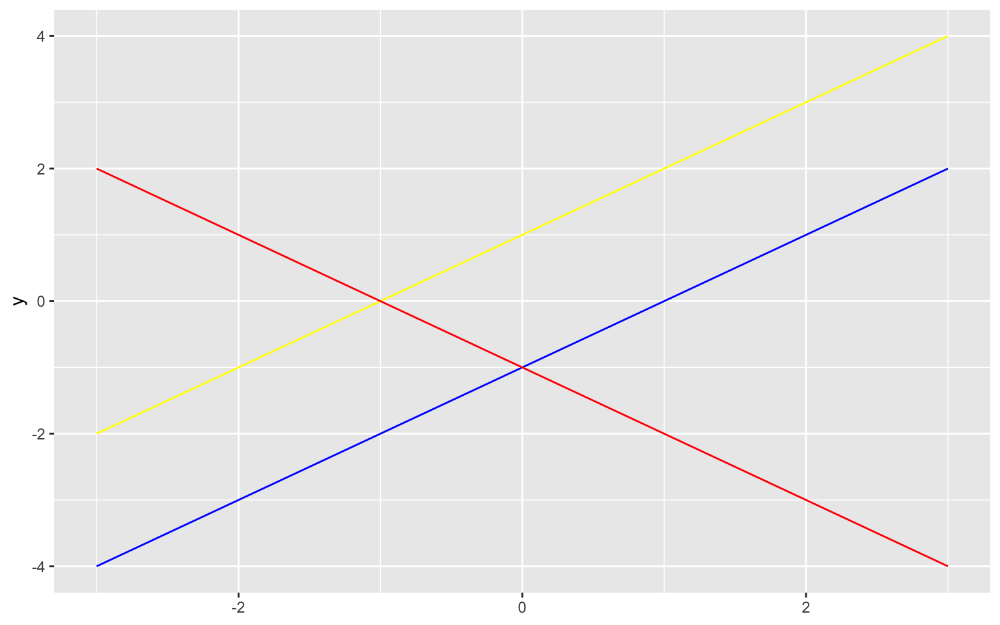

Volviendo a los datos descritos hasta ahora, note que estos pueden variar dependiendo de la muestra observada. Algunos países y áreas observados no hicieron parte de la muestra (Uzbekistan no se encuentra en los datos de producción y consumo de carbón, por ejemplo). Si este país hubiera sido incluido, seguramente obtendríamos diferentes resultados en nuestros gráficos y características numéricas. Esto nos indica que hay un **proceso aleatorio que rige nuestros resultados**. Este puede ser caracterizado midiendo el chance de ocurrencia de los eventos observados mediante modelos matemáticos aplicados en la estadística.

</div>

<div id="funcion-de-densidad" class="section level2">

## Funcion de densidad

Usualmente asumimos que los datos observados provienen de un proceso aleatorio, el cual es cuantificado por una variable aleatoria que a su vez es caracterizada por una función de densidad de probabilidad (fdp, para variables de tipo continuo) o una función másica de probabilidad (fmp, para variables de tipo discreto). La fdp es una función que rige las características de tipo probabilístico de la variable. Esta función toma los valores del recorrido de la variable aleatoria de interés en el eje <span class="math inline">\\x\\</span>, mientras que en el eje <span class="math inline">\\y\\</span> presenta la correspondiente **densidad** de cada punto, la cual representa que tan **verosímiles** son los valores de la variable.

<div id="densidad-paramétrica-estimación-normal-de-la-densidad" class="section level3">

### Densidad paramétrica: Estimación normal de la densidad

La distribución normal es un modelo de probabilidad utilizado en la cuantificación de experimentos aleatorios. De manera similar a la línea recta vista anteriormente, esta no es única al ser una familia indexada por dos parámetros: la media (un número real) y la varianza (un número real mayor o igual a cero). A continuación la ecuación que resume a esta famosa distribución de probabilidad:

<span class="math display">\\ f(x\|(\mu,\sigma)) =\dfrac{1}{\sqrt{2\pi \sigma^2}}e^{-\frac{1}{2} \left( \frac{x-\mu}{\sigma^2} \right)^2 } \hspace{0.5cm} \text{con } -\infty \< x \< +\infty\\</span>

Esto puede verse muy difícil en un comienzo, pero sigue la misma idea de la familia de las líneas rectas. Veamos:

``` r
f_normal = function(x,mu,sigma) {(1/(2* pi * sigma^2)) * (exp(-0.5*((x-mu)/sigma)^2))}
ggplot() + xlim(-3,3) + 
  geom_function(fun = f_normal,args=list(mu=-1,sigma=1) ,color = "yellow") +
  geom_function(fun = f_normal,args=list(mu=0,sigma=1),color = "blue")   +
  geom_function(fun = f_normal,args=list(mu=1,sigma=1),color = "red")
```

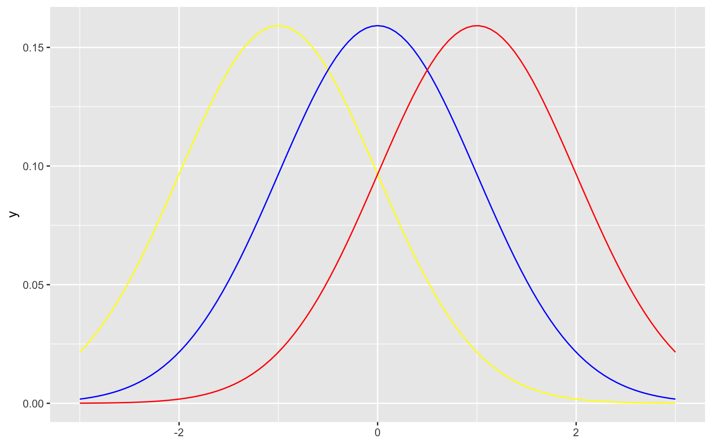

Ahora, cambiando el segundo parámetro del modelo:

``` r
ggplot() + xlim(-3,3) + 
  geom_function(fun = f_normal,args=list(mu=0,sigma=2) ,color = "yellow") +
  geom_function(fun = f_normal,args=list(mu=0,sigma=1),color = "blue")   +
  geom_function(fun = f_normal,args=list(mu=0,sigma=3),color = "red")
```

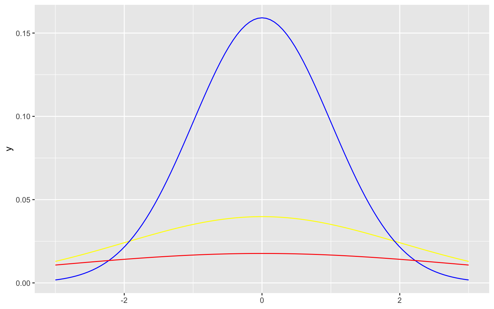

Entre los elementos de esta familia se encuentra la distribución normal estándar (de color azul en las dos últimas figuras), la cual tiene media cero y varianza uno. Todos los elementos de esta familia tienen una curva en forma de campana que resume la aletoriedad del fenómeno estudiado en la que la verosimilitud de un punto es mayor cerca del promedio y disminuye a medida que se aleja de este. Podemos ajustar a un conjunto de datos la distribución normal con su media y desviación estándar muestral, y si el ajuste es bueno, **se dice que la variable aleatoria correspondiente se distribuye normal**.

|  |
|----|
| Muchas de las técnicas utilizadas en estadística se basan en la distribución normal, esto es dado porque muchos fenómenos aleatorios, al ser medidos, siguen de manera aproximada esta distribución: los valores se aglomeran simétricamente en torno a un valor central específico. La mayoría de estas medidas se ubican dentro de alguna distancia determinada respecto a un valor central, a la izquierda o a la derecha, las demás se presentan de manera cada vez más escasa, en tanto que la distancia al valor central es grande. |

</div>

<div id="densidad-no-paramétrica-estimación-kernel-de-la-densidad" class="section level3">

### Densidad no paramétrica: Estimación kernel de la densidad

El segundo problema mencionado en la elaboración del histograma se relaciona con el número de clases <span class="math inline">\\k\\</span>. Se nota que en efecto para nuestros datos el número de intervalos de clase representa diferencias en las distribuciones presentadas.

``` r
par(mfrow=c(2,3))
for(k in c(5,10,25,50,75,100)){
hist(charcoal_prd19$Quantity,breaks=k,
     main = paste0('Histograma de producción de carbón\npor paises - áreas. Año 2019 - k = ',k),
     xlab = 'Intervalos de clase - Producción\n(en miles de toneladas métricas) de carbón',
     ylab = 'Frecuencia absoluta')
}
```

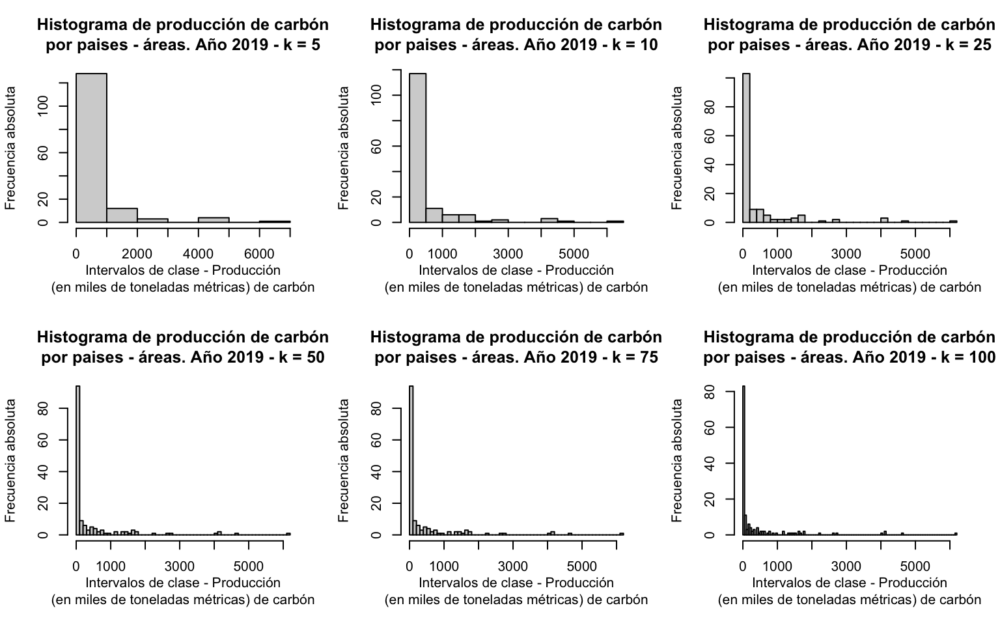

Asumimos que existe una única distribución subyacente generadora de los datos, sin embargo los gráficos previamente presentados muestran distribuciones diferentes sobre el mismo conjunto de datos. Las distribuciones con un <span class="math inline">\\k\\</span> menor parecen suavizar características importantes en los datos (como lo vimos previamente para el histograma con la regla de Sturges, cuyo primer intervalo de clase de por sí contenía una distribución en sus datos altamente sesgada a la derecha). Por otra parte, a medida que crece <span class="math inline">\\k\\</span>, el histograma se ve **ruidoso** y parece sobreajustarse a los datos. Naturalmente se preguntaría por el número óptimo <span class="math inline">\\k\\</span> para obtener aquella distribución que en efecto representa la realidad que muestran los datos, sin sobreajustar ni sobresuavizar la distribución de los datos.

A través del histograma se puede aproximar la fdp de la variable aleatoria continua subyacente. En R haciendo uso de la función `hist()` con `prob=TRUE` obtenemos la estimación de la fdp para la variable de interés (note que ahora definimos al histograma como un objeto en el ambiente de trabajo de R):

``` r
h_dens = hist(charcoal_prd19$Quantity,prob=TRUE,
         main = 'Histograma de producción de carbón por paises - áreas\nAño 2019',
         xlab = 'Intervalos de clase - Producción (en miles de toneladas métricas) de carbón',
         ylab = 'Densidad')
```

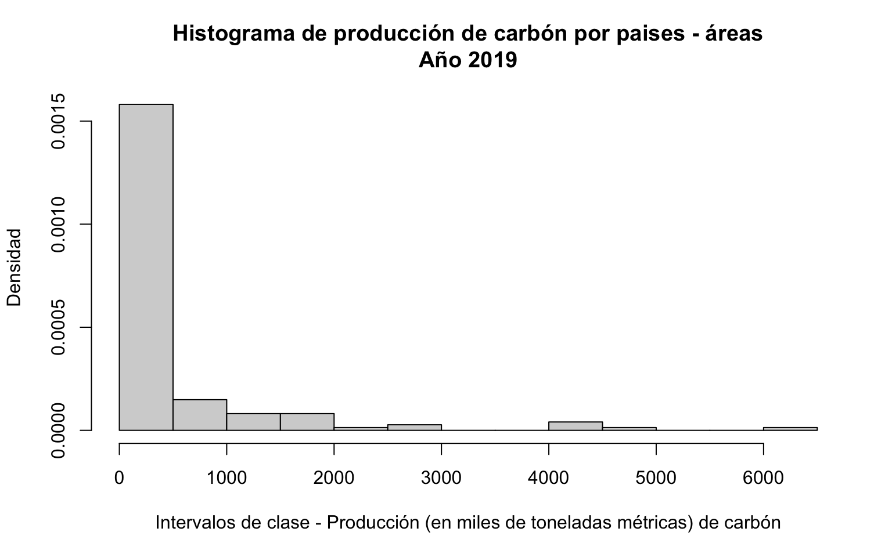

Ahora en el eje <span class="math inline">\\y\\</span> se tiene una estimación de la densidad de la distribución. Como puede observarse, si sumamos el área gris del gráfico obtenemos que esta es igual a uno (que por cierto, es verdadero para cualquier valor de <span class="math inline">\\k\\</span>). Esta es una propiedad de cualquier fdp, cuya área bajo la curva, o **integral**, es siempre igual a uno :

``` r
l_base   = diff(h_dens$breaks) # vector con longitud de c/intervalo de clase (base)
l_altura = h_dens$density      # vector con densidad estimada para c/intervalo de clase (altura)
sum(l_base*l_altura)           # área total de todos los rectángulos del histograma
```

    ## [1] 1

Esta propiedad nos permite medir el chance de ocurrencia de eventos de la variable aleatoria de interés. Por ejemplo, conocer la probabilidad del evento <span class="math inline">\\A\\</span>=‘Selección de un país-área con producción de carbón (en miles de toneladas métricas) entre 1000 y 1500’ como el área (o integral) de la fdp entre los valores <span class="math inline">\\x=1000\\</span> y <span class="math inline">\\x=1500\\</span>. Que para la estimación de la fdp mediante el histograma, esta probabilidad como porcentaje es igual a:

``` r
base_1000_1500 = 500
altu_1000_1500 = h_dens$density[h_dens$mids == 1250]
prob_A_hist    = base_1000_1500 * altu_1000_1500
round(100*prob_A_hist,2)
```

    ## [1] 4.05

------------------------------------------------------------------------

</div>

<div id="ejercicio-1" class="section level3">

### Ejercicio 1

> Calcule la probabilidad como porcentaje del evento <span class="math inline">\\B\\</span>=‘Selección de un país-área con producción de carbón (en miles de toneladas métricas) entre 0 y 500’ para la estimación de la fdp mediante el histograma.

``` r
### Solución
base_0000_0500 = 500
altu_0000_0500 = h_dens$density[h_dens$mids == 250]
prob_B_hist    = base_0000_0500 * altu_0000_0500
print(paste0('La probabilidad es igual a ',round(100*prob_B_hist,2)))
```

    ## [1] "La probabilidad es igual a 79.05"

------------------------------------------------------------------------

A partir de la estimación kernel de la densidad (KDE por sus siglas en inglés), en lugar de estimar la densidad como una constante para los datos en cada intervalo de clase de un histograma, calculamos un promedio en cada punto del recorrido de la variable. Este es un promedio ponderado de todas las observaciones, que da más importancia a las observaciones cercanas al punto y menos a aquellas que se encuentran más alejadas de este. Resumimos entonces los datos como promedios ponderados en su vecindad.

``` r
hist(charcoal_prd19$Quantity, # Histograma
     prob = TRUE, ylim=c(0,0.0030),xlim=c(-4,6500),
     main = 'Histograma con KDE de producción de carbón por países - áreas\nAño 2019',
     xlab = 'Producción (en miles de toneladas métricas) de carbón',
     ylab = 'Densidad')
lines(density(charcoal_prd19$Quantity), # Densidad
      lwd = 2,col = "red")
```

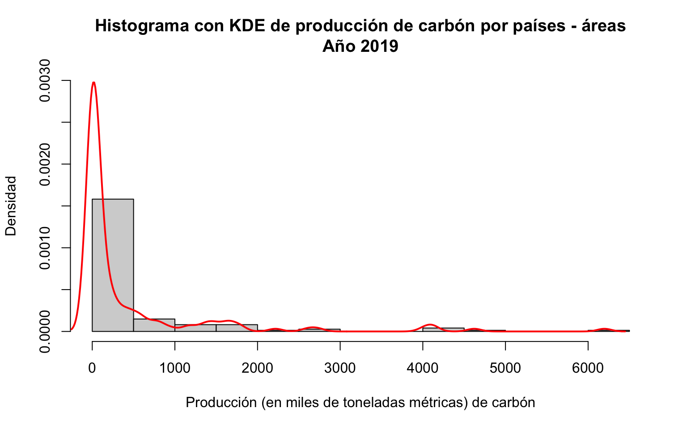

Para esta estimación de la densidad obtenemos una representación más precisa que la observada mediante el histograma. Vemos en particular que el primer intervalo de clase no presenta una densidad homogénea, esta es artificialmente generada por la discretización necesaria en la elaboración del histograma. En realidad, la probabilidad del evento <span class="math inline">\\A\\</span> descrito anteriormente está claramente sobreestimada mediante la estimación de la fdp del histograma. Se nota además que en ningún momento se especificó el número de intervalos. Sin embargo, se destaca que la implementación de este método no considera que la variable de interés es siempre mayor o igual a cero, por lo cual asigna una densidad importante a valores negativos dado el marcado sesgo de la variable. Además, hay un par de decisiones por defecto tomadas en R (el kernel <span class="math inline">\\k\\</span> y el ancho de banda <span class="math inline">\\h\\</span>), las cuales modifican significativamente la estimación de la densidad, pero salen del alcance de la presente introducción al curso.

------------------------------------------------------------------------

</div>

<div id="ejercicio-2" class="section level3">

### Ejercicio 2

> Para el conjunto de datos de consumo de carbón (`charcoal_chh19`), elabore la estimación kernel de la densidad para la variable `Quantity` junto a su histograma correspondiente. ¿Es similar a la estimación para la misma variable en el conjunto de datos `charcoal_prd19`?

``` r
### Solución
hist(charcoal_chh19$Quantity, # Histograma
     prob = TRUE, ylim=c(0,0.0030),xlim=c(-4,6500),
     main = 'Histograma con KDE de consumo de carbón por países - áreas\nAño 2019',
     xlab = 'Consumo (en miles de toneladas métricas) de carbón',
     ylab = 'Densidad')
lines(density(charcoal_chh19$Quantity), # Densidad
      lwd = 2,col = "red")
```

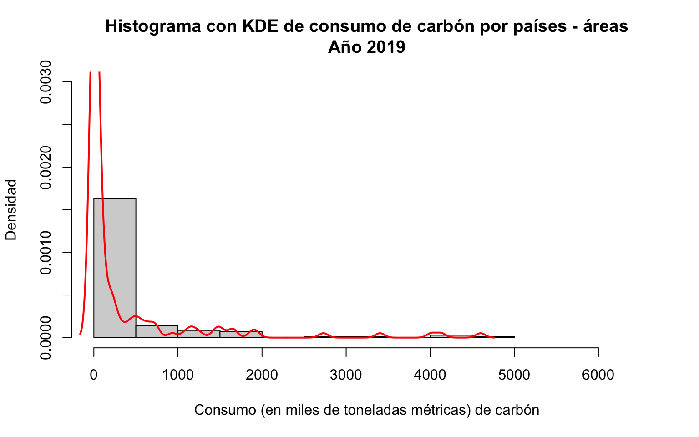

> Como reto, calcule el área bajo la curva de la estimación de la densidad del punto anterior. Ayuda: aproxime el área de la curva como la suma de áreas de los rectángulos que la contienen. Para esto, defina el gráfico como un objeto en el ambiente de R y extraiga de este (mediante el símbolo \$) la estimación de la verosimilitud y la colección correspondiente de valores en el dominio (eje x).

``` r
### Solución
kde_d    = density(charcoal_chh19$Quantity)
base_kde = diff(kde_d$x)
alt_kde  = tail(kde_d$y,length(base_kde))
paste0('El área total bajo la curva es igual a ', sum(base_kde*alt_kde))
```

    ## [1] "El área total bajo la curva es igual a 0.999076533801481"

------------------------------------------------------------------------

</div>

</div>

<div id="para-que-sirven-las-funciones-de-densidad" class="section level2">

## ¿Para que sirven las funciones de densidad?

Las funciones de densidad, como <span class="math inline">\\f(x\|(\mu,\sigma))\\</span> para la distribución normal, resumen el comportamiento aleatorio de la variable univariada de interés <span class="math inline">\\X\\</span>, y cualquier evento de dicha variable (por ejemplo: que <span class="math inline">\\X\\</span> resulte ser mayor a 0, menor que 15, o igual a 2) puede ser caracterizado con el área bajo dicha curva. Los posibles valores de una variable con distribución normal son <span class="math inline">\\-\infty \< x \< +\infty\\</span>, es decir, cualquier real puede ser resultado del experimento aleatorio. Números cercanos a la media tienen una mayor **verosimilitud**, y a medida que se alejan disminuyen su **verosimilitud.**, además, el chance de obtener un número real cualquiera mediante el experimento aleatorio será siempre igual a uno. Con lo cual se cumple la siguiente propiedad:

<span class="math display">\\\int\_{-\infty}^{\infty}f(x\|(\mu,\sigma)) dx = 1\\</span>

Y subintervalos más informativos pueden ser de interés en el estudio. Por ejemplo, si la variable aleatoria <span class="math inline">\\X\\</span> igual a la edad de los estudiantes del curso sigue la distribución normal con parámetros <span class="math inline">\\(\mu = 27 \text{ años},\sigma = 5 \text{ años})\\</span>. Se tiene que:

``` r
ggplot() + xlim(15,40) + 
  geom_function(fun = f_normal,args=list(mu=27,sigma=5) ,color = "red") 
```

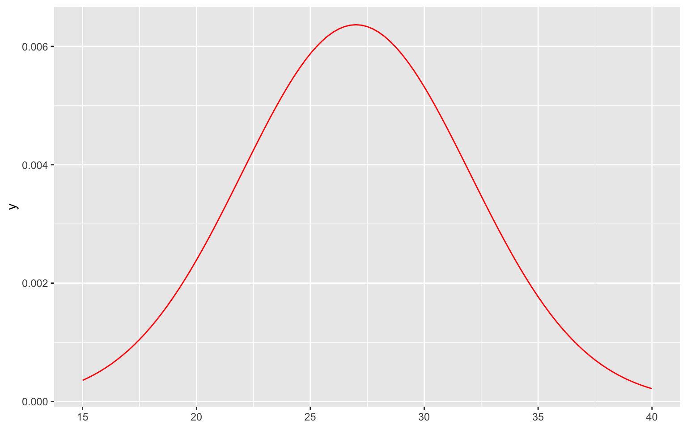

Con seguridad los estudiantes tienen entre <span class="math inline">\\-\infty \< x \< +\infty\\</span> con <span class="math inline">\\x\\</span> indicando la edad de los estudiantes. En este caso se tiene también que

<span class="math display">\\\int\_{-\infty}^{27}f(x\|(\mu,\sigma)) dx = 0.5\\</span> Y

<span class="math display">\\\int\_{27}^{\infty}f(x\|(\mu,\sigma)) dx = 0.5\\</span> Es decir, la probabilidad de tener menos de 27 años es 0.5, lo mismo para la probabilidad de tener más de 27.

</div>

</div>

<div id="pensamiento-bivariado" class="section level1">

# Pensamiento bivariado

En los ejemplos desarrollados hasta ahora nuestras observaciones han sido números o escalares, estas observaciones univariadas corresponden a una muestra fija de observaciones de una población determinada. Estas generalmente se notan como <span class="math inline">\\x_1\\</span>,…,<span class="math inline">\\x_n\\</span> dónde <span class="math inline">\\n\\</span> representa el tamaño muestral y <span class="math inline">\\x_i\\</span> (una observación arbitraria pero fija), representa para nuestro ejemplo la producción (en miles de toneladas métricas) de carbón del <span class="math inline">\\i\\</span>-ésimo país o área. Por ejemplo <span class="math inline">\\x_2\\</span> es igual a <span class="math inline">\\1159.8\\</span> y corresponde al país-área de Angola:

``` r
charcoal_prd19$Quantity[2]
```

    ## [1] 1159.8

``` r
charcoal_prd19$Country_Area[2]
```

    ## [1] "Angola"

En el análisis bivariado, nuestras observaciones son ahora vectores de dimensión dos. En notación estadística, ahora contamos con parejas ordenadas <span class="math inline">\\(x_1,y_1)\\</span>,…,<span class="math inline">\\(x_n,y_n)\\</span>. Continuando el ejemplo:

``` r
charcoal_bivar = (charcoal_prd19 %>% select(Country_Area,
                                     Charcoal_Production=Quantity)) %>% 
                  inner_join(charcoal_chh19 %>% 
                                     select(Country_Area,
                                            Charcoal_Consumption=Quantity),
                             by='Country_Area')

charcoal_bivar %>% filter(Country_Area == 'Argentina')
```

    ## # A tibble: 1 × 3
    ##   Country_Area Charcoal_Production Charcoal_Consumption
    ##   <chr>                      <dbl>                <dbl>
    ## 1 Argentina                    411                  247

En este caso, la observación <span class="math inline">\\(x_3,y_3)=(411,247)\\</span> corresponde a Argentina y podemos ver que el país produce más carbón del que consume (recuerde que las dos variables están medidas en las mismas unidades, por lo que la comparación es válida). Esto tiene sentido al ser Argentina uno de los pocos países productores de carbón de la región. En el análisis bivariado, como acabamos de notar, estamos interesados en la relación u asociación entre las dos variables, es decir, las características de la distribución **conjunta** de las variables, en lugar de la distribución **marginal** de cada variable de manera independiente. Sin embargo, no estamos interesados en una sola instancia o caso aislado, buscamos ver a través de los datos la relación existente entre las variables.

<div id="diagrama-de-dispersión" class="section level3">

### Diagrama de dispersión

Para finalizar esta introducción, concluímos con una herramienta gráfica importante en el estudio de la relación entre variables de tipo cuantitativo. El diagrama de dispersión presenta las parejas de observaciones en un plano. Para el diagrama de dispersión, ambas son variables cuantitativas continuas:

``` r
plot(charcoal_bivar$Charcoal_Production,charcoal_bivar$Charcoal_Consumption,
     main = 'Diagrama de dispersión de consumo y producción de carbón\n por paises - áreas. Año 2019',
     xlab = 'Producción (en miles de toneladas métricas) de carbón',
     ylab = 'Consumo (en miles de toneladas métricas) de carbón')
```

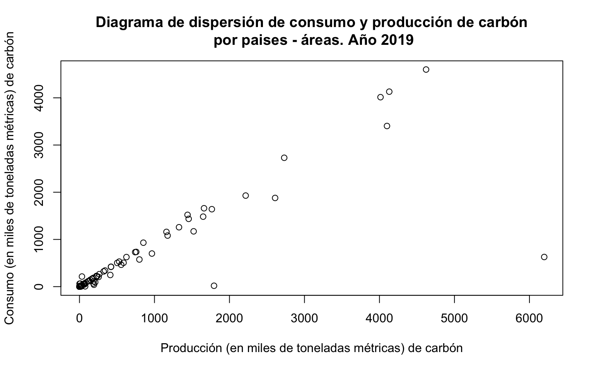

Es evidente la relación lineal y positiva que tienen las dos variables. Este gráfico sirve de base para detectar modelos generadores de las parejas de datos bivariados: tendencias lineales, no lineales, crecientes, decrecientes, heteroscedásticas, entre otros. Adiciones informativas pueden incluirse en el gráfico, por ejemplo, las distribuciones marginales pueden ser incorporadas. A continuación el gráfico de dispersión ampliado, con las distribuciones marginales para cada variable usando los métodos de estimación vistos en la lección: histograma, boxplot y KDE:

``` r
library(ggplot2)
library(ggExtra)
g_base = ggplot(charcoal_bivar, aes(x = Charcoal_Production,
                                    y = Charcoal_Consumption)) + 
         labs(title="Diagrama de dispersión de consumo y producción de carbón\npor paises - áreas. Año 2019") +
         xlab("Producción (en miles de toneladas métricas) de carbón") + 
         ylab("Consumo (en miles de toneladas métricas) de carbón") +
         geom_point()
```

``` r
g1 = ggMarginal(g_base, type = "histogram")
g1
```

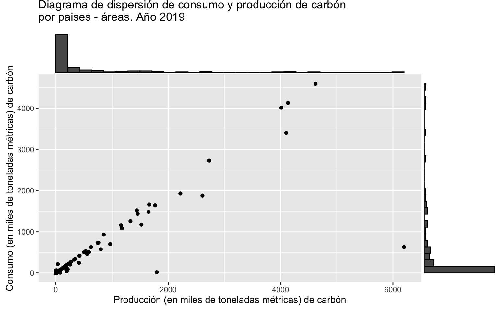

``` r
g2 = ggMarginal(g_base, type = "density")
g2
```

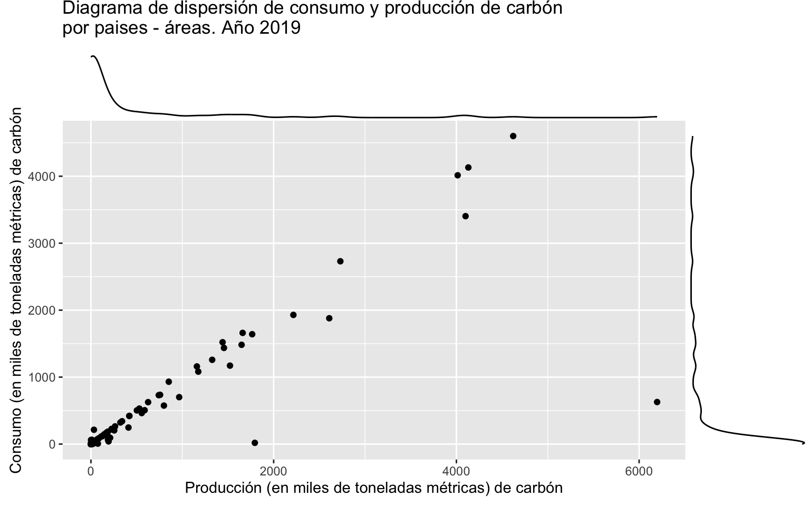

``` r
g3 = ggMarginal(g_base, type = "boxplot")
g3
```

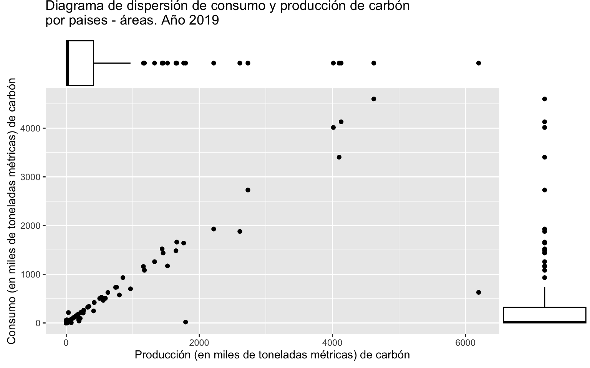

</div>

</div>

<div id="conclusiones" class="section level1">

# Conclusiones

- Herramientas esenciales univariadas, tales como el histograma y el boxplot, son de gran importancia en la descripción marginal de datos multivariados. Además, algunas definiciones básicas brevemente mencionadas en el presente cuaderno: tales como función de densidad y función de verosimilitud, se visitarán de manera recurrente en el análisis estadístico de datos.

- Los diagramas de dispersión, además de permitir observar relaciones bivariadas entre variables, se utilizarán en la proyección bidimensional de datos multidimensionales bajo diferentes contextos. Es importante una familiaridad con esta herramienta gráfica.

</div>

<div id="anexos" class="section level1">

# Anexos

<div id="función-de-distribución-de-probabilidad-normal" class="section level2">

## Función de distribución de probabilidad normal

Podemos calcular las probabilidades acumuladas bajo una variable normalmente distribuida en cualquier punto <span class="math inline">\\x\\</span>, con lo cual, introducimos el concepto de función de distribución de la variable <span class="math inline">\\X\\</span> denotado como <span class="math inline">\\F(x)\\</span> y definido como:

<span class="math display">\\F(x\|(\mu,\sigma)) = \int\_{-\infty}^{x}f(x\|(\mu,\sigma)) dx = 1\\</span> También es posible visualizar dicha función, note que nuevamente depende únicamente de los dos parámetros de la distribución normal:

``` r
x <- seq(-4, 4, length=100)
dnor <- pnorm(x)

sigma <- c(0.5, 2, 10)
colors <- c("red", "blue", "darkgreen", "black")
labels <- c("sigma=0.5", "sigma=2", "sigma=10",  "Normal Estándar")

plot(x, dnor, type="l", lty=2, xlab="x",
  ylab="Densidad", main="Distribuciones normales, con diferente parametro de dispersión", ylim=c(0,1))

for (i in 1:4){
  lines(x, pnorm(x,0,sigma[i]), lwd=2, col=colors[i])
}

legend("bottomright", inset=.05,
  labels, lwd=2, lty=c(1, 1, 1, 2), col=colors)
```

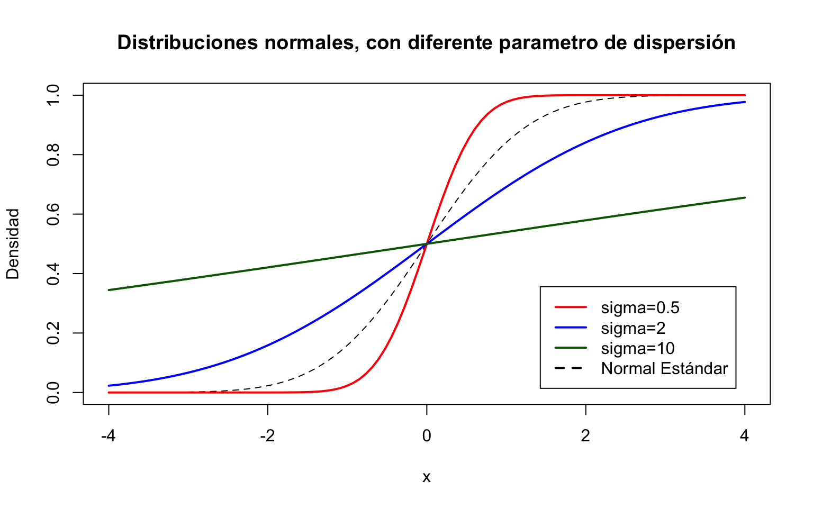

</div>

</div>

<div id="referencias" class="section level1">

# Referencias

- Mendenhall, W., Beaver, R. J., & Beaver, B. M. (2012). Introducción a la probabilidad y estadística. Cengage Learning.

</div>

</div>
