# Análisis Estadístico de Datos

<span class="glyphicon glyphicon-user"></span> Profesor: Nicolás López

<div class="page-content has-page-title">

<div id="dependencias" class="section level1">

# Dependencias

Para la ejecución de este cuaderno, debe instalar con anterioridad los siguientes paquetes desde la consola de R o usando el menú Tools\>Install Packages… en RStudio:

- `install.packages("tidyverse")`.
- `install.packages("rmdformats")`.
- `install.packages("plotly")`.
- `install.packages("mvtnorm")`.
- `install.packages("MASS")`.

</div>

<div id="objetivo-y-alcance" class="section level1">

# Objetivo y alcance

**Objetivo**:

1.  Identificar una distribución de probabilidad estadística y poder explicar sus principales características.

2.  Entender el concepto de estadística multivariada.

3.  Entender el concepto de distribución multivariada.

4.  Aplicar herramientas de visualización útiles que permitan generar valor agregado al análisis de datos.

**Alcance**:

En este cuaderno se encuentra la primera aproximación al concepto de distribución multivariada, un acercamiento a la distribución normal multivariada y algunas herramientas de visualización útiles para el curso.

</div>

<div id="distribución-normal-univariada-comentarios-de-cierre" class="section level1">

# Distribución normal univariada: comentarios de cierre

<div id="distribución-normal-univariada-estándar" class="section level2">

## Distribución normal univariada estándar

La distribución normal es un modelo de probabilidad utilizado en la cuantificación de experimentos aleatorios. Esta no es única al ser una familia indexada por dos parámetros: la media (un número real) y la varianza. En la familia de la distribución normal, la distribución con parámetros, <span class="math inline">\\\mu = 0\\</span> y <span class="math inline">\\\sigma = 1\\</span> es la más importante y se llama distribución **normal estándar**. Usualmente se nota con la letra <span class="math inline">\\Z\\</span>, y está dada por

<span class="math display">\\ f(z\|(\mu = 0,\sigma = 1)) =\dfrac{1}{\sqrt{2\pi \times 1 }}e^{-\frac{1}{2} \left( \frac{z-0}{1} \right)^2 } = \dfrac{1}{\sqrt{2\pi}}e^{-\frac{1}{2} z^2 } \hspace{0.5cm} \text{con } -\infty \< z \< +\infty\\</span> Presentada visualmente a continuación

``` r
f_normal = function(x,mu,sigma) {(1/(2* pi * sigma^2)) * (exp(-0.5*((x-mu)/sigma)^2))}
ggplot() + xlim(-3,3) + 
  geom_function(fun = f_normal,args=list(mu=0,sigma=1) ,color = "red") 
```

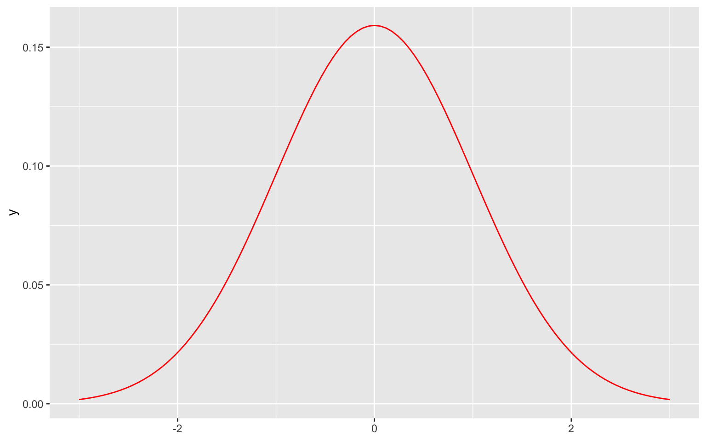

Y cualquier variable aleatoria <span class="math inline">\\X\\</span> con distribución normal de media <span class="math inline">\\\mu\\</span> y desviación estándar <span class="math inline">\\\sigma\\</span> puede ser ‘transportada’ a la variable aleatoria <span class="math inline">\\Z\\</span> con distribución normal estándar (de media <span class="math inline">\\\mu = 0\\</span> y desviación estándar <span class="math inline">\\\sigma = 1\\</span>) mediante la **estandarización** de la variable:

<span class="math display">\\ Z = \frac{X - \mu}{\sigma}\\</span>

</div>

<div id="estimación-de-parámetros-bajo-la-distribución-normal-univariada" class="section level2">

## Estimación de parámetros bajo la distribución normal univariada

Siguiendo el ejemplo práctico de la edad de los estudiantes de nuestra última clase, los parámetros <span class="math inline">\\(\mu = 27 \text{ años},\sigma = 5 \text{ años})\\</span> son usualmente desconocidos bajo el experimento aleatorio, pero pueden ser estimados al observar una colección de edades <span class="math inline">\\x_1\\</span>,…, <span class="math inline">\\x_n\\</span> a través de la media (<span class="math inline">\\\bar{x}\\</span>) y desviación estándar (<span class="math inline">\\s\\</span>) de la muestra:

<span class="math display">\\ \hat{ \mu } = \bar{x} \hspace{0.5cm} \text{con} \hspace{0.5cm} \bar{x}= \frac{ \sum x_i }{n} \\</span>

Y

<span class="math display">\\ \hat{ \sigma } = s \hspace{0.5cm} \text{con} \hspace{0.5cm} s= \sqrt{\frac{ \sum (x_i - \bar{x})^2 }{n-1}} \\</span>

</div>

<div id="otras-distribuciones" class="section level2">

## Otras distribuciones

Finalmente, es importante notar que no todas las variables aleatorias siguen la distribución normal, otras distribuciones continuas existen. Podemos además modelar variables discretas. Hay una gran cantidad de distribuciones de probabilidad, algunas descritas en el siguiente esquema:

<div id="id" class="float">

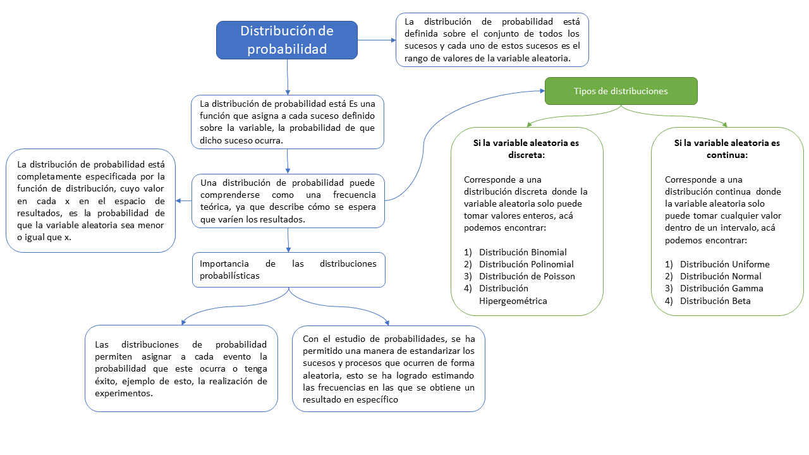

<div class="figcaption">

Conceptos de distribuciones de probabilidad

</div>

</div>

</div>

</div>

<div id="qué-es-la-estadística-multivariada" class="section level1">

# ¿Qué es la estadística multivariada?

La estadística multivarada entendida como la generalización de la estadística univiariada, hace referencia al conjunto de herramientas que permiten analizar más de una variable sobre un conjunto de individuos u objetos, que conocemos como unidades estadísticas (UE). En forma más general, los datos multivariados pueden proceder de varios grupos o poblaciones de UE, donde el interés se dirige a la exploración de las variables y la búsqueda de su interrelación dentro de los grupos y entre ellos (Díaz Monroy & Morales Rivera, 2012). Al igual que en el caso univariado, las variables aleatorias multivariadas poseen modelos matemáticos (las llamadas ***distribuciones de probabilidad multivariadas***) con parámetros determinados. Si bien, en la mayoría de casos dichas distribuciones no son sencillas de calcular; nos centraremos en el caso de la distribución normal multivariada.

</div>

<div id="técnicas-multivariadas" class="section level1">

# Técnicas multivariadas

Las técnicas del análisis multivariado hacen referencia a las relaciones entre un número de variables aleatorias a partir de sus mediciones (datos) sobre un conjunto de UEs. Este concepto se puede plasmar como un arreglo matricial, generalmente representado por <span class="math inline">\\\mathbb{X} = \\x\_{ij}\\\\</span>, donde las filas corresponden a los individuos y las columnas a las variables, de la siguiente manera:

<span class="math display">\\\mathbb{X} = \begin{bmatrix} x\_{11} & x\_{12} & \cdots & x\_{1p} \\ x\_{21} & x\_{22} & \cdots & x\_{2p} \\ \vdots & \vdots & \ddots & \vdots \\ x\_{n1} & x\_{n2} & \cdots & x\_{np} \end{bmatrix} \\ \\ \\ \\ (i)\\</span>

Donde <span class="math inline">\\x\_{np}\\</span> representa la realización de la variable <span class="math inline">\\p\\</span> en el <span class="math inline">\\n-ésimo\\</span> individuo. Piense en el arreglo matricial como un archivo de excel en el que cada fila corresponde a una UE y cada columna una variable observada. Así pues, podemos hablar ahora del vector de realizaciones de una variable aleatoria <span class="math inline">\\p\\</span>-dimensional (o **vector aleatorio**) para el individuo <span class="math inline">\\i\\</span> como:

<span class="math display">\\\mathbf{x}\_{i.} = \[x\_{i1},x\_{i2}, \cdots, x\_{ip}\] \\ \\ \\ \\ (ii)\\</span>

Podemos configurar la matriz de datos en filas:

<span class="math display">\\ \mathbb{X} = \begin{bmatrix} \mathbf{x}\_{1.} \\\mathbf{x}\_{2.}\\ \vdots \\ \mathbf{x}\_{n.} \end{bmatrix} \\</span>

Y también podemos pensar en la columna <span class="math inline">\\j\\</span> de <span class="math inline">\\\mathbf{x}\\</span> como la realización de la variable aleatoria <span class="math inline">\\j\\</span>, de forma univariada:

<span class="math display">\\\mathbf{x}\_{.j} = \begin{bmatrix} x\_{1j} \\x\_{2j}\\ \vdots \\ x\_{nj} \end{bmatrix} = \[x\_{1j},x\_{2j}, \cdots, x\_{nj}\]^t \\ \\ \\ \\ (iii) \\</span>

Podemos configurar la matriz de datos en columnas:

<span class="math display">\\ \mathbb{X} = \[\mathbf{x}\_{.1},\mathbf{x}\_{.2},\dots,\mathbf{x}\_{.p}\] \\</span>

El caso multivariado considera a <span class="math inline">\\\mathbf{x}\_{,j}\\</span> como el vector de <span class="math inline">\\n\\</span> realizaciones de la <span class="math inline">\\j\\</span>-ésima variable aleatoria <span class="math inline">\\X_j\\</span>, la cual hace parte del vector aleatorio <span class="math inline">\\p-\\</span>dimensional <span class="math inline">\\\mathbf{X}\\</span>: un vector donde cada una de sus componentes es una variable aleatoria:

<span class="math display">\\\vec{X} = (X\_{1},X\_{2}, \cdots, X\_{p})' \\</span>

</div>

<div id="parámetros-y-estadísticas-en-estadística-multivariada-normal" class="section level1">

# Parámetros y estadísticas en estadística multivariada normal

En la estadística normal multivariada normal tenemos dos parámetros que la caracterizan el modelo de probabilidad, de manera semejante al caso normal univariado. En este caso, sin embargo, son elementos multidimensionales. Si un vector aleatorio <span class="math inline">\\\vec{X}\\</span> de dimensión <span class="math inline">\\p\\</span> sigue la distribución normal multivariada de parámetros <span class="math inline">\\(\vec{\mu},\Sigma)\\</span> se nota como <span class="math inline">\\\vec{X} \sim N_p (\vec{\mu},\Sigma)\\</span>, los cuales se describen a continuación.

<div id="parámetros" class="section level2">

## Parámetros

1.  **Vector de medias**: Dado un vector aleatorio <span class="math inline">\\\mathbf{X}\\</span>, podemos definir la *media* de <span class="math inline">\\\mathbf{X}\\</span> como la media para cada una de las variables aleatorias:

<span class="math display">\\ \vec{\mu} = \begin{bmatrix} \mu_1\\ \mu_2\\ \vdots \\ \mu_p \end{bmatrix}\\</span>

2.  **Matriz de varianzas y covarianzas**: Esta matriz la cual notaremos por <span class="math inline">\\\Sigma\\</span>, está dada por:

<span class="math display">\\\Sigma = Cov(\vec{X}) = \begin{bmatrix} \sigma\_{11} & \sigma\_{12} & \cdots & \sigma\_{1p} \\ \sigma\_{21} & \sigma\_{22} & \cdots & \sigma\_{2p} \\ \vdots & \vdots & \ddots & \vdots \\ \sigma\_{n1} & \sigma\_{n2} & \cdots & \sigma\_{np} \end{bmatrix}\\</span>

Donde <span class="math inline">\\\sigma\_{ij}\\</span> representa la covarianza entre la variable <span class="math inline">\\X_i\\</span> y la variable <span class="math inline">\\X_j\\</span>.

</div>

<div id="modelo-matemático" class="section level2">

## Modelo matemático

Este modelo resembla el caso univariado, ya que existe una función de densidad <span class="math inline">\\f( \vec{x} \| (\vec{\mu},\Sigma))\\</span> con la que podemos calcular diferentes probabilidades de interés. Esta fórmula es bastante elaborada pero sigue el mismo principio del caso univariado, en el que se busca resumir matemáticamente el comportamiento acampanado descrito, pero ahora en múltiples dimensiones. También existe la distribución **normal multivariada estándar**, la cual nuevamente es sintácticamente más sencilla y se describirá a continuación.

Sea <span class="math inline">\\\vec{Z} = (Z_1,...,Z_p)\\</span> un vector p-dimensional de variables aleatorias independientes, cada una con distribución normal estándar. La distribución del vector <span class="math inline">\\\vec{Z}\\</span> es

<span class="math display">\\f(\vec{z}\| (\vec{\mu} = \vec{0},\Sigma = I_p)) = \prod\_{i=1}^{p} f\_{Z_i}(z_i) = \prod\_{i=1}^{p}\dfrac{1}{(2\pi)^{1/2}}e^{-\frac{1}{2} z\_{i}^2 }\\</span>

En el caso bidimensional (<span class="math inline">\\p=2\\</span>), puede pensar en la distribución normal estándar revolucionada sobre su media, generando un sólido similar a una campana de navidad.

</div>

<div id="qué-sucede-con-diferentes-estructuras-de-correlación" class="section level2">

## ¿Qué sucede con diferentes estructuras de correlación?

<div id="id" class="float">

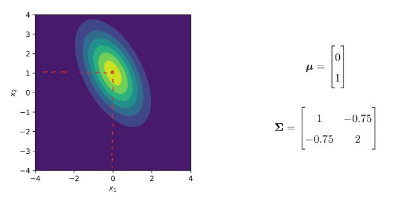

<div class="figcaption">

Distribución normal Multivariada

</div>

</div>

<div id="id" class="float">

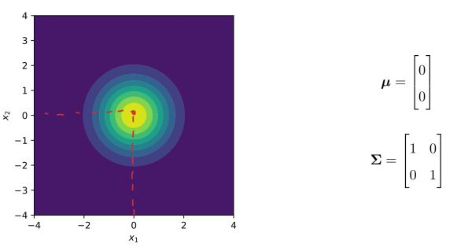

<div class="figcaption">

Distribución normal Multivariada estándar

</div>

</div>

<div id="id" class="float">

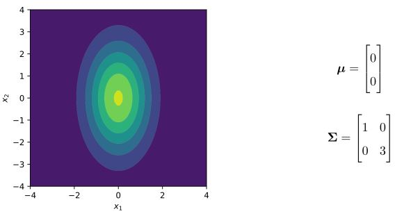

<div class="figcaption">

Distribución normal Multivariada no correlacionada

</div>

</div>

</div>

<div id="estadísticas" class="section level2">

## Estadísticas

Nuevamente, es usual que estos sean parámetros desconocidos, pero con ayuda de las observaciones multivariadas podremos estimarlo. De manera análoga al caso univariado, a cada UE seleccionada de manera aleatoria de la población de individuos, se le miden una serie de atributos u observaciones (valores de las variables aleatorias). Sea <span class="math inline">\\x\_{ij}\\</span> la observación de la <span class="math inline">\\j-\\</span>ésima variable en el <span class="math inline">\\i-\\</span>ésimo individuo, se define la matriz de datos multivariados como el arreglo:

<span class="math display">\\\mathbb{X} = \begin{bmatrix} x\_{11} & x\_{12} & \cdots & x\_{1p} \\ x\_{21} & x\_{22} & \cdots & x\_{2p} \\ \vdots & \vdots & \ddots & \vdots \\ x\_{n1} & x\_{n2} & \cdots & x\_{np} \end{bmatrix} \\</span>

Entonces:

1.  El vector formado por las <span class="math inline">\\p-\\</span>medias muestrales es el vector de promedios o medias:

<span class="math display">\\ \mathbf{\bar{x}} = \begin{bmatrix} \bar{x}\_1\\ \bar{x}\_2\\ \vdots \\ \bar{x}\_p \end{bmatrix}\\</span>

Con

<span class="math display">\\\bar{x}\_j = \frac{1}{n}\sum_i x\_{ij}\\</span>

2.  La matriz constituida por las covarianzas <span class="math inline">\\s\_{ij}\\</span> , es la matriz de varianzas y covarianzas muestral, ésta es:

<span class="math display">\\S = \dfrac{1}{n}\mathbb{X} \big(I_n - \dfrac{1}{n} \vec{1}^t\vec{1}\big)\mathbb{X} = \begin{bmatrix} s\_{11} & s\_{12} & \cdots & s\_{1p} \\ s\_{21} & s\_{22} & \cdots & s\_{2p} \\ \vdots & \vdots & \ddots & \vdots \\ s\_{p1} & s\_{p2} & \cdots & s\_{pp} \end{bmatrix}\\</span>

Dónde:

<span class="math display">\\s\_{jk} = \dfrac{1}{n-1}\sum\_{i=1}^{n} (x\_{ij}-\bar{x}\_j)(x\_{ik}-\bar{x}\_k)\\ \\ \\ \text{para} \\ \\ j,k = 1,...,p\\</span>

Más conocida como la covarianza muestral entre la variables columna <span class="math inline">\\j\\</span> y la variable columna <span class="math inline">\\k\\</span>. Cuando <span class="math inline">\\j=k\\</span> se convierte en la varianza de la variable <span class="math inline">\\j\\</span>. A continuación se presenta un ejercicio de aplicación para el calculo de las estadísticas multivariadas descritas:

------------------------------------------------------------------------

<div id="ejercicio-2" class="section level3">

### Ejercicio 2

Los siguientes datos pertenecen a una muestra de 1000 individuos con información de edad, estatura, peso y perímetro abdominal.

``` r
# read_delim se usa cuando un conjunto de datos csv no está separado por comas sino por otro separador
X = read_delim("health_data.csv")
```

    ## Rows: 1000 Columns: 4
    ## ── Column specification ────────────────────────────────────────────────────────
    ## Delimiter: ";"
    ## dbl (4): Edad, Estatura, Peso, Perimetro_abdominal
    ## 
    ## ℹ Use `spec()` to retrieve the full column specification for this data.
    ## ℹ Specify the column types or set `show_col_types = FALSE` to quiet this message.

``` r
print(head(X))
```

    ## # A tibble: 6 × 4
    ##    Edad Estatura  Peso Perimetro_abdominal
    ##   <dbl>    <dbl> <dbl>               <dbl>
    ## 1    36     178.  81.3               106. 
    ## 2    34     165.  72.7               101. 
    ## 3    26     187.  88.8               114. 
    ## 4    42     179.  77.6                99.3
    ## 5    42     172.  70.8                90.3
    ## 6    56     177.  86.3               112

Para los datos, calcule el vector de medias y la matriz de varianzas y covarianzas. Como se ha resaltado, R es un lenguaje orientado al análisis de datos. Estas dos rutinas se implementan fácilmente sin necesidad de programarlas. Para la media:

``` r
# Vector de medias
colMeans(X)
```

    ##                Edad            Estatura                Peso Perimetro_abdominal 
    ##             35.4020            175.6458             77.9449            102.3585

Para las varianzas y covarianzas

``` r
# Matriz de varianzas y covarianzas
cov(X)
```

    ##                            Edad  Estatura      Peso Perimetro_abdominal
    ## Edad                121.3717678 -8.497910  6.681031           0.3585415
    ## Estatura             -8.4979095 87.880963 39.900554           5.7127535
    ## Peso                  6.6810312 39.900554 81.530665          98.9103237
    ## Perimetro_abdominal   0.3585415  5.712753 98.910324         150.3589867

</div>

</div>

</div>

<div id="visualización-de-la-distribución-normal-multivariada" class="section level1">

# Visualización de la distribución normal multivariada

Para comprender la distribución normal multivariada, una visualización inicial permite caracterizar la relevancia de sus parámetros y la manera en la que interactúan al definir la función de densidad. A continuación se muestran gráficos basados en un modelo teórico y en los datos de salud previamente presentados. También se presenta una visalización basada en simulación de datos.

<div id="visualización-de-datos-reales" class="section level2">

## Visualización de datos reales

A continuación se trabajarán los datos de salud anteriormente mencionados.

------------------------------------------------------------------------

<div id="ejercicio-3" class="section level3">

### Ejercicio 3

Realice un diagrama de dispersión entre las variables peso y perimetro abdominal, tal como se hizo en el anterior cuaderno del curso.

``` r
plot(X$Peso,X$Perimetro_abdominal,
     main = 'Diagrama de dispersión del peso y el perímetro abdominal',
     xlab = 'Peso en kg',
     ylab = 'Perímetro abdominal en cm')
```

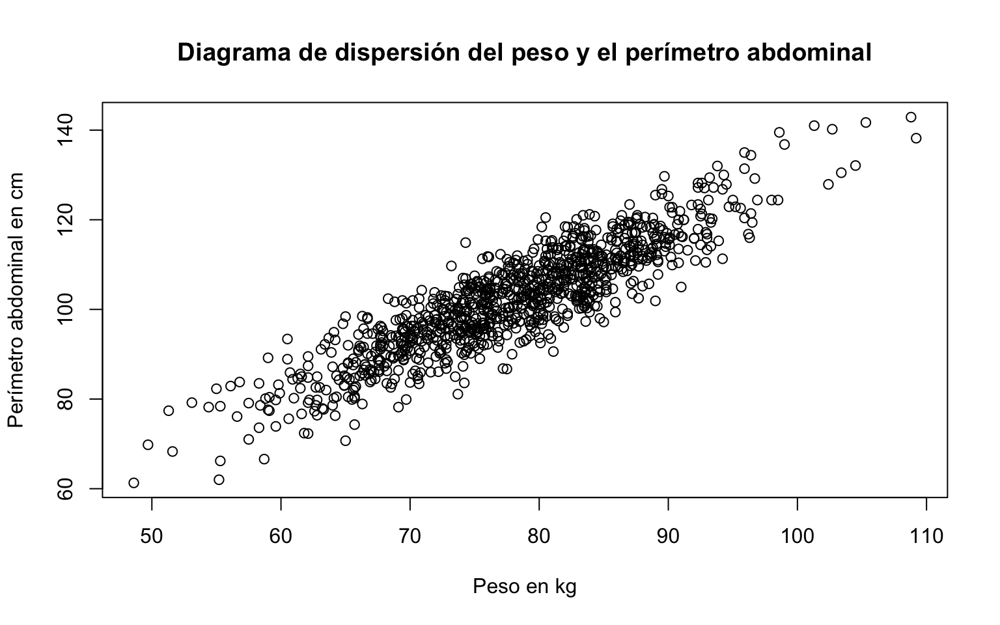

------------------------------------------------------------------------

</div>

</div>

<div id="densidad-univariada" class="section level2">

## Densidad univariada

Para el estudio de los datos de salud se presenta inicialmente la estimación de la densidad para cada una de las variables de manera univariada:

``` r
gather(X) %>%
  ggplot(aes(x = value, color = key)) +
  geom_density()+
  labs(x= "",y='Densidad',title="Densidad estimada")
```

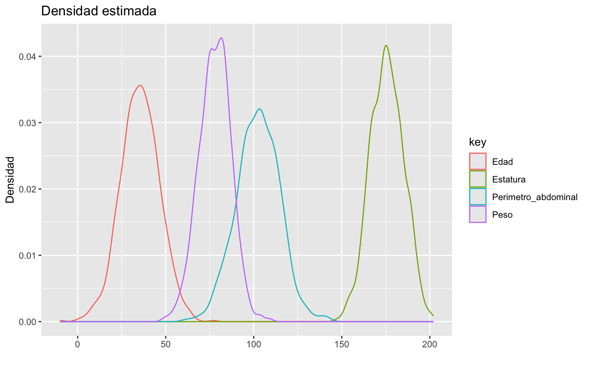

Se aprecia una semejanza con la densidad de la distribución normal para las diferentes variables. Sin embargo, graficar las 4 densidades de manera simultánea (bajo un mismo eje <span class="math inline">\\x\\</span>) no es correcto, pues las unidades de medición de las variables no son iguales; por lo tanto no son comparables. La forma correcta de presentar las densidades es la siguiente:

``` r
gather(X) %>%
  ggplot(aes(x=value)) +
  geom_density() +
  labs(x= "",y='Densidad',title="Densidad estimada") +
  facet_wrap(~key, scales = "free")
```

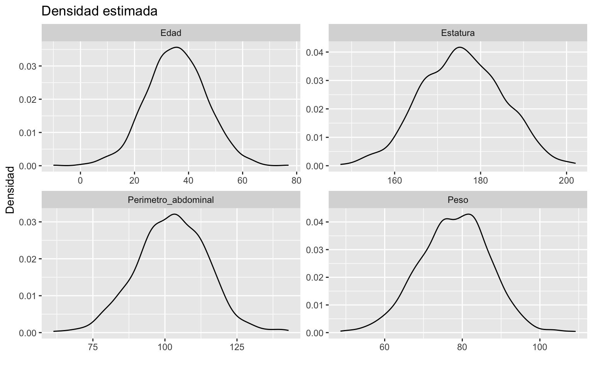

Al ser distribuciones centradas en un valor, aparentemente simétricas, las colas de la distribución “ligeras” y con forma de “campana” el método gráfico nos da un indicio de la normalidad en los datos.

</div>

<div id="distribución-multivariada-p2" class="section level2">

## Distribución multivariada (<span class="math inline">\\p=2\\</span>)

Note ahora el siguiente gráfico, en el cual se observan los datos de manera bivariada:

``` r
library(psych)

pairs.panels(X,
             scale = FALSE,      # If TRUE, scales the correlation text font
             density = TRUE,     # If TRUE, adds density plots and histograms
             method = "pearson", # Correlation method (also "spearman" or "kendall")
             cor = TRUE,         # If TRUE, reports correlations
             jiggle = FALSE)     # If TRUE, data points are jittered
```

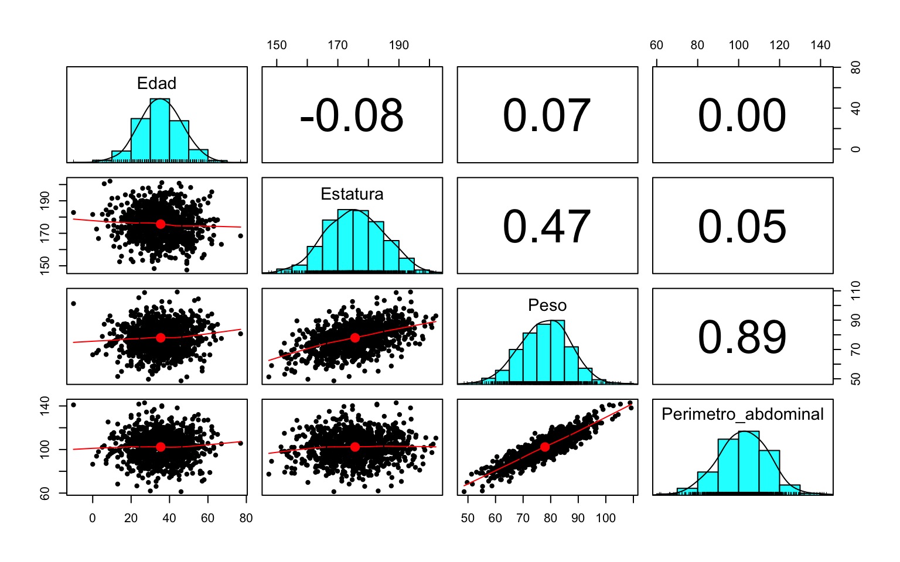

También se puede observar que los datos resemblan realizaciones de una distribución normal bivariada. Este gráfico cotiene información adicional del cojunto de datos. Para entender el gráfico, tenga en cuenta lo siguiente:

1.  Es un arreglo gráfico de dimensión 4x4, ya que estamos trabajando con 4 variables en simultáneo
2.  Los gráficos por debajo de la diagonal principal son gráficos de dispersión que muestran el 1 a 1 de los individuos en nuestra base de datos, y permite encontrar estructuras de correlación dos a dos dentro de las variables
3.  En la diagonal principal se encuentran los histogramas de frecuencia y las densidades estimadas de las variables en estudio.
4.  Los valores por encima de la diagonal principal, hacen referencia al valor de la correlación lineal de pearson entre las variables, y los “\*” que los acompañan refieren a la significancia de una prueba de hipótesis sobre este estadístico.

Finalmente revisamos la distribución conjunta de los datos, que nuevamente soporta el supuesto de normalidad en los mismos Para dos variables en particular (edad y peso), se muestran a continuación los gráficos de densidad. Primero el **gráfico de contorno** para visualizar las características tridimiensionales a graficar en dos dimensiones:

``` r
p2 <- ggplot(X, aes(x = Edad, y = Peso)) +
  geom_point(alpha = .5) +
  geom_density_2d()

p2
```

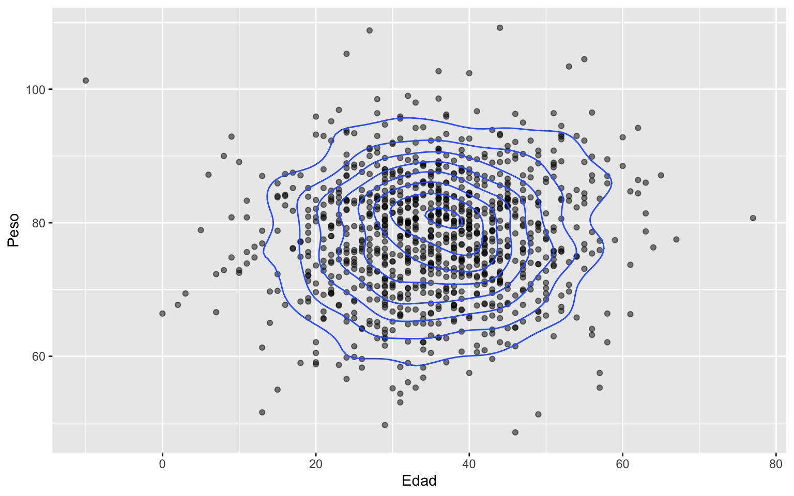

Se evidencia en este una gran concentración de puntos cerca a (35,80); sin correlación lineal aparente.

</div>

<div id="densidad-multivariada-p2" class="section level2">

## Densidad multivariada (<span class="math inline">\\p=2\\</span>)

Ahora, esta visualización se puede realizar directamente en el espacio tridimensional:

``` r
library(MASS)
library(plotly)
dens <- kde2d(X$Perimetro_abdominal, X$Peso)

plot_ly(x = dens$x,
        y = dens$y,
        z = dens$z) %>% add_surface()
```

<div id="htmlwidget-b3d4079649fe97e2fd0a" class="plotly html-widget html-fill-item" style="width:768px;height:480px;">

</div>

El gráfico que presenta de forma bivariada el peso y el perímetro abdominal parece que proviene de una distribución normal multivariada, centrada en el vector <span class="math inline">\\(102,79)\\</span> y su particular forma de campana son indicios de este hecho. Esta primera aproximación a la distribución multivariada **no prueba de que los datos provengan de esta distribución**, pues solamente hemos visualizado características de la densidad de manera univariada y bivariada. Pueden consultar más métodos gráficos de distribuciones multivariadas en (Everitt & Hothorn, 2011).

</div>

</div>

<div id="conclusiones" class="section level1">

# Conclusiones

- En este notebook hemos dado los principios básicos de la estadística multivariada, atendiendo de forma efectiva las principales fórmulas que rigen este conjunto de herramientas.

- Dimos claridad al concepto de parámetro, estadístico, estimación, muestra y población.

- Recreamos los cálculos de algunos estadísticos de forma manual, todo para aterrizar los conceptos que rodean a la estadística multivariada.

- Se dieron algunas herramientas de visualización y la primer aproximación a las distribuciones multivariadas, como caso particular a la distirbución normal multivariada.

</div>

<div id="anexos" class="section level1">

# Anexos

<div id="cálculo-manual-del-vector-de-medias-y-la-matriz-de-varianzas-y-covarianzas" class="section level2">

## Cálculo manual del vector de medias y la matriz de varianzas y covarianzas

Para los datos, el vector de medias se calcula de manera manual como sigue:

``` r
n = nrow(X)
p = ncol(X)
x_mean = c()
nombres_columnas = colnames(X)
for (i in nombres_columnas){
  prom <- mean(X[[i]])
  x_mean <- c(x_mean,prom)
  print(paste0("El promedio de la variable ", i , " es ",prom))
}
```

    ## [1] "El promedio de la variable Edad es 35.402"
    ## [1] "El promedio de la variable Estatura es 175.6458"
    ## [1] "El promedio de la variable Peso es 77.9449"
    ## [1] "El promedio de la variable Perimetro_abdominal es 102.3585"

``` r
names(x_mean) = nombres_columnas
print(x_mean)
```

    ##                Edad            Estatura                Peso Perimetro_abdominal 
    ##             35.4020            175.6458             77.9449            102.3585

------------------------------------------------------------------------

De manera complementaria, se presenta el cálculo de la matriz de varianzas y covarianzas:

``` r
S = matrix(NA, nrow=4, ncol=4)

for (j in 1:4){
  var_j = nombres_columnas[j]
  for (k in 1:4){
    var_k = nombres_columnas[k]
    sjk   = 1/(n-1)*sum((X[[var_j]]-x_mean[var_j])*(X[[var_k]]-x_mean[var_k]))
    S[j,k] <- sjk
  }
}

print(S)
```

    ##             [,1]      [,2]      [,3]        [,4]
    ## [1,] 121.3717678 -8.497910  6.681031   0.3585415
    ## [2,]  -8.4979095 87.880963 39.900554   5.7127535
    ## [3,]   6.6810312 39.900554 81.530665  98.9103237
    ## [4,]   0.3585415  5.712753 98.910324 150.3589867

Se destaca que esto no es necesario, y su propósito es meramente pedagógico. R tiene funciones espacializadas para estos cálculos, como lo vimos anteriormente.

</div>

<div id="propiedades-de-la-distribución-normal-multivariada" class="section level2">

## Propiedades de la distribución normal multivariada

A continuación se resaltan las dos propiedades de mayor relevancia en el estudio de la distirbución normal multivariada. Para el entendimientos de las otras propiedades de esta distribución, así como el desarrollo de las mismas, se puede consultar en el libro de Díaz Monroy & Morales Rivera (2012).

1.  *Linealidad.* Si <span class="math inline">\\X\\</span> es un vector aleatorio p-dimensional distribuido normalmente, con vector de medias <span class="math inline">\\\mu\\</span> y matriz de varianzas y covarianzas <span class="math inline">\\\Sigma\\</span>, entonces el vector <span class="math inline">\\Y = AX +b\\</span>, con <span class="math inline">\\A\\</span> una matriz de tamaño <span class="math inline">\\(q × p)\\</span> y <span class="math inline">\\b\\</span> un vector de tamaño <span class="math inline">\\(q × 1)\\</span>, tiene distribución normal q-variante, con vector de medias <span class="math inline">\\A\mu + b\\</span> y matriz de varianzas y covarianzas <span class="math inline">\\A\Sigma A^t\\</span>. En símbolos, si <span class="math inline">\\\vec{X} \sim N_p (\mu,\Sigma)\\</span> entonces <span class="math inline">\\\vec{Y} = (AX + b) ∼ N_q(A\mu + b; A\Sigma A^t)\\</span>.

2.  *Estandarización.* Sea <span class="math inline">\\X\\</span> un vector aleatorio p-dimensional distribuido normalmente con vector de medias <span class="math inline">\\\mu\\</span> y matriz de varianzas y covarianzas <span class="math inline">\\\Sigma\\</span>. Si <span class="math inline">\\\Sigma\\</span> es una matriz no singular entonces: <span class="math display">\\\vec{Z} = \Sigma^{−1/2} (\vec{X} − \vec{\mu})\\</span> tiene distribución normal p-variante con vector de medias cero y matriz de varianzas y covarianzas la identidad <span class="math inline">\\I_p\\</span>, donde <span class="math inline">\\\Sigma^{−1/2} = (\Sigma^{−1})^{1/2}\\</span>. De marera simbólica, si <span class="math inline">\\\vec{X} \sim N_p (\mu,\Sigma)\\</span>, entonces, <span class="math inline">\\Z = Σ^{−1/2}(X − \mu) ∼ N_p (0, I_p)\\</span>. Recuerde que esto es equivalente al caso univariado (<span class="math inline">\\p = 1\\</span>), pues si <span class="math inline">\\X ∼ N(\mu, \sigma^2)\\</span>, entonces, <span class="math inline">\\Z =\dfrac{Z − \mu}{\sigma}\sim N(0, 1).\\</span>

</div>

<div id="visualización-de-datos-simulados" class="section level2">

## Visualización de datos simulados

Al cambiar la estructura de correlación mediante la modificación de los parámetros varianza y covarianza, podemos visualizar datos observados mediante múltiples combinaciones de parámetros para la distribución normal multivariada:

``` r
library(mvtnorm)
my_mu1 <- c(0, 0)                                   # Vector de medias

for (i in c(-0.9,-0.5,0,0.3,0.9)){
  my_n1 <- 1000                                     # Tamaño muestral
  my_Sigma1 <- matrix(c(1, i, i, 1),ncol = 2)       # Matriz de varianzas y covarianzas
                    
  M_norm <- mvrnorm(n = my_n1, mu = my_mu1, Sigma = my_Sigma1) 
  
  pairs.panels(M_norm,
             scale = FALSE,      # If TRUE, scales the correlation text font
             density = TRUE,     # If TRUE, adds density plots and histograms
             method = "pearson", # Correlation method (also "spearman" or "kendall")
             cor = TRUE,         # If TRUE, reports correlations
             jiggle = FALSE)     # If TRUE, data points are jittered
}
```

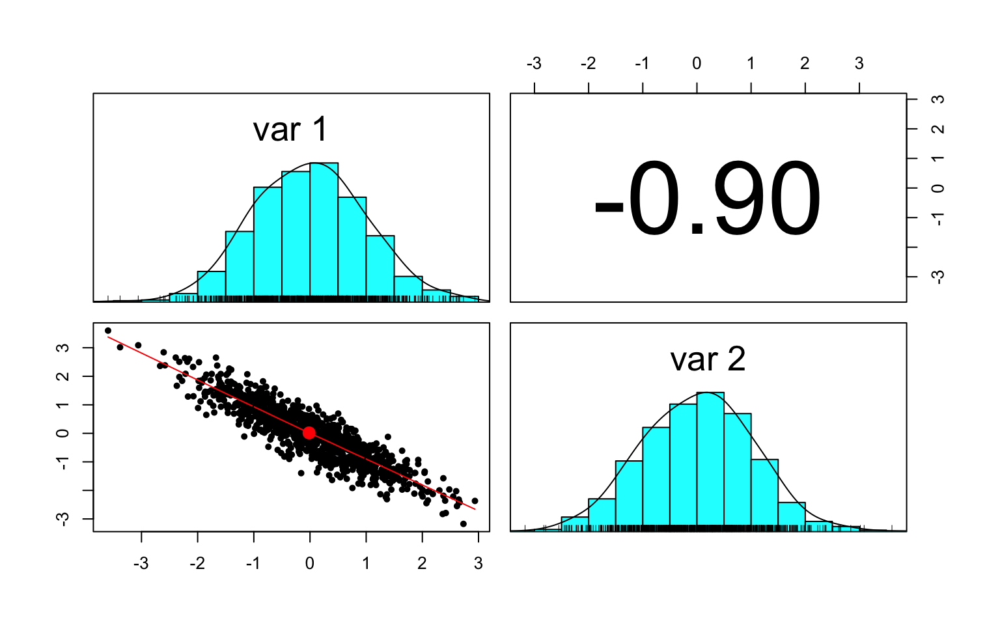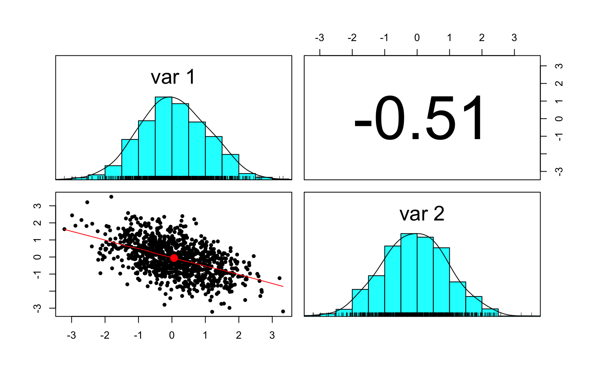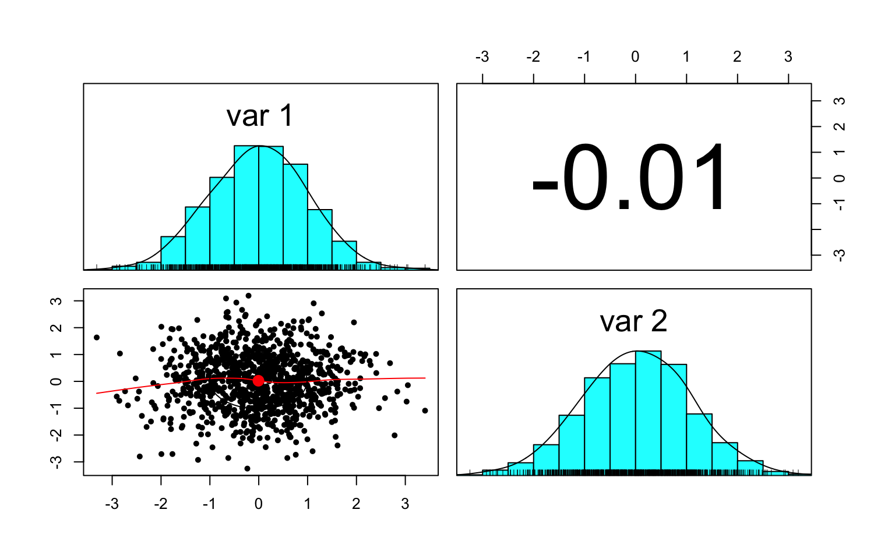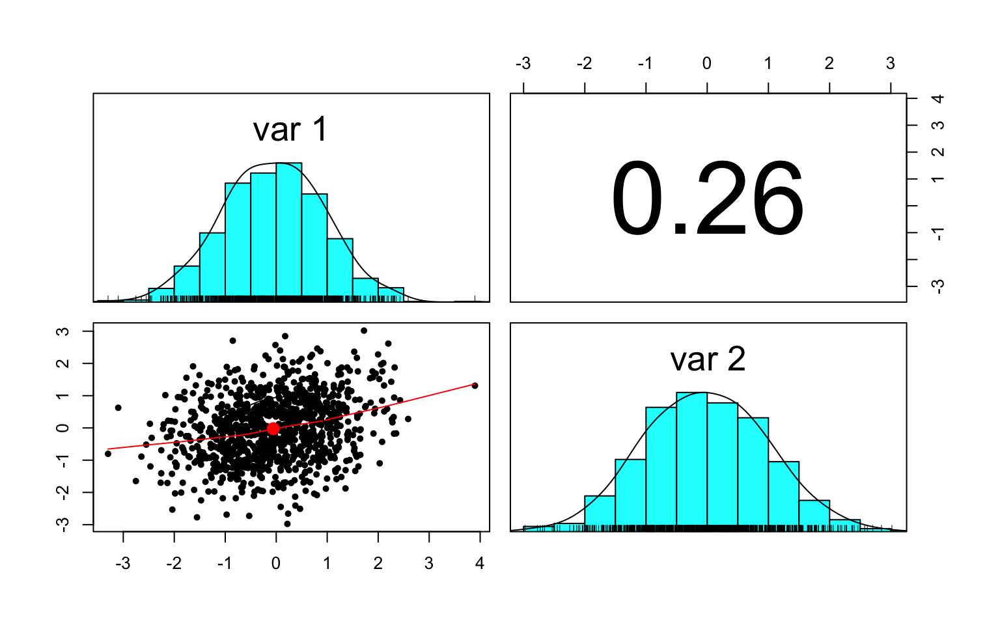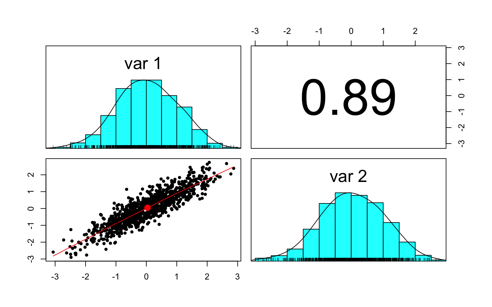

En este caso, los datos simulados claramente evidencian una distribución normal de manera bivariada.

</div>

</div>

<div id="bibliografía" class="section level1">

# Bibliografía

1.  Díaz Monroy, L. G., & Morales Rivera, M. A. (2012, septiembre). Análisis estadístico de datos multivariados. Coordinación de Publicaciones, Facultad de Ciencias. <http://ciencias.bogota.unal.edu.co/fileadmin/Facultad_de_Ciencias/Publicaciones/Imagenes/Portadas_Libros/Estadistica/Estadistica_Multivariada_Inferencia_y_Metodos/Estadistica_multivariada_inf>..pdf

2.  Everitt, B., & Hothorn, T. (2011). An Introduction to Applied Multivariate Analysis with R (1.a ed.). Springer. <https://www.webpages.uidaho.edu/~stevel/519/An%20Intro%20to%20Applied%20Multi%20Stat%20with%20R%20by%20Everitt%20et%20al.pdf>

3.  Blanco Castañeda, L. (2013). Probabilidad. Editorial UN.

4.  Mood, A. M. (1950). Introduction to the Theory of Statistics.

</div>

</div>
