# Análisis Estadístico de Datos

<span class="glyphicon glyphicon-user"></span> Profesor: Nicolás López

<div class="page-content has-page-title">

<div id="dependencias" class="section level1">

# Dependencias

Para la ejecución de este cuaderno, debe instalar con anterioridad los siguientes paquetes desde la consola de R o usando el menú Tools\>Install Packages en RStudio:

- `install.packages("tidyverse")`
- `install.packages("ggfortify")`
- `install.packages("corrplot")`
- `install.packages("gridExtra")`
- `install.packages("ggplot2")`
- `install.packages("ggrepel")`
- `install.packages("factoextra")`

------------------------------------------------------------------------

</div>

<div id="objetivo-y-alcance" class="section level1">

# Objetivo y Alcance

**Objetivo** Explicar el uso de la técnica de Análisis de Componentes principales ACP (PCA en inglés) aplicada a un conjunto de datos, iniciando con un ejemplo y posteriormente incluyendo aspectos relevantes de la teoría detrás de este método.

**Alcance**: Este cuaderno busca combinar la teoría de manera general con ejercicios prácticos que permitan el entendimiento de esta técnica.

</div>

<div id="contexto-general-de-acp" class="section level1">

# Contexto General de ACP

<div id="motivación" class="section level2">

## Motivación

Al analizar observaciones para dos variables de tipo cuantitativo, podemos observar de manera conjunta sus características de manera simple al realizar un diagrama de dispersión. Las parejas ordenadas son ubicadas en el plano y con esto podemos entender características de los datos: tales como la centralidad, dispersión y correlación entre estos. Incluso, podemos determinar si las características de los datos observados siguen un modelo probabilístico, como la distribución normal bivariada vista anteriormente. Al contar con más de dos variables por individuo, se dificulta analizar visualmente las características de los datos, sin embargo, en este espacio de mayor dimensión, también existen características de tendencia, dispersión, correlación, entre las UE ¿cómo podemos observar estos datos que viven en un espacio que no podemos visualizar?. Como motivación, observe la figura de abajo, la cual es tomada de la animación web disponible [aquí](https://www.viral3d.com/V3D/this_is_truth/v1/).

<div id="id" class="float">

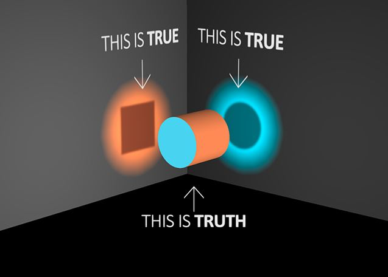

<div class="figcaption">

Grafica de motivación - ACP

</div>

</div>

Puede verse que la gran verdad (o *truth*) es una sola, y en este caso es representada por un cilindro en tres dimensiones. La perspectiva desde donde se mire dicha gran verdad puede llevar a diferentes verdades parciales (o *trues*), las cuales son las figuras proyectadas: cuadrada y circular. Note que pueden haber múltiples verdades parciales (visite la página web destacada arriba), pero se reflejan solamente las dos más informativas. Ambas son ciertas aunque sean diferentes, varían respecto a la perspectiva desde la cual se vea la gran verdad. **Estas figuras permiten entender la gran verdad a partir de verdades más simples**. Volviendo al escenario multivariado de datos, la gran verdad de los datos se encuentra en un espacio de gran dimensión, ya no es un cilindro tridimensional, son puntos en un espacio de dimensión <span class="math inline">\\p\\</span> (donde <span class="math inline">\\p\\</span> representa el número de variables, usualmente mayor a 2). Al ver los datos desde abstracciones simples e informativas, podremos acercarnos de manera aproximada a su representación multivariada, y este es el objetivo del ACP.

</div>

<div id="qué-es-el-acp" class="section level2">

## ¿Qué es el ACP?

El ACP es una técnica estadística que nos permite resumir y visualizar la información en un conjunto de datos que contiene UE descritas por múltiples variables cuantitativas. El ACP se utiliza para extraer la información importante de una tabla de datos multivariada y para expresar esta información como un conjunto de pocas variables nuevas llamadas componentes principales (CP, de Componentes Principales). Estas nuevas variables corresponden a una combinación lineal de las originales. El número de componentes principales es menor o igual al número de variables originales.

- Cada variable podría considerarse como una dimensión diferente. Si tiene más de 3 variables en sus conjuntos de datos, podría ser muy difícil visualizar un espacio multidimensional.

- La información en un conjunto de datos dado corresponde a la variación total que contiene. El objetivo de PCA es identificar direcciones (o componentes principales) a lo largo de las cuales la variación en los datos es máxima.

- En otras palabras, el ACP reduce la dimensionalidad de los datos multivariados a dos o tres componentes principales, que se pueden visualizar gráficamente, con una mínima pérdida de información.

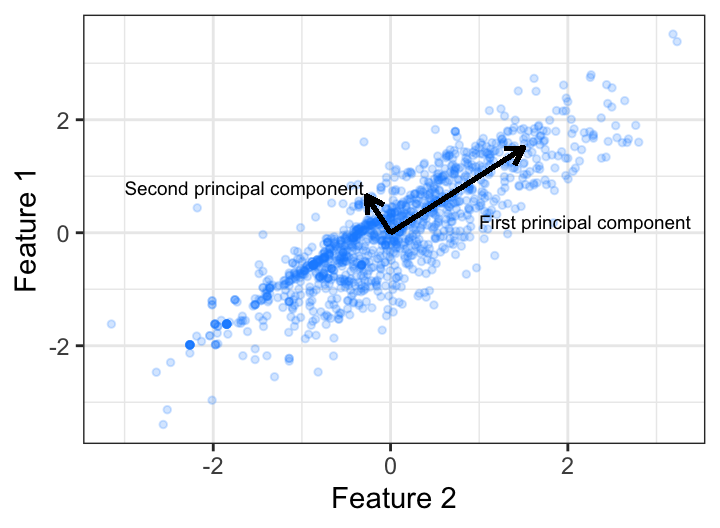 Fuente: <https://bradleyboehmke.github.io/HOML/pca.html>

El primer componente principal tiene la mayor variabilidad. El segundo componente tiene la máxima variabilidad entre todas las combinaciones lineales que son ortogonales al primero. El tercer componente principal es ortogonal tanto al primero como al segundo, y así sucesivamente para otros componentes. En otras palabras, el análisis de componentes principales reduce una gran cantidad de variables a una cantidad relativamente pequeña de combinaciones lineales de estas que pueden usarse para explicar gran parte de la variabilidad en los datos. Las variables con la mayor varianza típicamente dominarán el análisis.

</div>

<div id="cómo-se-obtienen-los-cp" class="section level2">

## ¿Cómo se obtienen los CP?

<div id="datos-de-ejemplo" class="section level3">

### Datos de ejemplo

Para motivar los conceptos, se utilizará un conjunto de datos multivariado con mas de tres variables: los datos de vehiculos (mtcars) incorporados en R por defecto. Estos datos describen 32 modelos de automóviles, tomados de una revista de automovilismo estadounidense (revista Motor Trend de 1974). Para cada modelo de automóvil, se tienen 11 variables, las cuales son:

<span class="math display">\\\begin{array}{\|l\|l\|} \hline \text{Variable} & \text{Descripción} \\ \hline mpg & \text{Consumo de combustible (millas por galón EE.UU.)} \\ cyl & \text{Número de cilindros} \\ disp & \text{Desplazamiento (cu.in.) el volumen combinado de los cilindros del motor} \\ hp & \text{Potencia bruta} \\ drat& \text{Relación del eje trasero: esto describe cómo un giro del eje de transmisión corresponde a un giro de las ruedas}\\ wt& \text{Peso (1000 lbs)}\\ qsec & \text{Tiempo de 1/4 de milla: la velocidad y aceleración de los autos } \\ vs & \text{Bloque del motor: esto indica si el motor del vehículo tiene forma de "V" o si es una forma recta más común} \\ am & \text{Transmisión: indica si la transmisión del automóvil es automática (0) o manual (1).} \\ marcha & \text{Número de marchas hacia adelante} \\ carb & \text{Número de carburadores} \\ \hline \end{array}\\</span>

Es importante señalar que las unidades utilizadas en las variables varían y ocupan diferentes escalas.

</div>

<div id="evidenciando-el-problema-multivariado" class="section level3">

### Evidenciando el problema multivariado

Si contáramos con una sola variable, podríamos fácilmente visualizarla en en una línea recta:

``` r
mtcars$car = rownames(mtcars)
gg1 = ggplot(mtcars,aes(x=mpg,
                        y=rep(0,nrow(mtcars)),
                        label=car)) + 
      geom_point() + 
      xlab('Millas por galón (rendimiento)') + 
      ylab('') + 
      geom_text_repel(max.overlaps = Inf,
                      size         = 2,
                      box.padding  = 1.5)

gg1
```

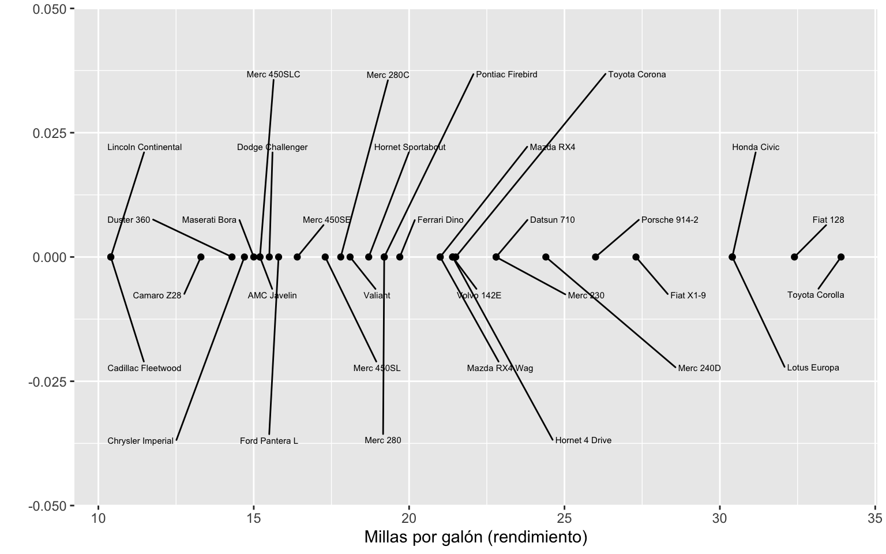

Los carros Fiat 128 y Toyota Corolla son los que rinden una mayor cantidad de millas por galón, es decir, son de mayor rendimiento de gasolina. Mientras que Lincoln Continental y Cadillac Fleetwood consumen mucho mas: al tener menor cantidad de millas por galón tienen un menor rendimiento de gasolina. En esta variable, Fiat 128 y Toyota Corolla son similares, y a su vez, diferentes a Lincoln Continental y Cadillac Fleetwood.

Si medimos dos variables:

``` r
gg2 = ggplot(mtcars,aes(x=mpg,
                        y=wt,
                        label=car)) + 
      geom_point() + 
      xlab('Millas por galón (rendimiento)') + 
      ylab('Peso') + 
      geom_text_repel(max.overlaps = Inf,
                      size         = 2,
                      box.padding  = 0)

gg2
```

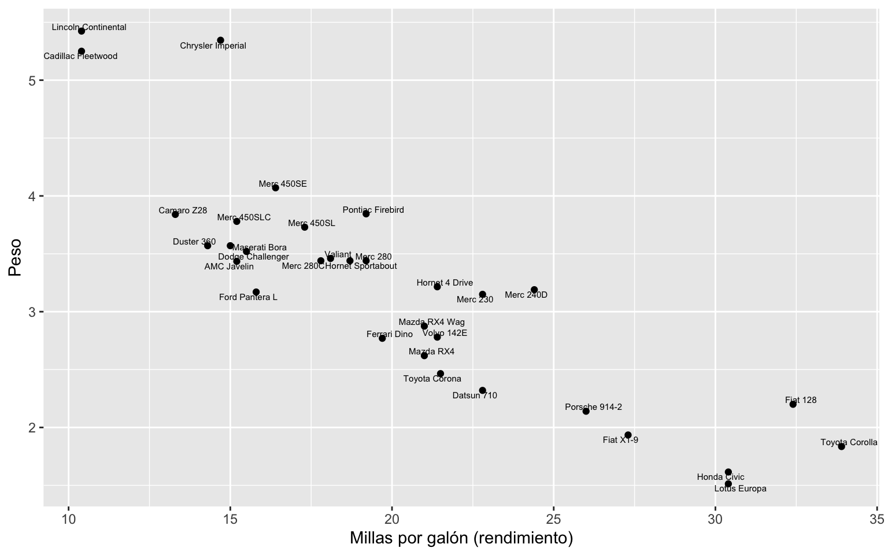

Este par de parejas siguen siendo similares dentro de ellas pero diferentes entre ellas: Fiat 128 y Toyota Corolla son los livianos de mayor rendimiento, mientras que Lincoln Continental y Cadillac Fleetwood son vehículos pesados de alto consumo. Si midiéramos una tercera variable, podríamos *cruzarla* con las dos variables anteriores y visualizar nuevas posibles agrupaciones:

``` r
gg3 = ggplot(mtcars,aes(x=mpg,
                        y=hp,
                        label=car)) + 
      geom_point() + 
      xlab('Millas por galón (rendimiento)') + 
      ylab('Potencia') + 
      geom_text_repel(max.overlaps = Inf,
                      size         = 2,
                      box.padding  = 0)

gg4 = ggplot(mtcars,aes(x=wt,
                        y=hp,
                        label=car)) + 
      geom_point() + 
      xlab('Peso') + 
      ylab('Potencia') + 
      geom_text_repel(max.overlaps = Inf,
                      size         = 2,
                      box.padding  = 0)

grid.arrange(gg3,gg4, ncol=2)
```

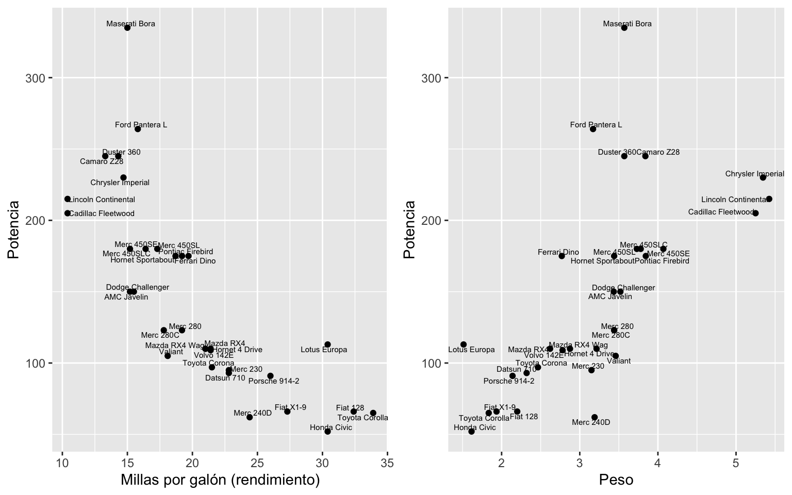

Ahora, Fiat 128 y Toyota Corolla, los livianos de mayor rendimiento, tienen menor potencia. Mientras que el Lincoln Continental el y Cadillac Fleetwood, los pesados de bajo consumo tienen una alta potencia. Es claro que las variables presentan asociaciones interesantes, y esta proyección en dos dimensiones puede resultar informativa para este análisis. Sin embargo, es tedioso e ineficiente observar todas las posibles parejas de gráficos de dispersión.

</div>

</div>

<div id="cálculo-de-los-ejes.-ejemplo-básico" class="section level2">

## Cálculo de los ejes. Ejemplo básico

Pensando unicamente en la relación entre consumo y peso, transformemos los datos de manera conveniente para el análisis: vamos a centrarlos respecto al promedio:

``` r
gg2c = ggplot(mtcars %>% mutate(mpg_c = mpg - mean(mpg),
                                wt_c  = wt  - mean(wt)),
              aes(x=mpg_c,
                  y=wt_c,
                  label=car)) + 
       geom_point() + 
       xlab('Millas por galón (rendimiento) centrado') + 
       ylab('Peso centrado') + 
       geom_text_repel(max.overlaps = Inf,
                      size          = 2,
                      box.padding   = 0)

grid.arrange(gg2,gg2c, ncol=2)
```

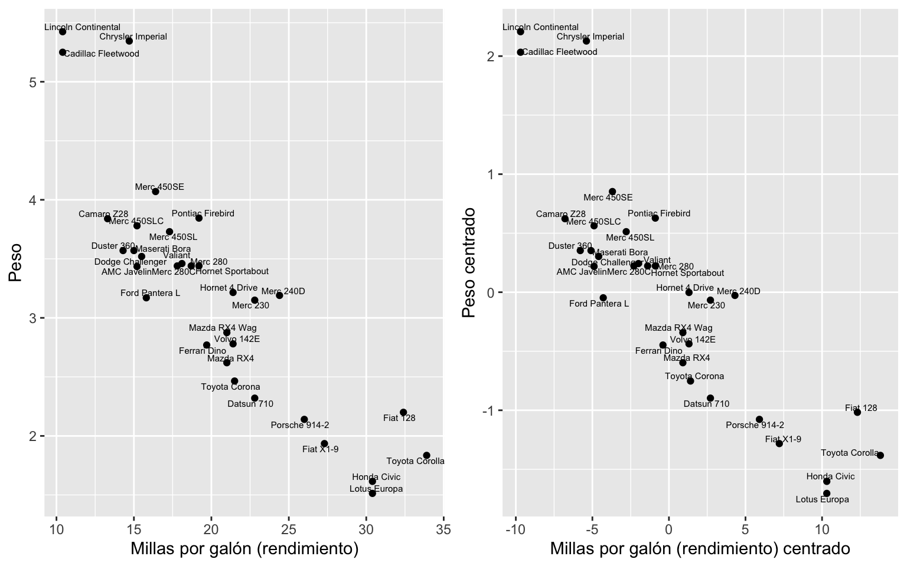

Ahora, vamos a añadir al gráfico centrado una línea a través del origen. Esta línea se va a rotar hasta encontrar aquella que se ajuste lo mejor posible a los datos:

``` r
gg2cl = gg2c
for(i in c(-1,-0.5,-0.1,0.1,0.5,1)){
  if(i==-0.1){
    gg2cl = gg2cl + geom_abline(intercept=0,slope=i,
                   linetype="dashed", linewidth=0.5,col='red')
  }else{
    gg2cl = gg2cl + geom_abline(intercept=0,slope=i,
                   linetype="dashed", linewidth=0.5,col='blue')
  }
}
gg2cl
```

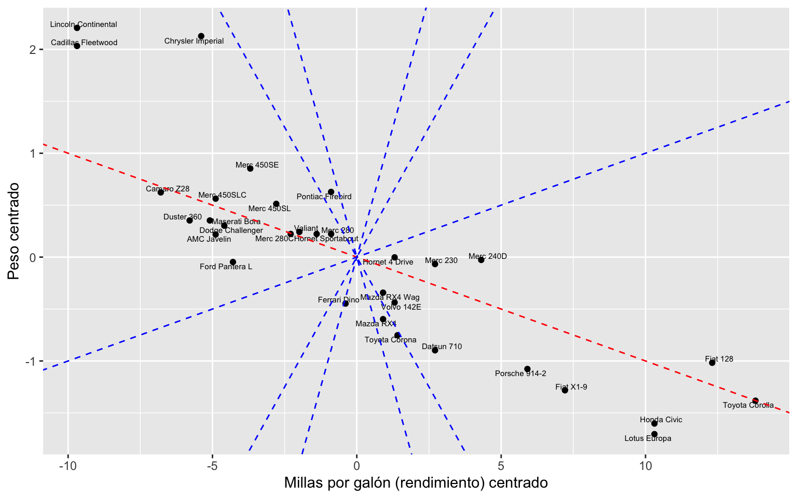

En rojo observamos la línea que más se acerca a los datos. Pero, ¿que significa exactamente que sea la más “cercana”?. En este caso, representa la línea que:

- Minimiza las distancias2 de cada punto a su proyección. O, de manera equivalente:
- Maximiza las distancias2 de cada proyección al origen (llamada suma de distancias proyectadas al cuadrado)

Estas son equivalentes, pues la distancia del punto al origen se mantiene constante bajo cualquier línea (recordar el teorema de Pitágoras). La línea roja corresponde al primer eje principal, y este eje, como vemos en la elaboración del gráfico, tiene una pendiente igual a -0.1 = -1/10: es decir, para CP1, cada aumento en 10 unidades de rendimiento (centrado), disminuye una unidad de peso (centrado) con lo cual los datos están bastante más dispersos sobre el eje de rendimiento Es decir, la variable rendimiento es más importante que el peso para describir la variabilidad del conjunto de datos.

Notas importantes:

- Podemos caracterizar la línea roja (es decir, el CP1) mediante cualquier *vector* que pase sobre ella. Por ejemplo, el vector <span class="math inline">\\v_1=(1,-0.1)\\</span>, ó, <span class="math inline">\\v_2=(10,-1)\\</span>, cualquiera sirve. En particular, el vector <span class="math inline">\\u_1\\</span> de longitud 1 da el vector de pesos o cargas de las variables y es llamado el vector propio de CP1.

- La suma de distancias proyectadas al cuadrado da una medida de qué tanta información captura el CP1. Entre mayor sea, más variabilidad captura el eje. Este valor es llamado el valor propio de CP1, y su raíz cuadrada es el valor singular del CP1.

- Además de centrados, los datos deben ser escalados para que la variabilidad inherente de las variables no *arrastre* los ejes. En este caso, puede verse que la variabilidad del rendimiento es mayor, y probablemente esto haga que dicha variable sea más importante.

El CP2 es aquel que mejor complementa la información que deja fuera el CP1. Es decir, aquél que maximiza la suma de distancias2 de cada proyección al origen, y además es ortogonal a CP1. En este ejercicio el resultado de CP2 es inmediato al estar ubicados en dos dimensiones, pero es claro que cuando se cuenta con más dimensiones, este segundo eje presentará información complementaria y no vista por el primero (volviendo al ejemplo de motivación, este segundo eje da una segunda verdad de los datos).

- A medida que hay más variables, el vector propio de CP1 (y de los demás), tendrá una mayor dimensión, igual al número de variables.

</div>

<div id="resumen" class="section level2">

## Resumen

- El análisis de componentes principales reduce una gran cantidad de variables multivariadas a una cantidad relativamente pequeña de combinaciones lineales de estas que pueden usarse para explicar gran parte de la variabilidad en los datos. Las variables con la mayor varianza típicamente dominarán el análisis.

- Luego del cálculo de los componentes principales se pueden utilizar estos como insumo para realizar análisis posteriores con una dimesionalidad menor.

- Si bien no es un método de agrupamiento, van a existir relaciones mas fuertes entre unas variables y un componente principal particular. Esto facilitara su interpretación en donde el primer componente principal tiene la mayor variabilidad. El segundo componente tiene la máxima variabilidad entre todas las combinaciones lineales que son ortogonales al primero. El tercer componente principal es ortogonal tanto al primero como al segundo, y así sucesivamente para otros componentes.

</div>

<div id="funciones-en-r-para-acp" class="section level2">

## Funciones en R para ACP

Hay múltiples métodos para realizar PCA en R, como las funciones princomp() y prcomp(). Se prefiere la función prcomp() sobre princomp() por precisión numérica, pero se usarán ambas en este cuaderno (ver anexo con detalles del cálculo mediante princomp()). Para ambas funciones existen salidas útiles que permiten utilizar los siguientes elementos para complementar el análisis:

<span class="math display">\\\begin{array}{\|c\|c\|l\|} \hline \text{prcomp()} & \text{princomp()} & Descripción \\ \hline sdev & sdev & \text{Desviaciones estándar de los componentes principales} \\ rotation & loadings & \text{La matriz de cargas variables (las columnas son vectores propios)} \\ center & center & \text{Las media de las variables (medias que se restaron)} \\ scale & scale & \text{Desviaciones estándar de las variables (el escalamiento aplicado a cada variable )} \\ x & scores & \text{Las coordenadas de los individuos (observaciones transformadas) sobre los componentes principales} \\ \hline \end{array}\\</span>

</div>

</div>

<div id="exploremos-un-poco-más-estos-datos" class="section level1">

# Exploremos un poco más estos datos

Por las definiciones de cada variable, ¿cuáles variables son cuantitativas y cuáles no? Es importante antes de realizar cualquier análisis tener claridad sobre los tipos de variables que están presentes en el conjunto de datos. La razón, no todos los métodos se pueden aplicar indistintamente en todas las variables.

``` r
head(mtcars)
```

    ##                    mpg cyl disp  hp drat    wt  qsec vs am gear carb
    ## Mazda RX4         21.0   6  160 110 3.90 2.620 16.46  0  1    4    4
    ## Mazda RX4 Wag     21.0   6  160 110 3.90 2.875 17.02  0  1    4    4
    ## Datsun 710        22.8   4  108  93 3.85 2.320 18.61  1  1    4    1
    ## Hornet 4 Drive    21.4   6  258 110 3.08 3.215 19.44  1  0    3    1
    ## Hornet Sportabout 18.7   8  360 175 3.15 3.440 17.02  0  0    3    2
    ## Valiant           18.1   6  225 105 2.76 3.460 20.22  1  0    3    1
    ##                                 car
    ## Mazda RX4                 Mazda RX4
    ## Mazda RX4 Wag         Mazda RX4 Wag
    ## Datsun 710               Datsun 710
    ## Hornet 4 Drive       Hornet 4 Drive
    ## Hornet Sportabout Hornet Sportabout
    ## Valiant                     Valiant

De esta misma forma es útil calcular algunas estadísticas básicas y de esta forma ver su comportamiento a nivel univariado. Si el método requiere que todas las variables sean **cuantitativas** entonces, ¿tendrá sentido incluir las variables “vs” y “am”? La respuesta es no, Al no tener una estructura ordinal no existe la posibilidad de establecer asociaciones lineales con las demás variables

**R tip** Existen múltiples acercamientos para descartar variables en R de un conjunto dado de datos. Hemos aprendido a realizarlo mediante tibble usando ´select(-c(variables_a_excluír))´, sin embargo, es posible lograrlo usando r base. Esto se puede hacer de al menos dos formas diferentes:

- Tomar las columnas que se desean conservar mediante los numeros de las columnas en las que se encuentran ubicadas: ´mtcars\[,c(1:7,10,11)\]´.
- Indicar nombres de las variables que no se desean tener en cuenta y utilizar el operador de negación: **mtcars\[ , ! names(mtcars) %in% c(“vs”, “am”)\]**.

``` r
summary(mtcars)
```

    ##       mpg             cyl             disp             hp       
    ##  Min.   :10.40   Min.   :4.000   Min.   : 71.1   Min.   : 52.0  
    ##  1st Qu.:15.43   1st Qu.:4.000   1st Qu.:120.8   1st Qu.: 96.5  
    ##  Median :19.20   Median :6.000   Median :196.3   Median :123.0  
    ##  Mean   :20.09   Mean   :6.188   Mean   :230.7   Mean   :146.7  
    ##  3rd Qu.:22.80   3rd Qu.:8.000   3rd Qu.:326.0   3rd Qu.:180.0  
    ##  Max.   :33.90   Max.   :8.000   Max.   :472.0   Max.   :335.0  
    ##       drat             wt             qsec             vs        
    ##  Min.   :2.760   Min.   :1.513   Min.   :14.50   Min.   :0.0000  
    ##  1st Qu.:3.080   1st Qu.:2.581   1st Qu.:16.89   1st Qu.:0.0000  
    ##  Median :3.695   Median :3.325   Median :17.71   Median :0.0000  
    ##  Mean   :3.597   Mean   :3.217   Mean   :17.85   Mean   :0.4375  
    ##  3rd Qu.:3.920   3rd Qu.:3.610   3rd Qu.:18.90   3rd Qu.:1.0000  
    ##  Max.   :4.930   Max.   :5.424   Max.   :22.90   Max.   :1.0000  
    ##        am              gear            carb           car           
    ##  Min.   :0.0000   Min.   :3.000   Min.   :1.000   Length:32         
    ##  1st Qu.:0.0000   1st Qu.:3.000   1st Qu.:2.000   Class :character  
    ##  Median :0.0000   Median :4.000   Median :2.000   Mode  :character  
    ##  Mean   :0.4062   Mean   :3.688   Mean   :2.812                     
    ##  3rd Qu.:1.0000   3rd Qu.:4.000   3rd Qu.:4.000                     
    ##  Max.   :1.0000   Max.   :5.000   Max.   :8.000

Es útil revisar los boxplot para las variables cuantitativas

``` r
mynames<-c("mpg", "cyl", "disp", "hp", "drat","wt","qsec","gear","carb")

ncols <- length(mynames)

par(mfrow=c(3,3),cex=.9,oma=c(.1,.1,.1,.1))
for(i in 1:ncols){
  boxplot(mtcars[,i],horizontal = FALSE,
        main = mynames[i])

}
```

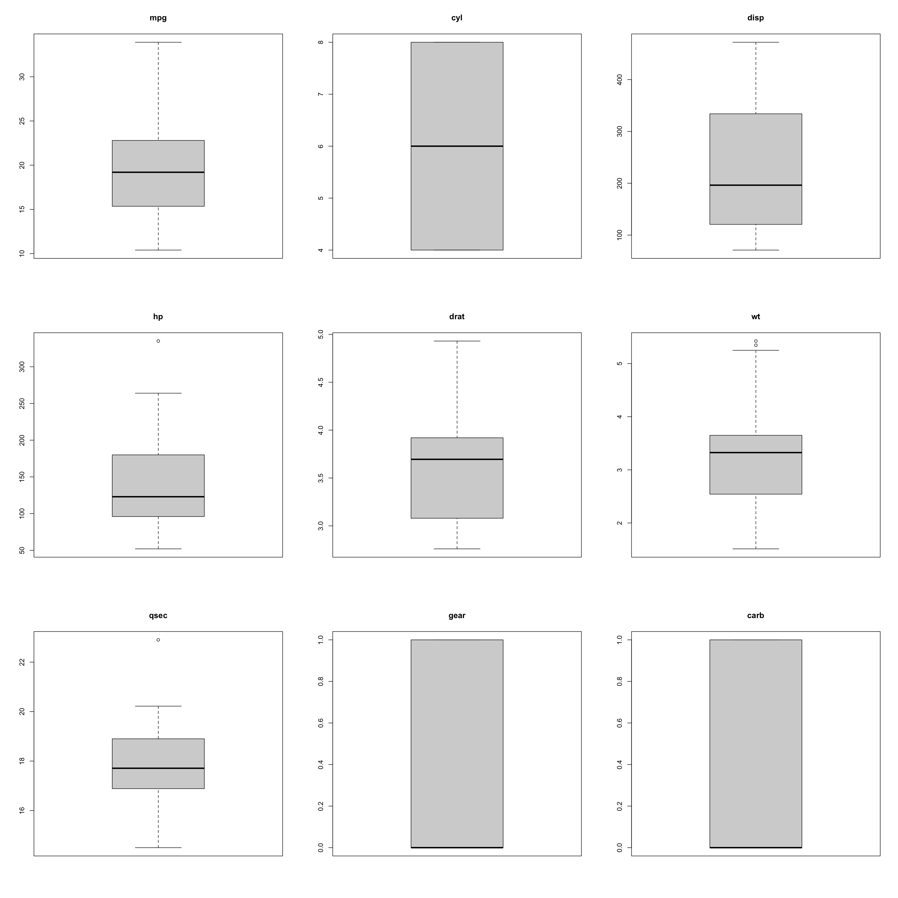

``` r
par(mfrow=c(1,1))
```

Una vez se revisan las variables individualmente es útil observarlas de manera bivariada La manera mas sencilla es observar las correlaciones entre las variables:

``` r
corrplot.mixed(cor(mtcars[ , ! names(mtcars) %in% c("vs", "am" , "car")]), order = 'AOE')
```

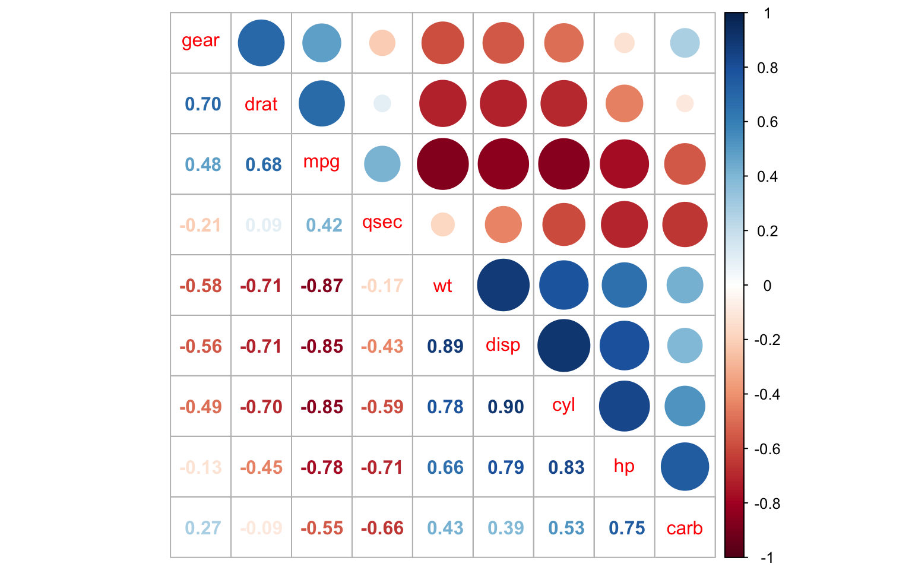

</div>

<div id="acp-en-acción" class="section level1">

# ACP en acción

<div id="objetivos" class="section level2">

## Objetivos

1.  *Reducción de dimensionalidad*: El análisis de componentes principales reduce una gran cantidad de variables multivariadas a una cantidad relativamente pequeña de combinaciones lineales de estas que pueden usarse para explicar gran parte de la variabilidad en los datos. Las variables con la mayor varianza típicamente dominarán el análisis.

2.  *Interpretabilidad del componente*: Si bien no es un método de agrupamiento, van a existir relaciones mas fuertes entre unas variables y un componente principal particular. Esto facilitara su interpretación.s

3.  *Comparar los individuos entre si*: Las gráficas que se obtienen permiten observar la estructura de la “nube de individuos” y detectar grupos de ellos.

</div>

<div id="calculo-de-las-componentes-principales" class="section level2">

## Calculo de las componentes Principales

Cada componente principal <span class="math inline">\\(Z_i)\\</span> se obtiene por combinación lineal de las variables originales. Se pueden entender como nuevas variables obtenidas al combinar de una determinada forma las variables originales. La primera componente principal de un grupo de variables <span class="math inline">\\(X_1, X_2, \cdots, X_p)\\</span> es la combinación lineal normalizada de dichas variables que tiene mayor varianza. Con la función *prcomp*

``` r
mtcars2 <- mtcars %>% 
  dplyr::select(-c(vs,am,car))

pc_b <-prcomp(mtcars2)
pc_b
```

    ## Standard deviations (1, .., p=9):
    ## [1] 136.5322763  38.1473452   3.0664227   1.2749238   0.9047389   0.6473353
    ## [7]   0.3054162   0.2859218   0.2158806
    ## 
    ## Rotation (n x k) = (9 x 9):
    ##               PC1          PC2         PC3          PC4         PC5
    ## mpg  -0.038118360  0.009186679  0.98365680  0.040854772 -0.09376515
    ## cyl   0.012035198 -0.003372536 -0.06344057 -0.236548841  0.22554404
    ## disp  0.899573033  0.435385992  0.03123388 -0.005079093 -0.01053658
    ## hp    0.434787255 -0.899322036  0.02541113  0.035168110  0.01667875
    ## drat -0.002660085 -0.003900050  0.03953535 -0.057314901 -0.13086355
    ## wt    0.006239435  0.004860835 -0.08487901  0.133441861 -0.24405170
    ## qsec -0.006671307  0.025010854 -0.07050906  0.910589254 -0.20719280
    ## gear -0.002604770 -0.011272257  0.04811434 -0.130320795 -0.27275503
    ## carb  0.005766046 -0.027779493 -0.10353404 -0.271781001 -0.86367709
    ##               PC6           PC7           PC8          PC9
    ## mpg  -0.133111460 -0.0361602003 -2.292248e-02  0.029482354
    ## cyl  -0.822715264  0.4045222924  1.914389e-01  0.108839579
    ## disp  0.007340014  0.0009963135  6.285318e-04 -0.006305575
    ## hp    0.001658475 -0.0026203774 -4.804737e-05  0.003098007
    ## drat  0.237708227  0.0334089045  9.408348e-01  0.187651070
    ## wt   -0.126208722 -0.2228246459 -1.633642e-01  0.907247320
    ## qsec -0.202621340  0.2172666165  1.036007e-01 -0.152523736
    ## gear  0.350400573  0.8450418392 -2.005106e-01  0.170562485
    ## carb -0.262858319 -0.1515876824 -5.449811e-03 -0.276712312

``` r
summary(pc_b)
```

    ## Importance of components:
    ##                            PC1      PC2     PC3     PC4     PC5     PC6    PC7
    ## Standard deviation     136.532 38.14735 3.06642 1.27492 0.90474 0.64734 0.3054
    ## Proportion of Variance   0.927  0.07237 0.00047 0.00008 0.00004 0.00002 0.0000
    ## Cumulative Proportion    0.927  0.99938 0.99985 0.99993 0.99997 0.99999 1.0000
    ##                           PC8    PC9
    ## Standard deviation     0.2859 0.2159
    ## Proportion of Variance 0.0000 0.0000
    ## Cumulative Proportion  1.0000 1.0000

</div>

<div id="escalamiento-de-las-variables" class="section level2">

## Escalamiento de las variables

El proceso de PCA identifica aquellas direcciones en las que la varianza es mayor. Como la varianza de una variable se mide en su misma escala elevada al cuadrado, si antes de calcular las componentes no se estandarizan todas las variables para que tengan media 0 y desviación estándar 1, aquellas variables cuya escala sea mayor dominarán al resto. De ahí que sea recomendable estandarizar siempre los datos.

``` r
pc_c <-prcomp(mtcars2, scale = TRUE)
pc_c
```

    ## Standard deviations (1, .., p=9):
    ## [1] 2.3782219 1.4429485 0.7100809 0.5148082 0.4279704 0.3518426 0.3241326
    ## [8] 0.2418962 0.1489644
    ## 
    ## Rotation (n x k) = (9 x 9):
    ##             PC1         PC2         PC3          PC4        PC5         PC6
    ## mpg  -0.3931477  0.02753861 -0.22119309 -0.006126378 -0.3207620  0.72015586
    ## cyl   0.4025537  0.01570975 -0.25231615  0.040700251  0.1171397  0.22432550
    ## disp  0.3973528 -0.08888469 -0.07825139  0.339493732 -0.4867849 -0.01967516
    ## hp    0.3670814  0.26941371 -0.01721159  0.068300993 -0.2947317  0.35394225
    ## drat -0.3118165  0.34165268  0.14995507  0.845658485  0.1619259 -0.01536794
    ## wt    0.3734771 -0.17194306  0.45373418  0.191260029 -0.1874822 -0.08377237
    ## qsec -0.2243508 -0.48404435  0.62812782 -0.030329127 -0.1482495  0.25752940
    ## gear -0.2094749  0.55078264  0.20658376 -0.282381831 -0.5624860 -0.32298239
    ## carb  0.2445807  0.48431310  0.46412069 -0.214492216  0.3997820  0.35706914
    ##              PC7         PC8         PC9
    ## mpg   0.38138068  0.12465987  0.11492862
    ## cyl   0.15893251 -0.81032177  0.16266295
    ## disp  0.18233095  0.06416707 -0.66190812
    ## hp   -0.69620751  0.16573993  0.25177306
    ## drat -0.04767957 -0.13505066  0.03809096
    ## wt    0.42777608  0.19839375  0.56918844
    ## qsec -0.27622581 -0.35613350 -0.16873731
    ## gear  0.08555707 -0.31636479  0.04719694
    ## carb  0.20604210  0.10832772 -0.32045892

``` r
summary(pc_c)
```

    ## Importance of components:
    ##                           PC1    PC2     PC3     PC4     PC5     PC6     PC7
    ## Standard deviation     2.3782 1.4429 0.71008 0.51481 0.42797 0.35184 0.32413
    ## Proportion of Variance 0.6284 0.2313 0.05602 0.02945 0.02035 0.01375 0.01167
    ## Cumulative Proportion  0.6284 0.8598 0.91581 0.94525 0.96560 0.97936 0.99103
    ##                           PC8     PC9
    ## Standard deviation     0.2419 0.14896
    ## Proportion of Variance 0.0065 0.00247
    ## Cumulative Proportion  0.9975 1.00000

</div>

<div id="influencia-de-outliers" class="section level2">

## Influencia de outliers

Al trabajar con varianzas, el método PCA es altamente sensible a outliers, por lo que es altamente recomendable estudiar si los hay. La detección de valores atípicos con respecto a una determinada dimensión es algo relativamente sencillo de hacer mediante comprobaciones gráficas. Sin embargo, cuando se trata con múltiples dimensiones el proceso se hace más difícil. La *distancia de Mahalanobis* es una medida de distancia entre un punto y la media que se ajusta en función de la correlación entre dimensiones y que permite encontrar potenciales outliers en distribuciones multivariante.

</div>

<div id="proporción-de-varianza-explicada" class="section level2">

## Proporción de varianza explicada

Como objetivo PCA busca reducir la dimensionalidad, por lo cual conviene contar con un número de componentes suficientes para explicar el conjunto de datos. No existe un método único que permita identificar cual es el número óptimo de componentes principales a utilizar. La forma mas común consiste en evaluar la proporción de varianza explicada acumulada y seleccionar el número de componentes mínimo a partir del cual el incremento deja de ser importante.

Este diagrama es una forma heuristica de determinar en que momento la ganancia de incluir un componente adicional no tiene un aporte grande a la varianza explicada de las componentes. Esto no es una prueba estadística que determine el número de componentes óptimos:

``` r
screeplot(pc_c, col = "red", pch = 16,
type = "lines", cex = 2, lwd = 2, main = "")
```

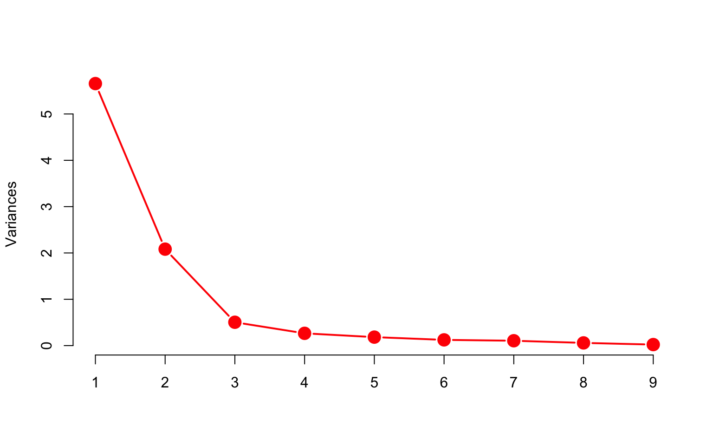

Según el gráfico de varianza explicada, en este PCA sería suficiente trabajar con 2 componentes principales, que explican el 86% de la variabilidad total.

</div>

<div id="resultados-finales" class="section level2">

## Resultados finales

A continuación se recalcula el PCA, pero esto no es necesario, ya que el resultado sobre los primeros 2 componentes es el mismo. Esto sirve para filtrar el resultado a los primeros dos componentes únicamente y para interpretar de manera clara los gráficos de la siguiente sección (**Uso de factoextra para la visualización**):

``` r
pc_f <-prcomp(mtcars2, scale = TRUE, rank. = 2)
pc_f
```

    ## Standard deviations (1, .., p=9):
    ## [1] 2.3782219 1.4429485 0.7100809 0.5148082 0.4279704 0.3518426 0.3241326
    ## [8] 0.2418962 0.1489644
    ## 
    ## Rotation (n x k) = (9 x 2):
    ##             PC1         PC2
    ## mpg  -0.3931477  0.02753861
    ## cyl   0.4025537  0.01570975
    ## disp  0.3973528 -0.08888469
    ## hp    0.3670814  0.26941371
    ## drat -0.3118165  0.34165268
    ## wt    0.3734771 -0.17194306
    ## qsec -0.2243508 -0.48404435
    ## gear -0.2094749  0.55078264
    ## carb  0.2445807  0.48431310

Podemos observar que, por ejemplo, la variable **mpg** está definida por las cargas <span class="math inline">\\(-0.393,0.027)\\</span>. Podemos además ver los puntajes sobre los dos primeros componentes para cada uno de los vehículos, redondeados a dos décimas

``` r
round(pc_f$x,2)
```

    ##                       PC1   PC2
    ## Mazda RX4           -0.66  1.17
    ## Mazda RX4 Wag       -0.64  0.98
    ## Datsun 710          -2.30 -0.33
    ## Hornet 4 Drive      -0.22 -1.98
    ## Hornet Sportabout    1.59 -0.83
    ## Valiant              0.05 -2.45
    ## Duster 360           2.71  0.36
    ## Merc 240D           -2.04 -0.80
    ## Merc 230            -2.30 -1.31
    ## Merc 280            -0.38  0.58
    ## Merc 280C           -0.37  0.41
    ## Merc 450SE           1.88 -0.72
    ## Merc 450SL           1.67 -0.71
    ## Merc 450SLC          1.78 -0.84
    ## Cadillac Fleetwood   3.65 -0.95
    ## Lincoln Continental  3.71 -0.84
    ## Chrysler Imperial    3.33 -0.48
    ## Fiat 128            -3.45 -0.43
    ## Honda Civic         -3.85  0.71
    ## Toyota Corolla      -3.85 -0.39
    ## Toyota Corona       -1.90 -1.57
    ## Dodge Challenger     1.80 -1.13
    ## AMC Javelin          1.46 -0.98
    ## Camaro Z28           2.60  0.76
    ## Pontiac Firebird     1.87 -0.98
    ## Fiat X1-9           -3.15 -0.26
    ## Porsche 914-2       -2.78  1.64
    ## Lotus Europa        -2.91  1.40
    ## Ford Pantera L       1.55  3.02
    ## Ferrari Dino         0.08  2.83
    ## Maserati Bora        2.96  4.00
    ## Volvo 142E          -1.90  0.11

Podemos observar que, por ejemplo, el vehículo **Maserati Bora** está definida por los puntajes <span class="math inline">\\(2.96,4.00)\\</span>.

</div>

<div id="uso-de-factoextra-para-la-visualización" class="section level2">

## Uso de factoextra para la visualización

Las funciones base vistas hasta ahora no permiten una inmediata visualización del análisis resultante de una manera informativa. Por tanto, existe un paquete complementario denominado **factoextra**. Este paquete permite realizar distintos gráficos de interés para el análisis. Las cargas pueden ser graficados de manera informativa mediante el gráfico de variables: cada variable es representada mediante una flecha, o vector, cuyo extremo está indicado por el vector de cargas en las dos nuevas dimensiones.

``` r
fviz_pca_var(pc_c)
```

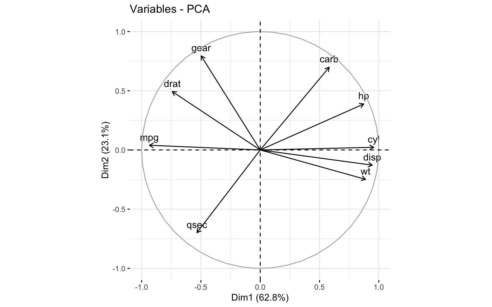

Notamos con esto que, entre más larga sea una flecha, la variable indicada tiene un vector de cargas de mayor magnitud absoluta. Recuerde que en la constitución de los CP, los vectores propios correspondientes indican la importancia de cada una de las variables: entre mayor sea su entrada en valor absoluto, más importante es la variable en la construcción del CP. Entonces, vemos por ejemplo que para el primer eje se tiene un vector particularmente alargado hacia la izquierda para la variable **mpg** (rendimiento), esto implica que este primer eje, a la izquierda, tiene valores de alto **mpg** (alto rendimiento, carros económicos en consumo de gasolina), mientras que a la derecha se tienen los carros de bajo rendimiento (alto consumo de gasolina).

Cuando graficamos los puntajes pueden ser en el plano cartesiano mediante la función *fviz_pca_ind*

``` r
fviz_pca_ind(pc_c,
             col.ind = mtcars$mpg, # Color por las mpg
             gradient.cols = c("red","green"),
             repel = TRUE         # Evita que el texto se sobreponga
             )
```

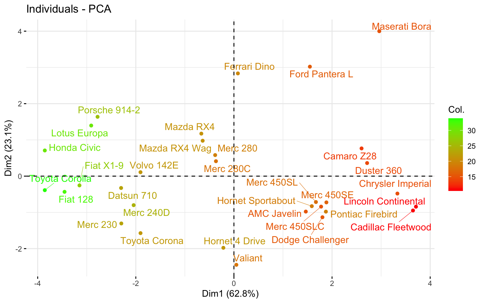

Notamos que en efecto, los carros que se encuentran a la izquierda del eje son carros de bajo consumo de gasolina (alto **mpg**), mientras los que están a la derecha, tienen un alto consumo (bajo **mpg**). Compare los dos gráficos con las dos tablas presentadas en la sección: **Resultados finales** para una mayor claridad en la interpretación.

</div>

</div>

<div id="anexos" class="section level1">

# Anexos

</div>

<div id="cálculo-de-los-componentes-principales-con-la-función-princomp" class="section level1">

# Cálculo de los componentes principales con la función *princomp*

``` r
pc_a <- princomp(mtcars2)
summary(pc_a)
```

    ## Importance of components:
    ##                             Comp.1      Comp.2       Comp.3       Comp.4
    ## Standard deviation     134.3820274 37.54656204 3.0181295838 1.254845e+00
    ## Proportion of Variance   0.9270116  0.07236743 0.0004676043 8.083193e-05
    ## Cumulative Proportion    0.9270116  0.99937900 0.9998466012 9.999274e-01
    ##                              Comp.5       Comp.6       Comp.7       Comp.8
    ## Standard deviation     8.904901e-01 6.371404e-01 3.006062e-01 2.814188e-01
    ## Proportion of Variance 4.070624e-05 2.083882e-05 4.638724e-06 4.065453e-06
    ## Cumulative Proportion  9.999681e-01 9.999890e-01 9.999936e-01 9.999977e-01
    ##                              Comp.9
    ## Standard deviation     2.124807e-01
    ## Proportion of Variance 2.317617e-06
    ## Cumulative Proportion  1.000000e+00

</div>

<div id="bibliografía" class="section level1">

# Bibliografía

-Muhammad Hanif, A., Muhammad Qaiser Shahbaz, A., & Saman Hanif Shahbaz, A. (2019). Multivariate Techniques: An Example Based Approach. Cambridge Scholars Publishing.

-Zelterman, D. (2015). Applied Multivariate Statistics with R. \[electronic resource\]. Springer International Publishing.

-Schumacker, R. E. (2016). Using R with multivariate statistics. a primer. SAGE.

-Everitt, B., & Hothorn, T. (2011). An Introduction to Applied Multivariate Analysis with R. \[electronic resource\]. Springer New York.

\-<https://rpubs.com/aaronsc32/eigenvalues-eigenvectors-r>

\-<https://www.datacamp.com/tutorial/pca-analysis-r>

</div>

</div>
