# Análisis Estadístico de Datos

<span class="glyphicon glyphicon-user"></span> Profesor: Nicolás López

<div class="page-content has-page-title">

<div id="dependencias" class="section level1">

# Dependencias

Para la ejecución de este cuaderno, debe instalar con anterioridad los siguientes paquetes desde la consola de R o usando el menú Tools\>Install Packages en RStudio:

- `install.packages("tidyverse")`.
- `install.packages("rmdformats")`.
- `install.packages("ggExtra")`.

</div>

<div id="objetivo-y-alcance" class="section level1">

# Objetivo y alcance

**Objetivo**: este cuaderno continúa la discusión del análisis estadístico de datos multivariado, en particular, se busca entender el agrupamiento de las UE contenidas en una tabla de datos. El objetivo principal es estudiar algunos métodos de *clustering* y aprender de su implementación en el lenguaje R.

**Alcance**: siga el desarrollo del cuaderno, ejecute los comandos contenidos y desarrolle los ejercicios propuestos.

</div>

<div id="datos" class="section level1">

# Datos

En la página web de la Red de Monitoreo de Calidad del Aire en Bogotá, RMCAB, se encuentra el seguimiento hora a hora de diversas características contaminantes en el aire de nuestra ciudad, dichas variables son medidas en diferentes estaciones de control ubicadas en distintas localidades de Bogotá (disponible en [este enlace](http://201.245.192.252:81/)). En [este video](https://youtu.be/69MziFSX-4c?si=0P6xLanh8w3p8HTP) encuentras cómo descargar los datos mientras que en [este otro](https://youtu.be/9-5BuRy7ScQ?si=b96W7uhZ5iT0nzWM) encuentras el preprocesamiento de los mismos.

<div id="descripción-del-conjunto-de-datos" class="section level2">

## Descripción del conjunto de datos

Para un total de 15 estaciones de la red, se obtienen las mediciones de 5 contaminantes a hora pico (8 de la mañana). Los contaminantes observados junto a sus unidades de medida correspondientes son los siguientes:

- CO (<span class="math inline">\\ppm\\</span>): dióxido de carbono
- NO (<span class="math inline">\\ppb\\</span>): óxido nítrico.
- NO2 (<span class="math inline">\\ppb\\</span>): dióxido de nitrógeno.
- OZONO (<span class="math inline">\\ppb\\</span>): ozono.
- PM2.5 (<span class="math inline">\\\mu g /m3\\</span>): cantidad de material particulado en el aire de menor diámetro.

Las observaciones obtenidas a través de la consulta realizada en la página web se encuentran en el conjunto de datos `ReporteContaminante_08012022_8am.csv`

``` r
library('tidyverse')
datos_aire = read_csv('ReporteContaminante_08012022_8am.csv')
```

    ## Rows: 15 Columns: 6
    ## ── Column specification ────────────────────────────────────────────────────────
    ## Delimiter: ","
    ## chr (1): Estaciones
    ## dbl (5): CO, NO, NO2, OZONO, PM2.5
    ## 
    ## ℹ Use `spec()` to retrieve the full column specification for this data.
    ## ℹ Specify the column types or set `show_col_types = FALSE` to quiet this message.

``` r
datos_aire
```

    ## # A tibble: 15 × 6
    ##    Estaciones                    CO    NO   NO2 OZONO PM2.5
    ##    <chr>                      <dbl> <dbl> <dbl> <dbl> <dbl>
    ##  1 Bolivia                    0.484 23.3  21.2   2.77   7.8
    ##  2 Carvajal Sevillana         1.19  50.1  19.1   5.13  26  
    ##  3 Centro de Alto Rendimiento 0.730 37.1  12.3   2.22  22  
    ##  4 Colina                     0.502 16.6  15.4   1.73   3.9
    ##  5 Fontibon                   0.908 42.2  21.6   6.49  20.9
    ##  6 Guaymaral                  0.101  5.92  3.27 13.4    6  
    ##  7 Kennedy                    1.40  60.1  28.4   8.25  17  
    ##  8 Las Ferias                 0.787 20.7  11.3   8.83  19  
    ##  9 MinAmbiente                1.24  39.6  17.8   2.86   8  
    ## 10 Movil Fontibon             1.23  47.2  22.4   3.82  21.6
    ## 11 Puente Aranda              1.53  48.6  21.9   1.61   3.2
    ## 12 San Cristobal              1.17  32.6  19.9   1.30  14  
    ## 13 Suba                       0.353  7.93  7.07  6.42   8  
    ## 14 Tunal                      1.10  25.3  11.0   9.49  14  
    ## 15 Usaquen                    0.268  3.61  4.26 15.1    8

------------------------------------------------------------------------

<div id="ejercicio-1" class="section level3">

### Ejercicio 1

> Discuta con sus compañeros ¿Cuáles estaciones presentan mayor similaridad en las diferentes variables medidas? ¿Qué variables adicionales serían interesantes de conocer para determinar la similaridad entre estaciones?

------------------------------------------------------------------------

------------------------------------------------------------------------

</div>

<div id="ejercicio-2" class="section level3">

### Ejercicio 2

> Para el conjunto de datos `datos_aire`, elabore un resumen estadístico univariado para cada variable mediante la función `summary()`, ¿qué características de centro, dispersión y forma tienen las variables? ¿Cuál estación es la más similar al valor promedio de contaminación de la ciudad?

``` r
summary(datos_aire)
```

    ##   Estaciones              CO               NO              NO2        
    ##  Length:15          Min.   :0.1009   Min.   : 3.612   Min.   : 3.268  
    ##  Class :character   1st Qu.:0.4932   1st Qu.:18.656   1st Qu.:11.152  
    ##  Mode  :character   Median :0.9075   Median :32.589   Median :17.770  
    ##                     Mean   :0.8664   Mean   :30.719   Mean   :15.797  
    ##                     3rd Qu.:1.2098   3rd Qu.:44.713   3rd Qu.:21.431  
    ##                     Max.   :1.5308   Max.   :60.127   Max.   :28.417  
    ##      OZONO            PM2.5      
    ##  Min.   : 1.303   Min.   : 3.20  
    ##  1st Qu.: 2.495   1st Qu.: 7.90  
    ##  Median : 5.134   Median :14.00  
    ##  Mean   : 5.965   Mean   :13.29  
    ##  3rd Qu.: 8.540   3rd Qu.:19.95  
    ##  Max.   :15.094   Max.   :26.00

``` r
par(mfrow=c(1,5))
boxplot(datos_aire$CO)
boxplot(datos_aire$NO)
boxplot(datos_aire$NO2)
boxplot(datos_aire$OZONO)
boxplot(datos_aire$PM2.5)
```

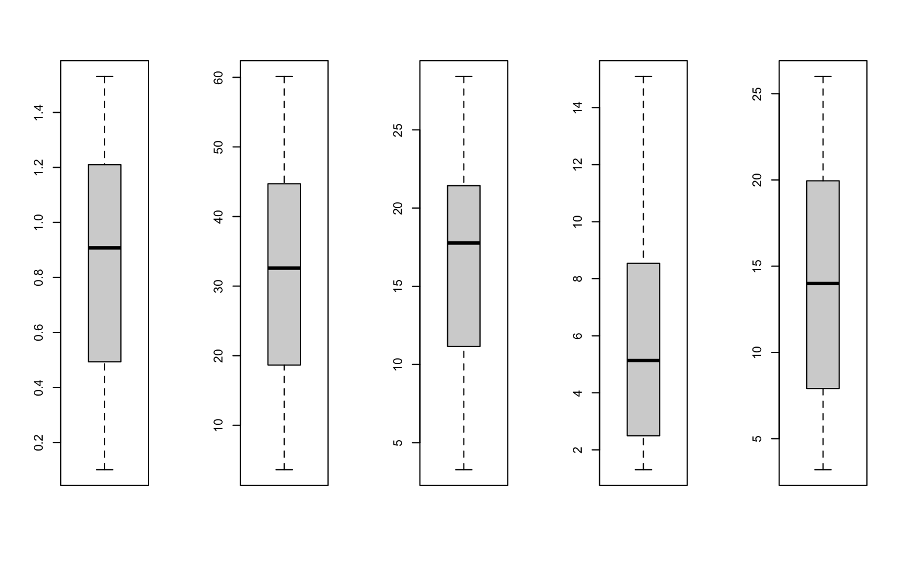

``` r
par(mfrow=c(1,1))
```

------------------------------------------------------------------------

------------------------------------------------------------------------

</div>

<div id="ejercicio-3" class="section level3">

### Ejercicio 3

> Para el conjunto de datos `datos_aire` ¿qué variables están altamente correlacionadas usando la correlación de Pearson?

``` r
matriz_cor = cor(datos_aire %>% select(-Estaciones))
round(matriz_cor,3)
```

    ##           CO     NO    NO2  OZONO  PM2.5
    ## CO     1.000  0.892  0.770 -0.474  0.357
    ## NO     0.892  1.000  0.873 -0.490  0.529
    ## NO2    0.770  0.873  1.000 -0.610  0.304
    ## OZONO -0.474 -0.490 -0.610  1.000 -0.046
    ## PM2.5  0.357  0.529  0.304 -0.046  1.000

------------------------------------------------------------------------

------------------------------------------------------------------------

</div>

<div id="ejercicio-4" class="section level3">

### Ejercicio 4

> Para el conjunto de datos `datos_aire`, realice un análisis en componentes principales ¿cuántos componentes son necesarios para retener 85% de la variabilidad de los datos? Realice el screeplot para complementar el análisis. Recuerde estandarizar los datos al realizar el análisis.

``` r
pc_1 = prcomp(datos_aire %>% select(-Estaciones), scale = TRUE)
summary(pc_1)
```

    ## Importance of components:
    ##                          PC1    PC2    PC3    PC4     PC5
    ## Standard deviation     1.810 0.9965 0.6888 0.4561 0.22228
    ## Proportion of Variance 0.655 0.1986 0.0949 0.0416 0.00988
    ## Cumulative Proportion  0.655 0.8536 0.9485 0.9901 1.00000

``` r
screeplot(pc_1, col = "red", pch = 16, type = "lines", cex = 2, lwd = 2, main = "")
```

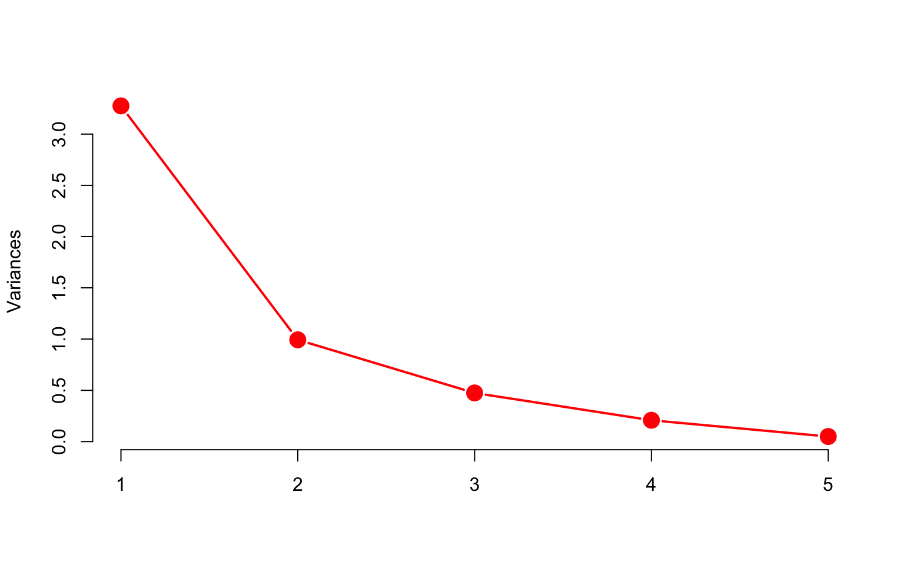

------------------------------------------------------------------------

------------------------------------------------------------------------

</div>

<div id="ejercicio-5" class="section level3">

### Ejercicio 5

> Interprete los primeros dos componentes del ACP realizado anteriormente. ¿Son los resultados concordantes con la matriz de correlaciones?

``` r
pc_1$rotation
```

    ##              PC1          PC2        PC3         PC4         PC5
    ## CO     0.5000942 -0.003422953 -0.4322979  0.63726549 -0.39611278
    ## NO     0.5334037 -0.128036528 -0.1996014 -0.05098763  0.81033735
    ## NO2    0.5078989  0.158041428 -0.1426837 -0.73749441 -0.39090272
    ## OZONO -0.3608856 -0.579246697 -0.6968431 -0.21703035 -0.03927221
    ## PM2.5  0.2778246 -0.789361199  0.5170385  0.01711053 -0.17916694

``` r
# El primer componente conforma un índice de contaminación general, con similares pesos para todas las variables
# El segundo componente conforma un índice específico de contaminación, el cual diferencia contaminación industrial de la no industrial.
```

------------------------------------------------------------------------

------------------------------------------------------------------------

</div>

<div id="ejercicio-6" class="section level3">

### Ejercicio 6

> Ejercicio para revisar en casa: Grafique los puntajes para los dos primeros componentes principales en un diagrama de dispersión, reemplace los puntos por los nombres de las estaciones. Contraste la interpretación de los ejes con la posición de las estaciones en el plano ¿son los resultados concordantes con la tabla original de datos?

``` r
library("ggplot2")
library("ggrepel")
pc_f        = prcomp(datos_aire %>% select(-Estaciones), scale = TRUE, rank. = 2)
scores_aire = as_tibble(pc_f$x)
scores_aire$Estacion = datos_aire$Estaciones

gg2 = ggplot(scores_aire,aes(x=PC1,
                             y=PC2,
                             label=Estacion)) + 
      geom_point() + 
      xlab('PC1') + 
      ylab('PC2') + 
      geom_text_repel(max.overlaps = Inf,
                      size         = 3,
                      box.padding  = 0.5) +
      geom_vline(xintercept = 0) +
      geom_hline(yintercept = 0)

gg2
```

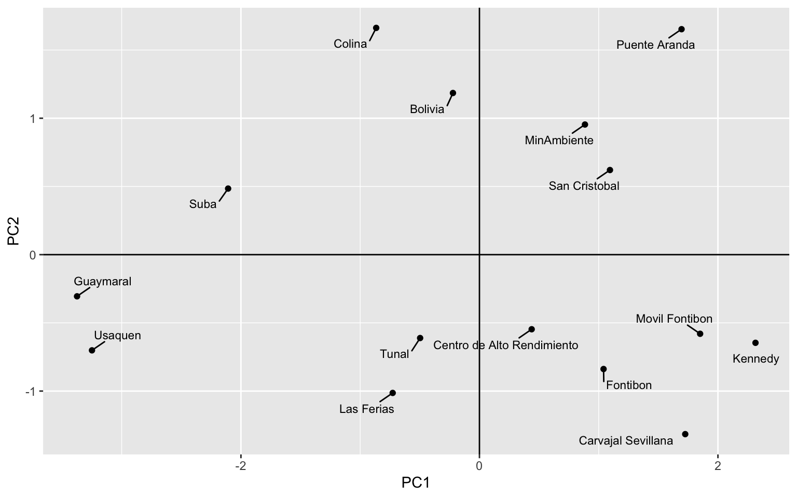

------------------------------------------------------------------------

</div>

</div>

</div>

<div id="métodos-de-agrupamiento-clustering" class="section level1">

# Métodos de agrupamiento (Clustering)

Utilizamos ACP para visualizar los datos en dos dimensiones informativas y entender las características de correlación entre las variables. En contraste, los métodos de agrupamiento buscan grupos (o clústers) de observaciones en los datos. Existen múltiples métodos de agrupamiento, entre ellos los más conocidos son **agrupamiento de K-medias** y **agrupamiento aglomerativo** (o también llamado jerárquico). A continuación desarrollaremos de manera pedagógica las ideas básicas del agrupamiento con el conocimiento previo adquirido de ACP, **IMPORTANTE: esto no implica que el proceso de clustering se deba hacer sobre un ACP o que un método necesite del otro para funcionar**.

Recordando que los puntajes sobre el primer componente principal son una suma ponderada de las variables, podemos pensar en este como una variable univariada adicional <span class="math inline">\\Z\\</span> en la tabla de datos. Para nuestro ejemplo, como vimos, el primer componente resume en general la contaminación encontrada en las estaciones. Supongamos que nos han entregado como parte del estudio únicamente esta característica univariada, llamada ‘índice de contaminación’.

    ## Warning in attr(x, "align"): 'xfun::attr()' is deprecated.
    ## Use 'xfun::attr2()' instead.
    ## See help("Deprecated")
    ## Warning in attr(x, "align"): 'xfun::attr()' is deprecated.
    ## Use 'xfun::attr2()' instead.
    ## See help("Deprecated")

| Estacion                   | Indice De Contamiacion |
|:---------------------------|-----------------------:|
| Bolivia                    |             -0.2221451 |
| Carvajal Sevillana         |              1.7256697 |
| Centro de Alto Rendimiento |              0.4379804 |
| Colina                     |             -0.8658017 |
| Fontibon                   |              1.0408518 |
| Guaymaral                  |             -3.3744241 |
| Kennedy                    |              2.3148955 |
| Las Ferias                 |             -0.7275077 |
| MinAmbiente                |              0.8848360 |
| Movil Fontibon             |              1.8505419 |
| Puente Aranda              |              1.6948763 |
| San Cristobal              |              1.0944647 |
| Suba                       |             -2.1075582 |
| Tunal                      |             -0.4974314 |
| Usaquen                    |             -3.2492482 |

Datos de contaminación univariados {.table .table-striped style="width: auto !important; margin-left: auto; margin-right: auto;"}

Ubiquemos de manera unidimensional las observaciones de esta variable sobre una línea recta:

``` r
library(ggrepel)
gg3 = ggplot(scores_aire,aes(x=PC1,
                             y=rep(0,nrow(scores_aire)),
                             label=Estacion)) + 
      geom_point() + 
      xlab('Índice de contaminación') + 
      theme(
      axis.title.y = element_blank(),  # Removes the y-axis title
      axis.text.y = element_blank(),   # Removes the y-axis labels
      axis.ticks.y = element_blank(),  # Removes the y-axis ticks
      axis.line.y = element_blank()    # Removes the y-axis line
      ) +
      geom_text_repel(max.overlaps = Inf,
                      size         = 2,
                      box.padding  = 1.5)

gg3
```

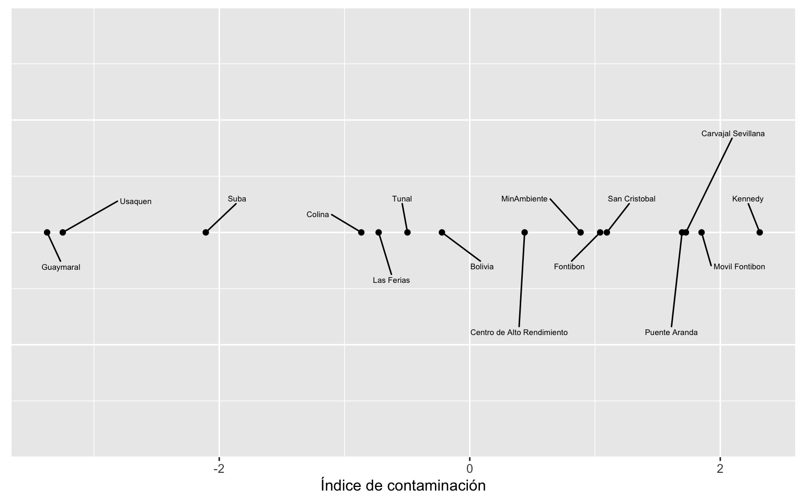

Si se tuvieran que definir 3 grupos de localidades (<span class="math inline">\\G_1\\</span>, <span class="math inline">\\G_2\\</span>, <span class="math inline">\\G_3\\</span>) con índices de contaminación similares dentro de cada grupo, pero disimiles entre cada grupo, ¿cuáles serían dichos grupos?. A continuación graficamos un posible agrupamiento, denominado *Agrupamiento_A*

``` r
library(ggrepel)
scores_aire = scores_aire %>% 
              mutate(Agrupamiento_A = case_when(Estacion %in% c('Guaymaral',
                                                                'Usaquen',
                                                                'Suba') ~ 'G1',
                                                Estacion %in% c('Kennedy',
                                                                'Movil Fontibon',
                                                                'Carvajal Sevillana',
                                                                'Puente Aranda') ~ 'G2',
                                                TRUE  ~ 'G3'))

gg4 = ggplot(scores_aire,aes(x=PC1,
                             y=rep(0,nrow(scores_aire)),
                             colour=Agrupamiento_A,
                             label=Estacion)) + 
      geom_point() + 
      xlab('Índice de contaminación') + 
      theme(
      axis.title.y = element_blank(),  # Removes the y-axis title
      axis.text.y = element_blank(),   # Removes the y-axis labels
      axis.ticks.y = element_blank(),  # Removes the y-axis ticks
      axis.line.y = element_blank()    # Removes the y-axis line
      ) + 
      geom_text_repel(max.overlaps = Inf,
                      size         = 2,
                      box.padding  = 1.5)

gg4
```

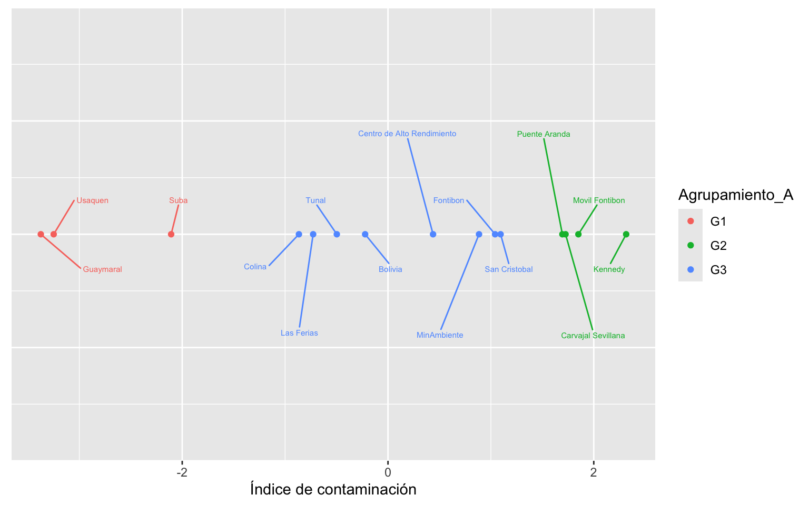

Esto es sencillo de hacer manualmente en una dimensión, pues el orden del índice muestra claramente tres grupos. Los de mayor contaminación general (verde), contaminación media (azul) y contaminación baja (rosado). ¿Cómo automatizar este proceso? (es decir, sin hacerlo manualmente), y aún en una dimensión ¿es esta partición realmente la mejor?

<div id="k-medias-k-means" class="section level2">

## K-medias (K-means)

Se busca una partición (colección disyunta y exhaustiva) de tamaño <span class="math inline">\\K\\</span> de los <span class="math inline">\\n\\</span> datos, en la cual los grupos sean lo más homogéneos (similares) dentro de cada grupo. Para nuestro ejercicio, <span class="math inline">\\K=3\\</span>. Note que hay muchas posibles particiones de dicho tamaño, ahora graficamos el *Agrupamiento B*:

``` r
scores_aire = scores_aire %>% 
              mutate(Agrupamiento_B = case_when(Estacion %in% c('Guaymaral',
                                                                'Usaquen',
                                                                'Suba',
                                                                'Colina') ~ 'G1',
                                                Estacion %in% c('Kennedy',
                                                                'Movil Fontibon',
                                                                'Carvajal Sevillana',
                                                                'Puente Aranda',
                                                                'San Cristobal',
                                                                'Fontibon') ~ 'G2',
                                                TRUE  ~ 'G3'))

gg5 = ggplot(scores_aire,aes(x=PC1,
                             y=rep(0,nrow(scores_aire)),
                             colour=Agrupamiento_B,
                             label=Estacion)) + 
      geom_point() + 
      xlab('Índice de contaminación') + 
      theme(
      axis.title.y = element_blank(),  # Removes the y-axis title
      axis.text.y = element_blank(),   # Removes the y-axis labels
      axis.ticks.y = element_blank(),  # Removes the y-axis ticks
      axis.line.y = element_blank()    # Removes the y-axis line
      ) +
      geom_text_repel(max.overlaps = Inf,
                      size         = 2,
                      box.padding  = 1.5)

gg5
```

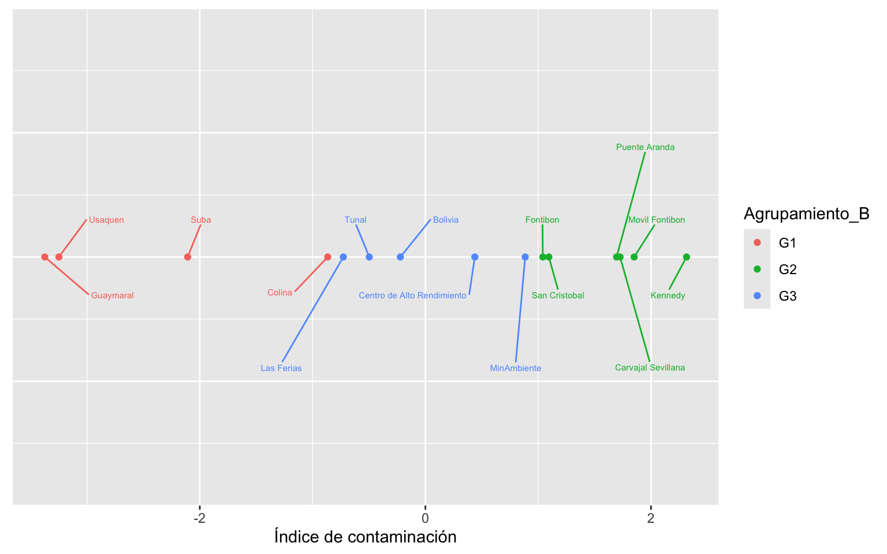

<div id="medición-de-calidad-de-la-pertición" class="section level3">

### Medición de calidad de la pertición

¿Cual es el mejor agrupamiento? ¿A o B?, parece más apropiada el primero, pero ¿cómo lo medimos para automatizar el proceso?. El objetivo es encontrar grupos similares dentro, por lo cual tiene sentido calcular en cada grupo el total de distancias cuadradas entre las parejas de observaciones, es decir, para cada grupo en el agrupamiento B se tiene:

<span class="math inline">\\d^2(G1) = (z\_{Guaymaral} - z\_{Usaquén})^2 + ... + (z\_{Guaymaral} - z\_{Colina})^2 + (z\_{Usaquén} - z\_{Suba})^2 ...\\</span> <span class="math inline">\\d^2(G2) = (z\_{Ferias} - z\_{Tunal})^2 + ... + (z\_{Ferias} - z\_{M.Ambiente})^2 + (z\_{Tunal} - z\_{Bolivia})^2 + ...\\</span> <span class="math inline">\\d^2(G3) = (z\_{Fontibón} - z\_{S.Cristobal})^2 + ... + (z\_{Fontibón} - z\_{Kennedy})^2 + (z\_{S.Cristobal} - z\_{P.Aranda})^2 + ...\\</span>

Y la distancia promedio total para el agrupamiento B

<span class="math display">\\ d^2(Agrupamiento_B) = \frac{d^2(G1)}{n\_{G1}} + \frac{d^2(G2)}{n\_{G2}} +\frac{d^2(G3)}{n\_{G3}} \\</span>

Es claro que <span class="math inline">\\d^2(Agrupamiento_i)\\</span> da una medida de la calidad del agrupamiento dado: entre más pequeño sea este valor para un agrupamiento, mayor homogeneidad promedio hay dentro de los <span class="math inline">\\K\\</span> grupos. Para nuestro ejercicio se tienen las distancias dentro de cada grupo del agrupamiento B como:

``` r
d2_grupoB = NULL
for(G in c('G1','G2','G3')){
  data_tmp  = scores_aire %>% filter(Agrupamiento_B==G) %>% select(PC1)
  dst_tmp   = dist(data_tmp)**2
  d2_grupoB = c(d2_grupoB,sum(dst_tmp)/nrow(data_tmp))
}
round(d2_grupoB,2)
```

    ## [1] 4.11 1.16 1.80

``` r
round(sum(d2_grupoB),2)
```

    ## [1] 7.07

Así

<span class="math display">\\ d^2(Agrupamiento_B) = 4.11 + 1.16 + 1.80= 7.07\\</span>

De manera similar se tiene

<span class="math display">\\ d^2(Agrupamiento_A) = 0.97 + 0.25 + 4.67 = 5.89\\</span>

Con lo cual, podemos cuantificar la bondad de un agrupamiento determinado respecto a otro. En este caso, el agrupamiento A claramente permite una mayor homogeneidad entre grupos.

</div>

<div id="algoritmo-de-k-means" class="section level3">

### Algoritmo de K-means

Este ejercicio puede repetirse para todos los posibles agrupamientos de tamaño <span class="math inline">\\K=3\\</span>, y aquél con mínimo <span class="math inline">\\d^2\\</span> será el seleccionado. Sin embargo:

- A medida que crece <span class="math inline">\\n\\</span> y/o <span class="math inline">\\K\\</span>, calcular <span class="math inline">\\d^2(Agrupamiento)\\</span> para todos los agrupamientos posibles se hace computacionalmente muy difícil.
- Encontrar aquel agrupamiento entre todos los posibles que minimice el promedio ponderado de distancias resulta en un problema mayor que el original.

Sin embargo, de manera aproximada y rápida podemos encontrar dicha agrupación óptima mediante el algoritmo de <span class="math inline">\\K\\</span> medias (<span class="math inline">\\K\\</span> means). En una dimensión:

- i = 1. De manera aleatoria, tome <span class="math inline">\\K\\</span> puntos en la línea recta. Asigne cada observación al punto más cercano para conformar los <span class="math inline">\\K\\</span> grupos iniciales.
- i = 2. Itere los siguientes pasos hasta que no cambie el agrupamiento:
- \*2.1. Para cada uno de los <span class="math inline">\\K\\</span> grupos, calcule el centroide (punto medio).
- \*2.2. Asigne cada observación al grupo del centroide más cercano.

Para ilustrar el procedimiento, vea los primeros 13 segundos de [este video](https://www.youtube.com/watch?v=fGkGRoiBtKg). La agrupación obtenida **no necesariamente es aquella que tiene menor <span class="math inline">\\d^2\\</span> entre todas las posibles agrupaciones**, pues:

- Los grupos dependen de la asignación inicial realizada en el paso 1, y dicha asignación aleatoria puede ser muy pobre (vea los segundos 14 a 25 del mismo video).
- El algoritmo de K-means no pretende encontrar dicha partición óptima.

Este algoritmo está implementado en R con una sola línea de comando:

``` r
kmedias_cluster  = kmeans(scores_aire %>% select(PC1),centers = 3)
# Asignación de cada UE en cada cluster
agrupamiento_k   = kmedias_cluster$cluster
# Distancias2 medias dentro de cada cluster
d2_dentro        = kmedias_cluster$withinss
 # Número necesario de iteraciones para el algoritmo
niter_kmeans     = kmedias_cluster$iter
# Asignación de agrupamiento a base de grupos
scores_aire$Agrupamiento_K = paste0('G',agrupamiento_k)
```

------------------------------------------------------------------------

------------------------------------------------------------------------

</div>

<div id="ejercicio-7" class="section level3">

### Ejercicio 7

> Compare el vector obtenido de agrupaciones con su compañero (kmedias_cluster\$cluster) ¿son iguales las asignaciones? ¿Por qué serían diferentes?.

``` r
paste0('G',agrupamiento_k)
```

    ##  [1] "G1" "G3" "G1" "G1" "G3" "G2" "G3" "G1" "G3" "G3" "G3" "G3" "G2" "G1" "G2"

------------------------------------------------------------------------

------------------------------------------------------------------------

</div>

<div id="ejercicio-8" class="section level3">

### Ejercicio 8

> Para realizar casa: El algoritmo le brinda un agrupamiento, por lo cual, puede calcular el <span class="math inline">\\d^2\\</span> del agrupamiento. Realice el cálculo de <span class="math inline">\\d^2\\</span> manualmente (ver el código de arriba) y compare con los resultados en kmedias_cluster\$withinss ¿Es el clustering obtenido mediante Kmeans mejor que el Agrupamiento A? Grafique su nuevo agrupamiento en la línea recta.

``` r
d2_grupoK = NULL
for(G in c('G1','G2','G3')){
  data_tmp  = scores_aire %>% filter(Agrupamiento_K==G) %>% select(PC1)
  dst_tmp   = dist(data_tmp)**2
  d2_grupoK = c(d2_grupoK,sum(dst_tmp)/nrow(data_tmp))
}
d2_grupoK
```

    ## [1] 1.0644392 0.9746914 1.6279312

``` r
d2_dentro
```

    ## [1] 1.0644392 0.9746914 1.6279312

``` r
sum(d2_dentro)
```

    ## [1] 3.667062

El algoritmo de k-medias nos permite obtener otro agrupamiento (llamado en este caso, agrupamiento K). El ejercicio 8 le permitirá definir si este agrupamiento es bueno o no.

``` r
gg6 = ggplot(scores_aire,aes(x=PC1,
                             y=rep(0,nrow(scores_aire)),
                             colour=Agrupamiento_K,
                             label=Estacion)) + 
      geom_point() + 
      xlab('Índice de contaminación') + 
      theme(
      axis.title.y = element_blank(),  # Removes the y-axis title
      axis.text.y = element_blank(),   # Removes the y-axis labels
      axis.ticks.y = element_blank(),  # Removes the y-axis ticks
      axis.line.y = element_blank()    # Removes the y-axis line
      ) +
      geom_text_repel(max.overlaps = Inf,
                      size         = 2,
                      box.padding  = 1.5)

gg6
```

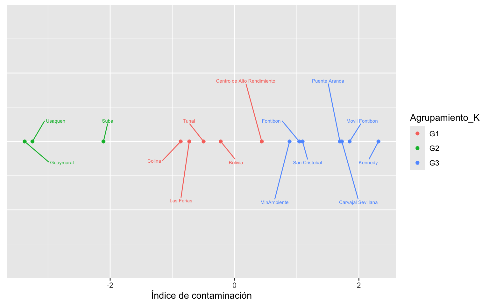

Hemos con esto realizado **de manera pedagógica** una clasificación basada en el primer componente principal de los datos. Vuelva a la tabla original de datos y contraste la similaridad de las estaciones dentro de los grupos obtenidos.

</div>

<div id="k-means-en-más-de-una-dimensión" class="section level3">

### K-means en más de una dimensión

Si vuelve al algoritmo de K means, este no restringe el número de dimensiones <span class="math inline">\\p\\</span> de los datos de entrada. Volvamos al algoritmo en una dimensión:

- i = 1. De manera aleatoria, tome <span class="math inline">\\K\\</span> puntos en <span class="math inline">\\p=1\\</span> (línea recta). Asigne cada observación al punto más cercano para conformar los <span class="math inline">\\K\\</span> grupos iniciales.
- i = 2. Itere los siguientes pasos hasta que no cambie el agrupamiento:
- \*2.1. Para cada uno de los <span class="math inline">\\K\\</span> grupos, calcule el centroide (punto medio).
- \*2.2. Asigne cada observación al grupo del centroide más cercano.

Se seleccionan en el paso 1 un total de <span class="math inline">\\K\\</span> puntos de manera aleatoria, esta vez en el espacio de dimensión <span class="math inline">\\p\\</span>. Si <span class="math inline">\\p=1\\</span> es un punto en una línea, <span class="math inline">\\p=2\\</span> en el plano, <span class="math inline">\\p=3\\</span>, en el [espacio](https://www.kaggle.com/code/naren3256/kmeans-clustering-and-cluster-visualization-in-3d/notebook) (ver última figura). Por lo cual, no es necesario utilizar previamente ACP sobre la base de datos para ejecutar el algoritmo, sólo basta medir la distancia en el espacio <span class="math inline">\\p\\</span> dimensional.

</div>

<div id="selección-de-k" class="section level3">

### Selección de K

<div id="primera-guía-general-primer-plano-factorial" class="section level4">

#### Primera guía general: primer plano factorial

En el ejemplo univariado presentado anteriormente, es muy claro que en total son 3 grupos en el conjunto de datos. Justamente esta ayuda visual mediante el primer componente principal nos permitió detectar la existencia de los tres grupos. Sin embargo, esto no es siempre así de obvio. Vea ahora el diagrama de dispersión para los dos componentes principales (es decir, el primer plano factorial):

``` r
plot(gg2 + xlab('Índice de contaminación general') + 
           ylab('Índice de contaminación específico'))
```

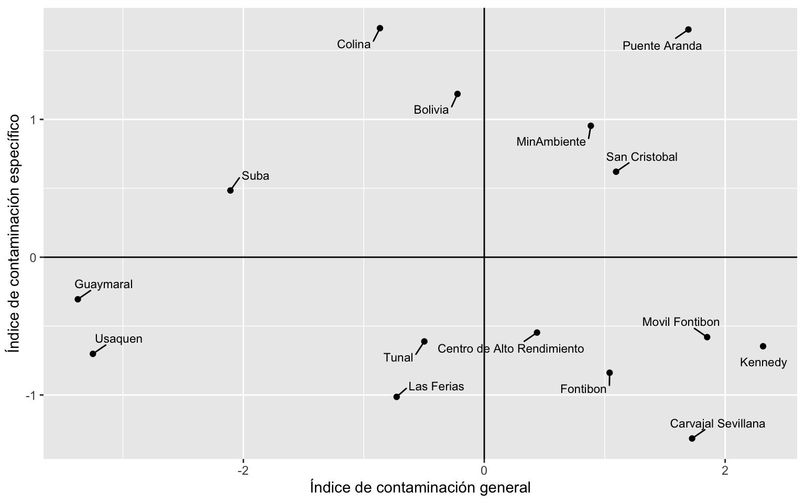

- Nota. Por el segundo eje, podemos pensar que representa un índice de contaminación especial en Ozono y PM2.5, donde valores bajos denotan alta contaminación Ozono & PM2.5 (score -) vs una baja contaminación Ozono & PM2.5 (score +).
- Nota 2. No es necesario graficar los datos para hacer el agrupamiento, esto nos sirve para visualizar el procedimiento.

Nos preguntamos ¿cuántos grupos hay ahora en el conjunto de datos?, esto ya no es tan claro, por lo que buscaremos métodos más sofisticados para la selección del número de clusters. Es importante destacar que, al tener por definición varianzas diferentes en cada dirección del ACP, en general no es recomendable realizar K-means directamente sobre los puntajes en planos factoriales. Sin embargo, el primer plano factorial (que retiene más del 85% de la variabilidad en los datos en este caso) nos permite detectar la existencia de entre 3 y 4 grupos de datos. Este primer indicio en <span class="math inline">\\K\\</span> será validado con un método más riguroso para la selección del número de componentes. **El ACP no es un método de clasificación, pero puede ayudar a revelar clusters**.

</div>

<div id="selección-de-k-mediante-d2" class="section level4">

#### Selección de K mediante <span class="math inline">\\d^2\\</span>

Usamos el método de <span class="math inline">\\d^2(Agrupamiento_i)\\</span> para detectar el mejor cluster de tamaño <span class="math inline">\\K=3\\</span> puede usarse para determinar el número de clusters en el conjunto de datos: A medida que <span class="math inline">\\K\\</span> crece, los grupos sean cada vez más homogéneos dentro de ellos, llegando a una homogeneidad total (cuando cada punto es su propio cluster). Naturalmente, que cada punto sea su propio clúster es poco informativo, por lo cual, la pregunta a resolver es ¿en qué tamaño de clúster este aumento se vuelve marginal o irrelevante?:

``` r
dist_total   =  sum(dist(scores_aire$PC1)**2)/nrow(scores_aire)

dist_cluster = NULL

for(i in 1:10){
  kmedias_cluster_k = kmeans(scores_aire %>% select(PC1),centers = i)
  dist_cluster[i]   = dist_total - sum(kmedias_cluster_k$withinss)
}

plot(1:10,dist_cluster,ylab='Reducción de varianza explicada por los clusters',type='b')
```

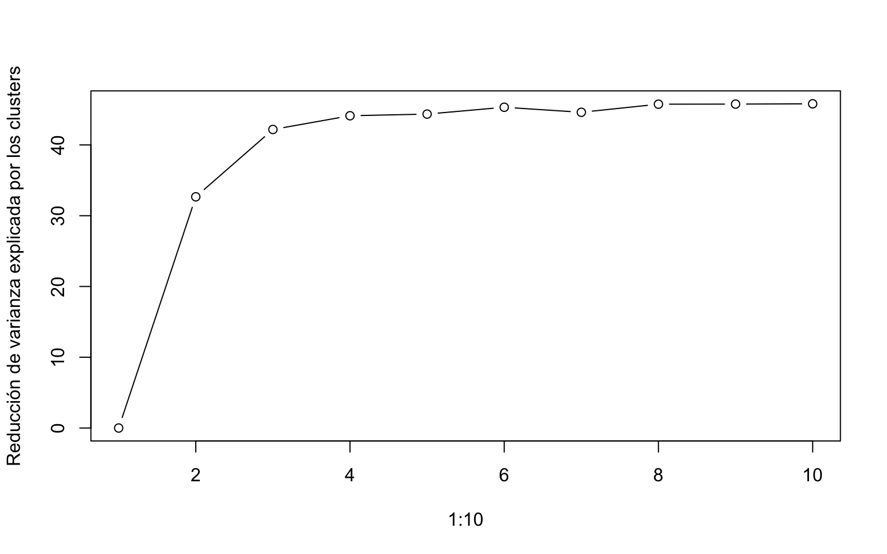

Intentar múltiples valores de <span class="math inline">\\k\\</span> es posible con el método de agrupamiento: calculamos <span class="math inline">\\d^2(Agrupamiento\|k=1) - d^2(Agrupamiento\|k\>1)\\</span> y el número óptimo de clusters está dado por el valor de <span class="math inline">\\k\\</span> en el que el decrecimiento se vuelve poco importante.

</div>

</div>

</div>

<div id="aglomeración-jerárquica" class="section level2">

## Aglomeración jerárquica

Uno de las mayores deficiencias del método de k-means es la determinación del número de clusters antes de ejecutar el análisis. El aglomeramiento jerárquicopermitirá construír los grupos de manera progresiva, con lo cual la decisión del número de grupos no debe ser tomada de manera apriori. Esta aglomeración progresiva permite una visualización en forma de árbol del proceso de clasificación, denominada **dendograma**. El algoritmo se describe a continuación:

- i = 1. Calcule las distancias entre todos los pares de puntos. Trate cada observación como si fuera un cluster de tamaño 1.
- i = 2. Una los clusters hasta resultar con un único clúster de tamaño <span class="math inline">\\n\\</span>:
- \*2.1 Calcule las distancias entre todos los clústers.
- \*2.2 Una la pareja de clusters más cercana en un sólo grupo.

Esta es una metodología robusta, en el sentido que provee los mismos resultados sin depender de puntos iniciales de arranque. Sin embargo, la reproducibilidad anteriormente mencionada depende de la **distancia entre grupos** definida, es decir, el dendograma de clasificación puede variar dependiendo el criterio de distancia entre grupos seleccionado.

<div class="float">

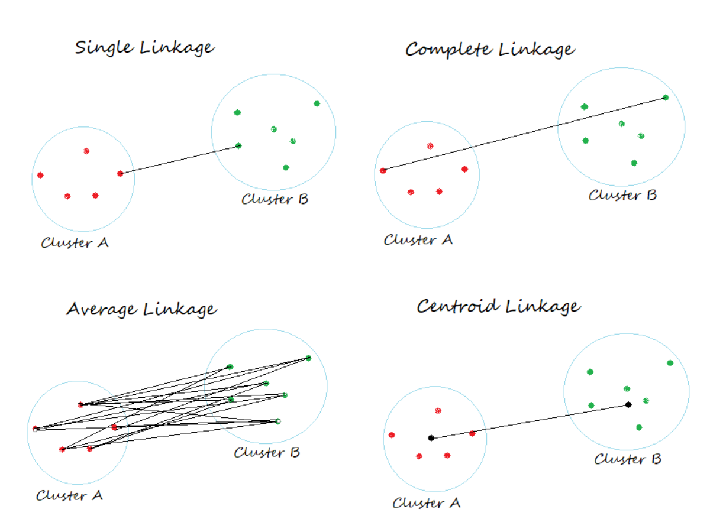

<div class="figcaption">

Diferentes distancias entre grupos

</div>

</div>

Adicionalmente, para un número grande de observaciones, el método puede ser muy exigente computacionalmente, requiriendo almacenar matrices de distancias en cada iteración del algoritmo. Finalmente, los clúster quedan anidados bajo este método, potencialmente clasificando observaciones similares en diferentes grupos.

Vamos a agrupar las observaciones con este método, nuevamente usando de manera pedagógica el perimer componente del análisis:

``` r
scores_aire_jerarquico = data.frame(Indice_Contaminacion=scores_aire$PC1)
rownames(scores_aire_jerarquico) = scores_aire$Estacion
jer_completo = hclust(dist(scores_aire_jerarquico), method = "complete")
jer_promedio = hclust(dist(scores_aire_jerarquico), method = "average")
jer_simple   = hclust(dist(scores_aire_jerarquico), method = "single")
```

Recordemos la gráfica univariada:

``` r
gg3
```

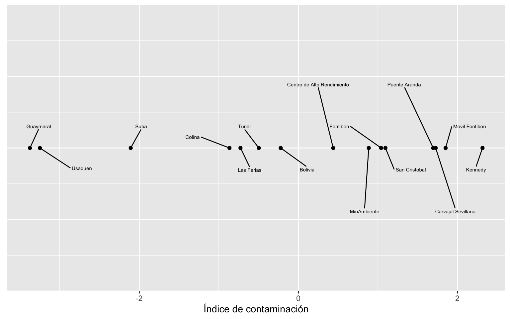

Ahora visualizamos el algoritmo en forma de dendograma:

``` r
par(mfrow = c(1, 3))
plot(as.dendrogram(jer_completo),main="Completo")
plot(as.dendrogram(jer_promedio),main="Promedio")
plot(as.dendrogram(jer_simple),main="Simple")
```

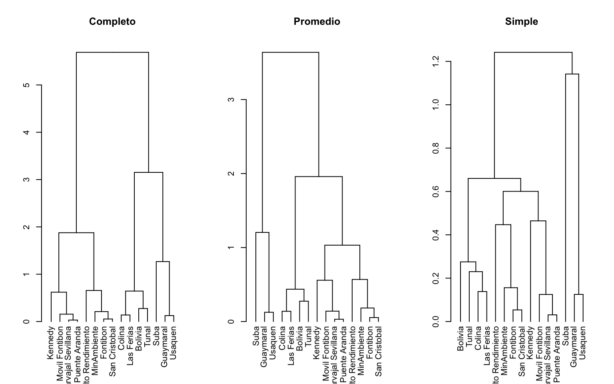

``` r
par(mfrow = c(1, 1))
```

Para determinar el número de grupos en el conjunto de datos, se corta el árbol (línea horizontal sobre el dendograma) y las ramas resultantes determinan cada uno de los grupos sobre el índice de contaminación univariado. El corte se realiza de forma tal que las ramas resultantes presenten una baja distancia entre los grupos contenidos en cada una de ellas. Nuevamente, si vuelve al algoritmo de de aglomeración jerárquica, este no restringe el número de dimensiones <span class="math inline">\\p\\</span> de los datos de entrada.

</div>

</div>

<div id="aplicación-en-datos-reales" class="section level1">

# Aplicación en datos reales

<div id="kmeans" class="section level2">

## Kmeans

El número de clusters dado por el método de inspección del primer plano factorial da un total de entre 3 a 4 clústers, se va a verificar mediante la reducción de la varianza (esta vez, sobre la tabla completa)

``` r
total_aire_kmeans = scale(datos_aire %>% select(-Estaciones))
dist_total        = sum(dist(total_aire_kmeans)**2)/nrow(total_aire_kmeans)
dist_cluster      = NULL

for(i in 1:10){
  kmedias_cluster_k = kmeans(total_aire_kmeans,centers = i)
  dist_cluster[i]   = dist_total - sum(kmedias_cluster_k$withinss)
}

plot(1:10,dist_cluster,ylab='Reducción de varianza explicada por los clusters',type='b')
```

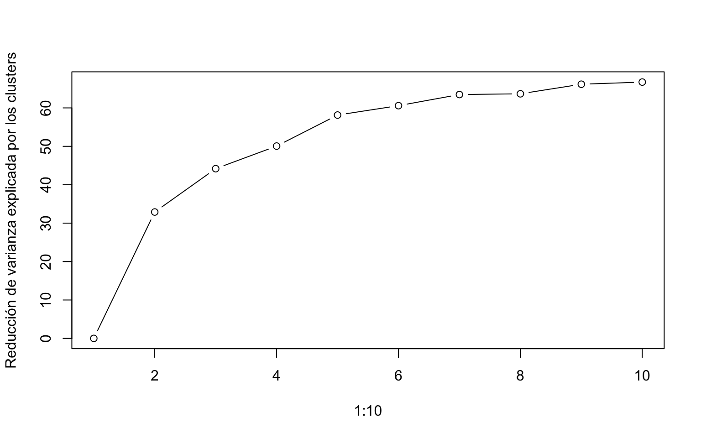

Parece que 4 clusters son apropiados para el análisis. ¿Cuál es la aglomeración correspondiente?. Realizamos el algoritmo con dos semillas diferentes para verificar el mínimo obtenido mediante el algoritmo de kmeans:

``` r
set.seed(123)
kmeans_4a = kmeans(datos_aire %>% select(-Estaciones),centers = 4)
set.seed(456)
kmeans_4b = kmeans(datos_aire %>% select(-Estaciones),centers = 4)

Cluster_A = paste0("G",kmeans_4a$cluster)
Cluster_B = paste0("G",kmeans_4b$cluster)
```

En efecto los grupos son iguales bajo diferentes semillas:

``` r
resultados_cluster = tibble(Estacion=datos_aire$Estaciones,Cluster_A,Cluster_B) %>% arrange(Cluster_A)
resultados_cluster
```

    ## # A tibble: 15 × 3
    ##    Estacion                   Cluster_A Cluster_B
    ##    <chr>                      <chr>     <chr>    
    ##  1 Guaymaral                  G1        G4       
    ##  2 Suba                       G1        G4       
    ##  3 Usaquen                    G1        G4       
    ##  4 Centro de Alto Rendimiento G2        G3       
    ##  5 MinAmbiente                G2        G3       
    ##  6 Puente Aranda              G2        G3       
    ##  7 San Cristobal              G2        G3       
    ##  8 Bolivia                    G3        G1       
    ##  9 Colina                     G3        G1       
    ## 10 Las Ferias                 G3        G1       
    ## 11 Tunal                      G3        G1       
    ## 12 Carvajal Sevillana         G4        G2       
    ## 13 Fontibon                   G4        G2       
    ## 14 Kennedy                    G4        G2       
    ## 15 Movil Fontibon             G4        G2

</div>

<div id="agrupamiento-jerárquico" class="section level2">

## Agrupamiento jerárquico

Ahora, para el conjunto completo de datos se realiza el algoritmo de agrupamiento jerárquico:

``` r
total_aire_jerarquico = data.frame(datos_aire %>% select(-Estaciones))
total_aire_jerarquico = scale(total_aire_jerarquico)
rownames(total_aire_jerarquico) = datos_aire$Estaciones
jer_completo = hclust(dist(total_aire_jerarquico), method = "complete")
jer_promedio = hclust(dist(total_aire_jerarquico), method = "average")
jer_simple   = hclust(dist(total_aire_jerarquico), method = "single")
```

Ahora visualizamos el algoritmo en forma de dendograma:

``` r
par(mfrow = c(1, 3))
plot(as.dendrogram(jer_completo),main="Completo")
plot(as.dendrogram(jer_promedio),main="Promedio")
plot(as.dendrogram(jer_simple),main="Simple")
```

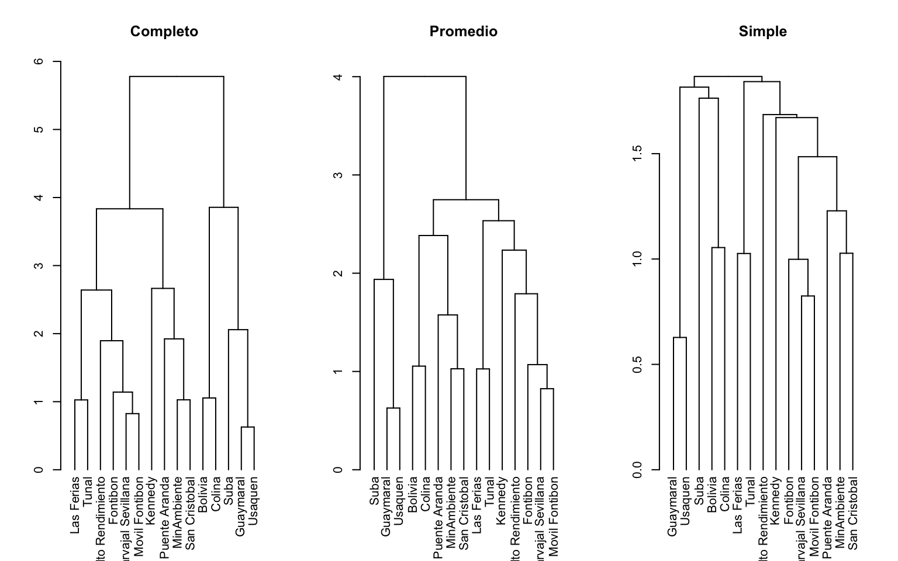

``` r
par(mfrow = c(1, 1))
```

Cortamos el dendograma en 4 grupos para determinar como quedan estos conformados:

``` r
plot(as.dendrogram(jer_promedio),main="Promedio")
abline(h = 2.45, col = "red")
```

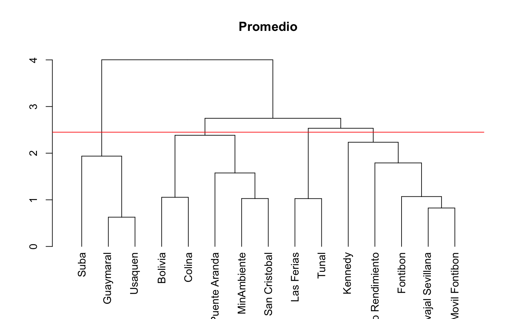

Los resultados son en general concordantes, sin embargo hay una diferencia en un par de clusters:

``` r
grupos = cutree(jer_promedio, k = 4) 
resultados_jerarquico = tibble(Estacion   = names(grupos),
                               Cluster_C  = paste0('G',grupos))
resultados_cluster = resultados_cluster %>% left_join(resultados_jerarquico,by='Estacion')
```

Lo visualizamos a través del primer plano factorial

``` r
resultados_cluster = resultados_cluster %>% left_join(scores_aire %>% select('PC1','PC2','Estacion'))
```

    ## Joining with `by = join_by(Estacion)`

``` r
gg_k = ggplot(resultados_cluster,aes(x=PC1,
                                     y=PC2,
                                     colour=Cluster_A,
                                     label=Estacion)) + 
      geom_point() + 
      xlab('PC1') + 
      ylab('PC2') + 
      ggtitle('Agrupamiento mediante k-means') +
      geom_text_repel(max.overlaps = Inf,
                      size         = 3,
                      box.padding  = 0.5) +
      geom_vline(xintercept = 0) +
      geom_hline(yintercept = 0)

gg_k
```

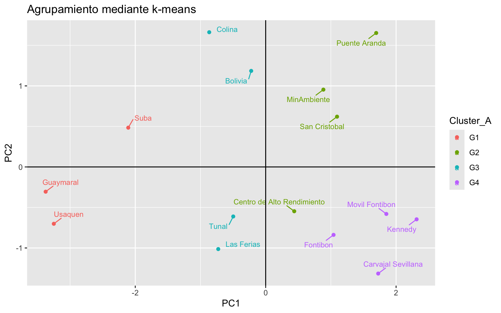

``` r
gg_j = ggplot(resultados_cluster,aes(x=PC1,
                                     y=PC2,
                                     colour=Cluster_C,
                                     label=Estacion)) + 
      geom_point() + 
      xlab('PC1') + 
      ylab('PC2') + 
     ggtitle('Agrupamiento jerárquico')+
      geom_text_repel(max.overlaps = Inf,
                      size         = 3,
                      box.padding  = 0.5) +
      geom_vline(xintercept = 0) +
      geom_hline(yintercept = 0)

gg_j
```

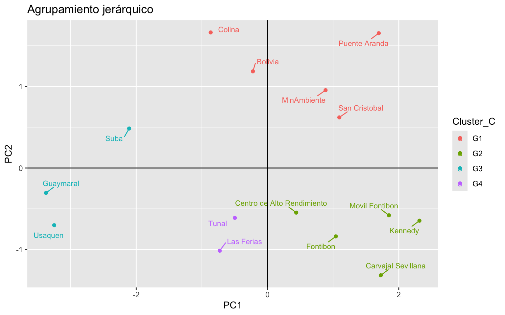

</div>

</div>

<div id="anexo" class="section level1">

# Anexo

<div id="correlación-espacial" class="section level2">

## Correlación espacial

Para finalizar, vemos una correlación alta entre los grupos obtenidos bajo ambos métodos y la agrupación espacial. Esto resulta muy interesante, pues recuperamos información espacial mediante el análisis de correlaciones de medidas de calidad del aire.

<div class="float">

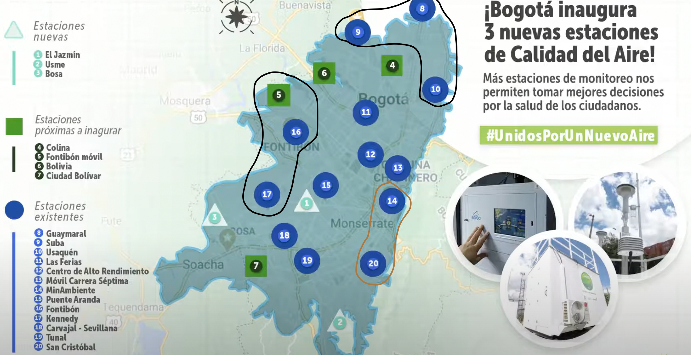

<div class="figcaption">

Correlación espacial & métodos clustering

</div>

</div>

</div>

</div>

</div>
