# Análisis Estadístico de Datos

<span class="glyphicon glyphicon-user"></span> Profesor: Nicolás López

<div class="page-content has-page-title">

<div id="dependencias" class="section level1">

# Dependencias

Para la ejecución de este cuaderno, debe instalar con anterioridad los siguientes paquetes desde la consola de R o usando el menú Tools\>Install Packages en RStudio:

- `install.packages("tidyverse")`.
- `install.packages("rmdformats")`.
- `install.packages("ggExtra")`.

</div>

<div id="objetivo-y-alcance" class="section level1">

# Objetivo y alcance

**Objetivo**: En este notebook se pretende dar una introducción al análisis de regresión lineal en su versiones simples y múltiples, pasando por la motivación, desarrollo de modelos y generación de resultados a partir de su análisis.

**Alcance**: siga el desarrollo del cuaderno, ejecute los comandos contenidos y desarrolle los ejercicios propuestos.

</div>

<div id="propósito" class="section level1">

# Propósito

La regresión lineal es una técnica de modelamiento estadístico que permite describir la relaciones de tipo lineal entre una o varias de variables independientes y una variable de respuesta (variable dependiente) que (en el contexto de regresión, las palabras dependiente o independiente no están relacionadas con el concepto de variables aleatorias dependientes o independientes). Al contar con <span class="math inline">\\n\\</span> datos, asumimos que el i-ésimo individuo tiene como respuesta la variable aleatorias <span class="math inline">\\Y_i\\</span> que promedio toma un valor <span class="math inline">\\\mu_i\\</span>, que depende de las variables no aleatorias <span class="math inline">\\x\_{1,i}\\</span>,…,<span class="math inline">\\x\_{p,i}\\</span>.

*¡OJO!* la parte “lineal” en este tipo de modelos hace referencia a los coeficientes que acompañan la ecuación, no directamente a las variables.

Los modelos de regresión se usan con varios fines, que incluyen los siguientes:

- Descripción de datos.
- Estimación de parámetros.
- Predicción y estimación.
- Control

Para motivar el método usaremos un conjunto de datos que contiene información de variables meteorológicas medidas en diferentes puntos de la región Orinoquía de Colombia:

``` r
library(tidyverse)
library(GGally) # para ggpairs
library(pracma) # para la función meshgrid
library(plotly) # para gráfico 3D
library(plot3D) # para gráfico 3D
library(car)    # para calcular VIF
data = read.csv('ORI.csv', sep=";")
head(data,5)
```

    ##    Cod_Div Latitud  Longitud Region Departamento  Municipio      Fecha  Hora
    ## 1 50006000 3.99012 -73.76594    ORI         META ACAC\xcdAS 25/08/2022 16:00
    ## 2 50006000 3.99012 -73.76594    ORI         META ACAC\xcdAS 25/08/2022 17:00
    ## 3 50006000 3.99012 -73.76594    ORI         META ACAC\xcdAS 25/08/2022 18:00
    ## 4 50006000 3.99012 -73.76594    ORI         META ACAC\xcdAS 25/08/2022 19:00
    ## 5 50006000 3.99012 -73.76594    ORI         META ACAC\xcdAS 25/08/2022 20:00
    ##   Temperatura Velocidad_del_Viento Direccion_del_Viento Presion Punto_de_Rocio
    ## 1        26.5                  1.5                159.8  1012.7           21.2
    ## 2        25.6                  0.9                226.2  1012.9           22.2
    ## 3        24.1                  1.7                299.7  1013.7           21.7
    ## 4        23.4                  1.8                310.3  1014.6           21.2
    ## 5        22.8                  2.2                310.0  1015.2           20.3
    ##   Cobertura_total_nubosa Precipitacion_mm_h Probabilidad_de_Tormenta Humedad
    ## 1                   70.0                  0                        0    72.7
    ## 2                   70.0                  0                        0    81.5
    ## 3                   70.0                  0                        0    86.5
    ## 4                   63.7                  0                        0    87.1
    ## 5                   60.1                  0                        0    85.9
    ##             Pronostico
    ## 1 Parcialmente Nublado
    ## 2 Parcialmente Nublado
    ## 3 Parcialmente Nublado
    ## 4 Parcialmente Nublado
    ## 5 Parcialmente Nublado

Cada observación corresponde a la medición en algún punto del día en un municipio dado de la región para las variables:

- Temperatura
- Velocidad del viento
- Dirección del viento
- Presión
- Punto de rocio
- Cobertura total nubosa
- Humedad

Las herramientas que vemos en este curso no son aplicables para datos con algún tipo de indexación temporal como lo es este caso, por lo tanto vamos a resumir nuestros datos para remover dicha indexación y así obtener resultados marginales:

``` r
var<-c("Municipio",
       "Temperatura",
       "Velocidad_del_Viento",
       "Direccion_del_Viento",
       "Presion",
       "Punto_de_Rocio",
       "Cobertura_total_nubosa",
       "Humedad"
)

data2 <- data %>% 
  dplyr::select(all_of(var)) %>% 
  group_by(Municipio) %>% 
  summarise(Temperatura = mean(Temperatura),
            Velocidad_del_Viento = mean(Velocidad_del_Viento),
            Direccion_del_Viento = mean(Direccion_del_Viento),
            Presion = mean(Presion),
            Punto_de_Rocio = mean(Punto_de_Rocio),
            Cobertura_total_nubosa = mean(Cobertura_total_nubosa),
            Humedad = mean(Humedad)) %>% 
  ungroup()  %>% 
  remove_rownames %>% 
  drop_na(any_of("Municipio")) %>% 
  column_to_rownames(var="Municipio")

data3<-data2
```

Una vez que hemos resuelto la indexación a través del tiempo, podemos analizar los datos:

``` r
ggpairs(data3)
```

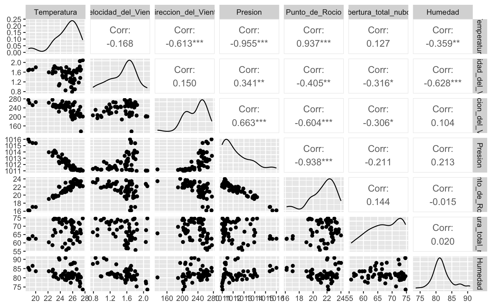

Como se pudo observar en el taller, encontramos ciertas relaciones bastantes interesantes en nuestros datos; en particular nos centraremos con las variables Presión y Punto de Rocio:

``` r
data4<- data3 %>% 
  dplyr::select(c("Presion", "Punto_de_Rocio"))

ggpairs(data4)
```

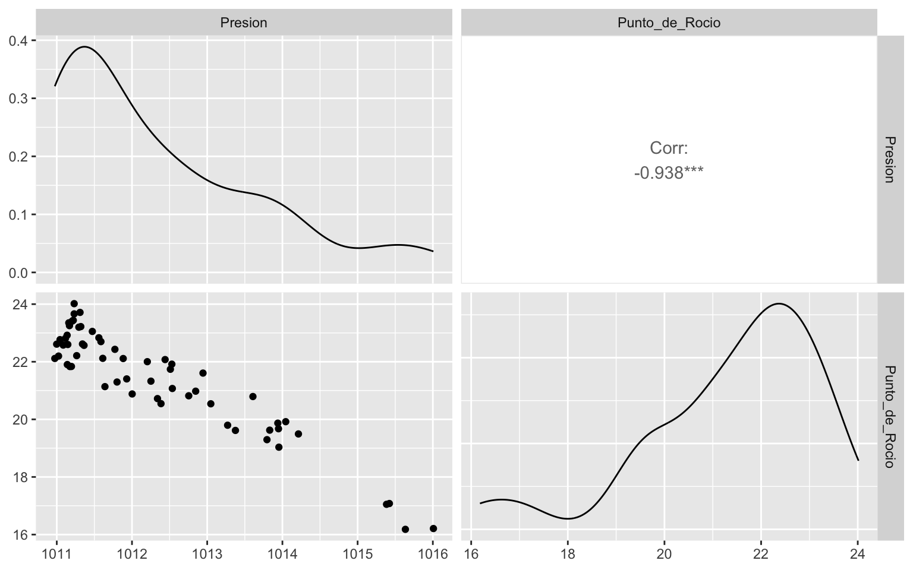

<div id="ejercicio-1" class="section level2">

## Ejercicio 1

Discuta con sus compañeros, ¿Qué fenómenos físicos pueden influir en la relación que estamos estudiando entre estas dos variables? ¿Son lógicos los resultados de estas mediciones?

</div>

<div id="motivación-de-la-regresión-lineal" class="section level2">

## Motivación de la regresión lineal

Uno de los objetivos de la ciencia consiste en predecir y describir sucesos del mundo en que vivimos. Una manera de hacerlo es construir modelos matemáticos que describan adecuadamente el mundo real, y la regresión lineal no es la excepción. Si analizamos con detenimiento la gráfica de dispersión de los datos de Presion y punto de Rocio podemos establecer con claridad una relación entre estas dos variables. Si <span class="math inline">\\y\\</span> representa el punto de rocio y <span class="math inline">\\x\\</span> la presion para algún municipio en la región Orinoquía de Colombia, podemos crear un **modelo determinístico** de la siguiente forma:

<span class="math display">\\y = \beta_0 + \beta_1x\\</span> De hecho, da la impresión que los datos caen, en general, pero no exactamente, en una línea recta, por lo cuál, deberíamos modificar dicha ecuación para tener en cuenta el error aleatorio que rige todo el estudio de estos datos (puede consultar todos los tipos de errores en Holmes, Tyson (2004)). Por lo tanto un modelo que se aproxima más a la realidad sería un **modelo probabilístico**

<span class="math display">\\Y = \beta_0 + \beta_1x + \epsilon\\</span>

La ecuación anterior se llama *Modelo de Regresión Lineal Simple*. Analicemos con detenimiento cada parte de nuestra ecuación:

- <span class="math inline">\\Y\\</span> variable dependiente
- <span class="math inline">\\\beta_0\\</span> y <span class="math inline">\\\beta_1\\</span> coeficientes de regresion: Valores fijos
- <span class="math inline">\\x\\</span> variable independiente: Valor fijo conocido, podemos medirlo.

La componente de error que acompaña la ecuación es aleatoria y determina las propiedades de nuestra variable respuesta. Supongamos que <span class="math inline">\\\epsilon \sim (0, \sigma^2)\\</span>. Por lo tanto la respuesta esperada de <span class="math inline">\\y\\</span> dado <span class="math inline">\\x\\</span> es:

<span class="math display">\\E(y\|x) = \mu\_{y\|x} = E(\beta_0 + \beta_1x+\epsilon) = \beta_0 + \beta_1x\\</span> Así, el verdadero modelo de regresión <span class="math inline">\\\mu\_{y\|x} = \beta_0 + \beta_1x\\</span> es una línea recta de valores promedios, esto es, la altura de la línea de regresión en cualquier valor de <span class="math inline">\\x\\</span> no es más que el valor esperado de <span class="math inline">\\y\\</span> para esa <span class="math inline">\\x\\</span>. Se puede interpretar que la pendiente <span class="math inline">\\\beta_1\\</span> es el cambio de la media de <span class="math inline">\\y\\</span> para un cambio unitario de <span class="math inline">\\x\\</span>. Además, la variabilidad de <span class="math inline">\\y\\</span> en algún valor particular de <span class="math inline">\\x\\</span> queda determinada por la varianza del componente de error en el modelo, <span class="math inline">\\\sigma^2\\</span>. Esto implica que hay una distribución de valores de <span class="math inline">\\y\\</span> en cada <span class="math inline">\\x\\</span>, y que la varianza de esta distribución es igual en cada x.

Cuando <span class="math inline">\\\sigma^2\\</span> es pequeña, los valores observados del tiempo de entrega serán cercanos a la recta, y cuando <span class="math inline">\\\sigma^2\\</span> es grande, se pueden desviar bastante de la línea.

<div class="float">

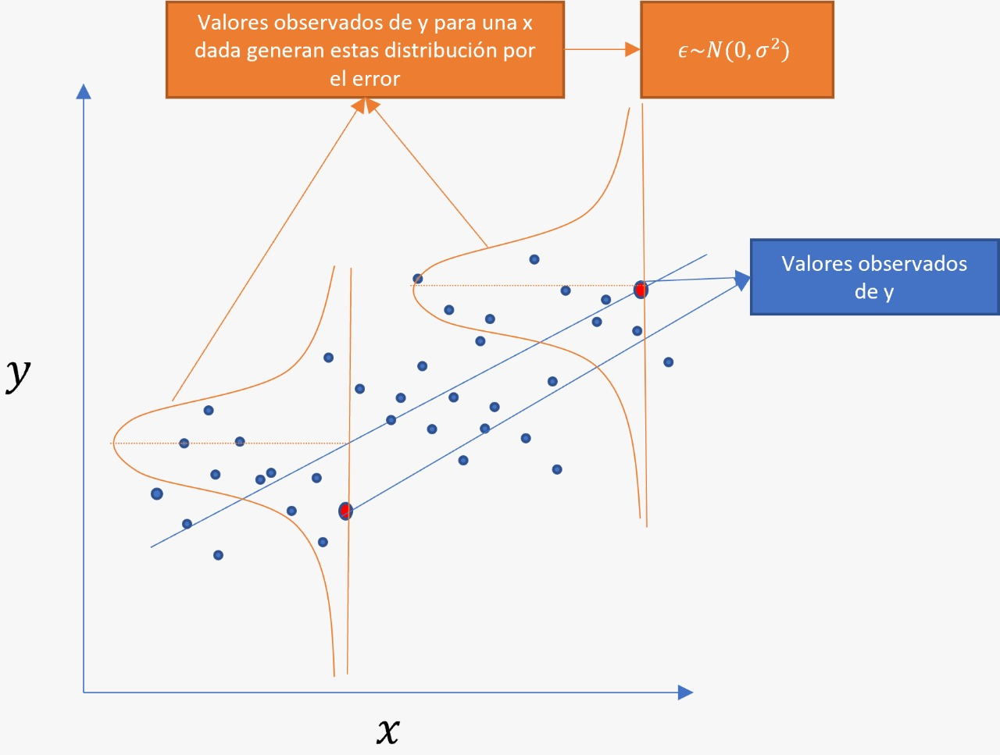

<div class="figcaption">

Explicación modelo de regresión lineal simple

</div>

</div>

Para que el modelo de regresión lineal simple sea válido, debe cumplir 4 supuestos:

1.  **Relación lineal:** La relación entre la variable dependiente y la independiente debe ser lineal. Esto puede apreciarse con algo tan sencillo como un diagrama de puntos o de dispersión, que nos muestra el aspecto de la relación en el rango de valores observados de la variable independiente. Sin embargo, cada supuesto debe examinarse a través de métodos estadísticos de manera formal.

2.  **Normalidad del error:** La distribución aproximada de los errores, debe ser normal.

3.  **Errores no autocorrelacionados:** Los residuos deben ser independientes entre sí y que no haya ningún tipo de correlación entre ellos.

4.  **Homocedasticidad del los errores:** Los residuos deben distribuirse de forma homogénea para todos los valores de la variable de predicción.

Después de obtener el ajuste por mínimos cuadrados, surgen varias preguntas interesantes:

1.  ¿Qué tan bien se ajusta esta ecuación a los datos?

2.  ¿Es probable que el modelo sea útil como predictor?

3.  ¿Se viola alguna de las hipótesis básicas (como la de varianza constante y (como la de varianza constante y la de errores no correlacionados)? y en caso afirmativo, ¿qué tan grave es eso?

Los residuales juegan un papel clave para evaluar la adecuación del modelo. Se puede considerar que los residuales son realizaciones de los errores <span class="math inline">\\\epsilon_i\\</span> del modelo. Así, para comprobar la constancia de la varianza y la hipótesis de errores no correlacionados, uno se debe preguntar si los residuales parecen ser realmente una muestra aleatoria de una distribución con esas propiedades.

</div>

</div>

<div id="metodología" class="section level1">

# Metodología

En el campo de modelamiento de datos, siempre se deben tener en cuenta cuatro etapas:

1.  *Identificación:* La fase de identificación corresponde a la aplicación de herramientas estadísticas que nos permitan encontrar algún tipo de relación entre las variables de estudio. En pocas palabras, podemos identificar un modelo a través de métodos gráficos o numéricos previamente a la ejecución del mismo.

2.  *Estimación:* Tal vez la más sencilla de las fases, ya que dependiendo el modelo, ya las rutinas de estimación están establecidas a través de funciones en los diferentes lenguajes de programación enfocados al análisis de datos.

3.  *Validación:* En esta fase se deben verificar los supuestos con los cuales se ha estimado el modelo en el paso anterior. Dicha validación debe hacerse para cada uno de los supuestos y el incumplmiento de al menos uno de ellos, nos retornará de nuevo a la fase de identificación. Existen metodologías para mejorar el cumplimiento de estos supuestos.

4.  *Uso:* La fase de más utilidad ya que ponemos en funcionamiento el modelo que ha pasado por todas las fases anteriores y nos permite tomar decisiones según sus valores.

<div id="identificación" class="section level2">

## Identificación

Volvamos a los datos de Presion y Punto de Rocío para diferentes municipios en la región Orinoquía. Para la identificación del mismo, es necesario realizar un análisis descriptivo completo, por esta vez omitimos este análisis, ya que previamente se ha realizado en el Taller I y al inicio de este notebook.

``` r
library(ggrepel)
ggplot(data4, aes(x=Presion, y=Punto_de_Rocio)) +
  geom_point() + 
  geom_text_repel(aes(Presion, Punto_de_Rocio, label = rownames(data4)),max.overlaps = 12,
                      size         = 2,
                      box.padding  = 0.5) 
```

    ## Warning: ggrepel: 14 unlabeled data points (too many overlaps). Consider
    ## increasing max.overlaps

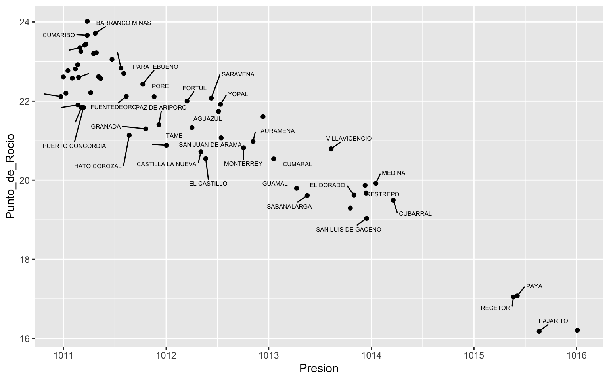

Como vimos anteriormente, existe una relación lineal entre las dos variables de análisis, por lo tanto podríamos aplicar un modelo de regresión lineal simple.

</div>

<div id="estimación" class="section level2">

## Estimación

<div id="motivación" class="section level3">

### Motivación

Para encontrar la línea que se ajusta mejor a los datos, necesitamos una medida de calidad del ajuste. Bajo estos tres candidatos es claro cual resulta en una menor **suma de cuadrados**. Tomando nuevamente el ejemplo de carros para motivar la estimación del modelo bajo este método:

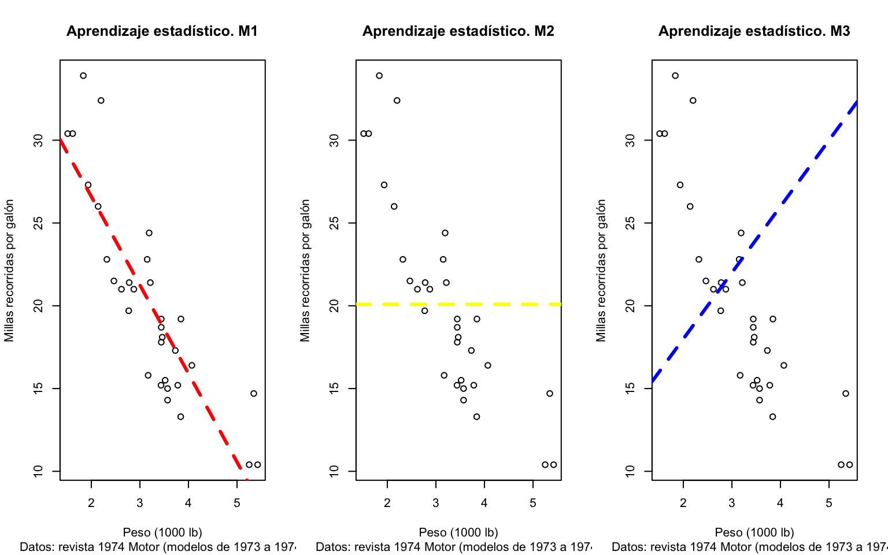

Es claro que:

<span class="math display">\\ SC(M1) \< SC(M2) \<SC(M3) \\</span> Con

<span class="math display">\\ SC(Mj) = \sum_i (y_i - \hat{y}\_{i,Mj})^2 \\</span> En dónde

- El **modelo simple o reducido** (M2) no utiliza información de <span class="math inline">\\X\\</span> para encontrar el valor de <span class="math inline">\\Y\\</span>, asume el valor promedio de <span class="math inline">\\Y\\</span> como modelo marginal. Este es considerado la línea base (*baseline*).
- La estimación por mínimos cuadrados consiste en encontrar <span class="math inline">\\\beta_0\\</span> y <span class="math inline">\\\beta_1\\</span> de tal forma que minimicen la suma de cuadrados, es decir, los **residuales cuadrados**.

Es evidente que hay menor variabilidad alrededor de <span class="math inline">\\M1\\</span> que alrededor de <span class="math inline">\\M2\\</span>, es decir que la variación de las millas recorridas es explicada por el peso del vehículo. ¿Cómo formalizar esta noción?

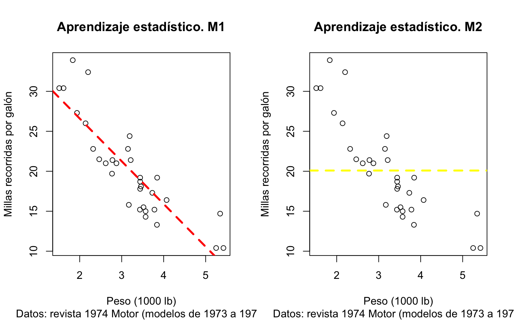

La <span class="math inline">\\SC\\</span> del modelo simple (<span class="math inline">\\SC(M2) = SC_T\\</span>) cuantifica la variabilidad total de <span class="math inline">\\Y\\</span> respecto a su media. Por su parte <span class="math inline">\\SC(M1) = SC_E\\</span> mide la variación remanente al ajustar el modelo mediante mínimos cuadrados.

Fíjese que para cada modelo se tiene un intercepto y una pendiente <span class="math inline">\\(\beta_0,\beta_1)\\</span>, y con ello se obtiene <span class="math inline">\\SC_E\\</span>, es decir <span class="math inline">\\SC_E(\beta_0,\beta_1)\\</span>. Los valores estimados <span class="math inline">\\(\hat{\beta}\_0,\hat{\beta}\_1)\\</span> por mínimos cuadrados minimizan la función de error:

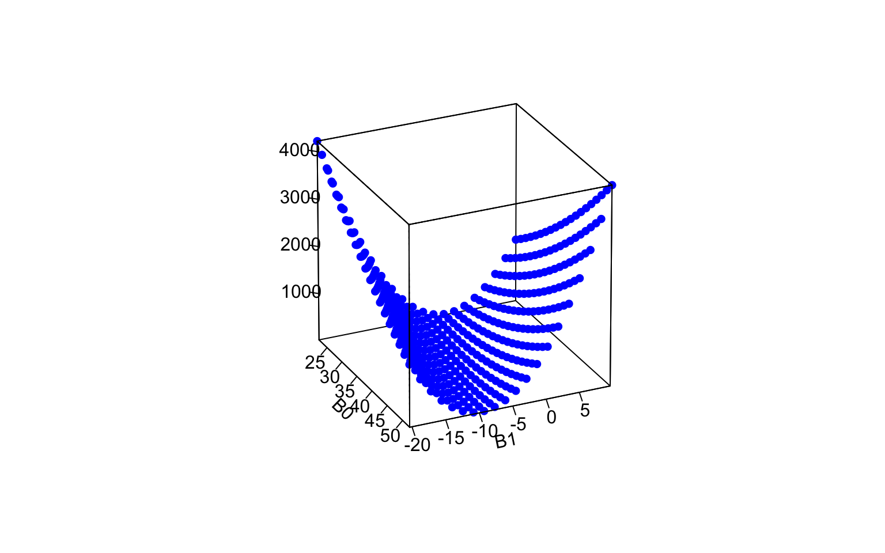

En este caso <span class="math inline">\\(\hat{\beta}\_0=37.3,\hat{\beta}\_1=-5.3)\\</span>. Para cualquier pareja de parámetros, comparar <span class="math inline">\\SC_T\\</span> con <span class="math inline">\\SC_E\\</span> cuantifica la reducción de la variabilidad bajo el modelo lineal en <span class="math inline">\\X\\</span>. La reducción de la varianza en <span class="math inline">\\Y\\</span> explicada por <span class="math inline">\\X\\</span> bajo el modelo es igual a:

<span class="math display">\\ SC_M = SC_T - SC_E \\</span>

Así <span class="math inline">\\SC_M\\</span> cuantifica la reducción en la variación total al ajustar el modelo lineal en <span class="math inline">\\X\\</span>. Al igual que <span class="math inline">\\SC_E\\</span>, <span class="math inline">\\SC_M\\</span> es función de <span class="math inline">\\(\beta_0,\beta_1)\\</span>, es decir <span class="math inline">\\SC_M(\beta_0,\beta_1)\\</span>, la cual es maximizada en <span class="math inline">\\(\hat{\beta}\_0,\hat{\beta}\_1)\\</span> por mínimos cuadrados (¿qué unidades tiene <span class="math inline">\\SC_M\\</span>?).

La <span class="math inline">\\SC_M\\</span> es estandarizada como:

<span class="math display">\\ R^2 = \frac{SC_M}{SC_T} \\</span>

- Con <span class="math inline">\\R^2\\</span> cuantificamos la **proporción** de la varianza en <span class="math inline">\\Y\\</span> explicada por el regresor <span class="math inline">\\X\\</span>.
- Al ser <span class="math inline">\\R^2\\</span> cercano a 1, <span class="math inline">\\SC_M\\</span> se acerca a <span class="math inline">\\SC_T\\</span>, es decir que el *modelo explica* la variabilidad en <span class="math inline">\\Y\\</span> (¿cómo lo medimos objetivamente?).
- Al ser <span class="math inline">\\R^2\\</span> cercano a 0, <span class="math inline">\\SC_M\\</span> se aleja de <span class="math inline">\\SC_T\\</span>, es decir que el *modelo no explica* la variabilidad en <span class="math inline">\\Y\\</span> (¿cómo lo medimos objetivamente?).

En nuestro ejemplo <span class="math inline">\\R^2=0.75\\</span>, con lo cual hay una reducción de la varianza de un 75% en las millas recorridas al considerar linealmente el peso del vehículo. Los estimadores por mínimos cuadrados para los parámetros son:

<span class="math display">\\\hat{\beta_0} = \bar{y}-\hat{\beta_1}\bar{x}\\</span> <span class="math display">\\\hat{\beta_1} = \dfrac{S\_{xy}}{S\_{xx}}\\</span>

donde <span class="math inline">\\S\_{xy} = \sum\_{i=1}^{n} y_i(x_i-\bar{x})\\</span> y <span class="math inline">\\S\_{xx} = \sum\_{i=1}^{n} (x_i-\bar{x})^2\\</span>.

</div>

<div id="estimación-desde-r" class="section level3">

### Estimación desde R

Para la estimación del modelo ocuparemos la función `lm()` que se encuentra incorporada entre las funciones base de R.

``` r
ggplot(data4, aes(x=Presion, y=Punto_de_Rocio)) + 
  geom_point()+
  geom_smooth(method=lm, se=FALSE)
```

    ## `geom_smooth()` using formula = 'y ~ x'

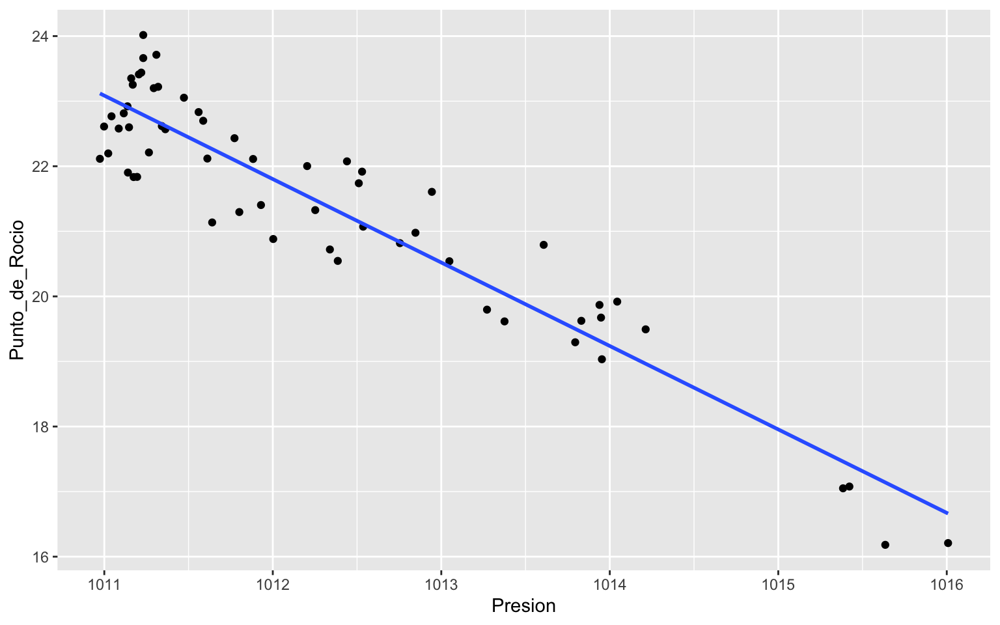

``` r
reg <- lm(Punto_de_Rocio ~ Presion, data = data4)
summary(reg)
```

    ## 
    ## Call:
    ## lm(formula = Punto_de_Rocio ~ Presion, data = data4)
    ## 
    ## Residuals:
    ##     Min      1Q  Median      3Q     Max 
    ## -1.1279 -0.4386 -0.0305  0.5099  1.2279 
    ## 
    ## Coefficients:
    ##               Estimate Std. Error t value Pr(>|t|)    
    ## (Intercept) 1319.70436   63.31502   20.84   <2e-16 ***
    ## Presion       -1.28251    0.06255  -20.50   <2e-16 ***
    ## ---
    ## Signif. codes:  0 '***' 0.001 '**' 0.01 '*' 0.05 '.' 0.1 ' ' 1
    ## 
    ## Residual standard error: 0.6308 on 57 degrees of freedom
    ## Multiple R-squared:  0.8806, Adjusted R-squared:  0.8785 
    ## F-statistic: 420.5 on 1 and 57 DF,  p-value: < 2.2e-16

<div class="float">

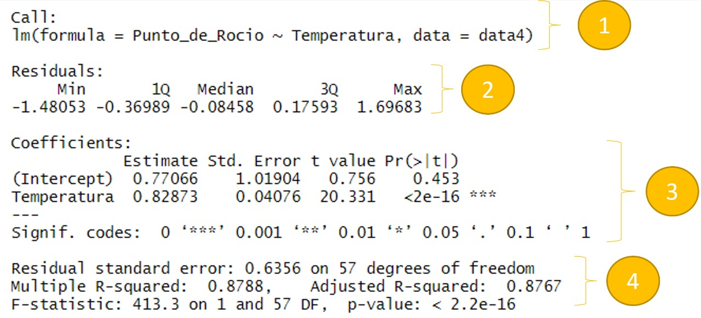

<div class="figcaption">

Salida de la estimación del modelo en R

</div>

</div>

</div>

<div id="interpretación-del-modelo-ajustado" class="section level3">

### Interpretación del modelo ajustado

1.  Identificación del modelo

2.  Estadísticas descriptivas de los errores calculados con el modelo

3.  Tabla de coeficientes asociados al modelo de regresión lineal, por las filas encontramos todos los parámetros asociados al modelo. Por las columnas encontramos:

- Estimación: Valor de la estimación asociado al parámetro correspondiente.

- Std. Error: Error estándar de la estimación, se usa para construir intervalos de confianza para este parámetro.

- t-value: Estadístico de prueba t, utilizado para evaluar la hipótesis:

<span class="math display">\\H_0 : \beta_i = 0\\</span> <span class="math display">\\vs\\</span> <span class="math display">\\H_a : \beta_i \neq 0\\</span>

La forma de interpretar los coeficientes es la siguiente:

1.  Intercepto: Con un p-valor superior a 0.05, no podemos rechazar la hipótesis nula. Por lo tanto se asumir que este no es importante en el modelo.

2.  Presión: Con un p-valor inferior a 0.05, concluimos que existe suficiente evidencia estadística para rechazar <span class="math inline">\\H_0\\</span>. Con lo cuál, interpretamos que la Presion explica el punto de rocío y es importante dentro de nuestro modelo.

- Pr(\>\|t\|): P-valor, asociado al estadístico de prueba incluido en el sistema de hipótesis anterior.

4.  Resultados para el ANOVA (*ANalysis Of VAriance*) asociado al modelo. El ANOVA (detallado en el siguiente cuaderno) permite determinar la bondad de ajuste del modelo a los datos y diferenciar las fuentes de variación del mismo:

``` r
anova(reg)
```

    ## Analysis of Variance Table
    ## 
    ## Response: Punto_de_Rocio
    ##           Df  Sum Sq Mean Sq F value    Pr(>F)    
    ## Presion    1 167.308 167.308  420.46 < 2.2e-16 ***
    ## Residuals 57  22.681   0.398                      
    ## ---
    ## Signif. codes:  0 '***' 0.001 '**' 0.01 '*' 0.05 '.' 0.1 ' ' 1

Del ANOVA asociado al modelo podemos extraer varias conclusiones:

- El error estándar residual da la desviación estándar de los residuos y nos dice qué tan grande es el error de predicción en los datos. Viene dado por

<span class="math display">\\\hat{\sigma} = \sqrt{\frac{\sum \hat{\epsilon}^2}{n-p}} = \sqrt{\frac{\sum (y_i -\hat{y}\_i)^2}{n-2}} = \sqrt{\frac{SC_E}{n-2}}\\</span>

- <span class="math inline">\\R^2\\</span>: Descrito a detalle anteriormente.

- <span class="math inline">\\R^2\\</span> ajustado: Note que incorporar una variable al modelo, esta puede o no ser relevante para explicar la variabilidad en <span class="math inline">\\y\\</span>. Si la variable <span class="math inline">\\z\\</span> no tiene efecto en la respuesta:

- Al minimizar <span class="math inline">\\SC_M\\</span>, se lleva a <span class="math inline">\\\beta_2=0\\</span> y así <span class="math inline">\\y = \beta_0 + \beta_1 x+ 0 z \rightarrow y = \beta_0 + \beta_1 x\\</span> tenemos el modelo de RLS.

- <span class="math inline">\\SC_M\\</span> es la misma bajo los dos modelos, es decir añadir <span class="math inline">\\Z\\</span> no mejoró, ni empeoró <span class="math inline">\\R^2\\</span>.

- Añadir variables mantiene igual o incluso **mejora** <span class="math inline">\\R^2\\</span> aunque no sean de utilidad para explicar <span class="math inline">\\Y\\</span>.

  - Variables irrelevantes pueden estar correlacionadas con la variable <span class="math inline">\\Y\\</span> por coincidencia.
  - Mas variables irrelevantes aumentan la probabilidad de que esto suceda, mejorando artificialmente <span class="math inline">\\R^2\\</span>.

En la práctica se reporta usualmente un <span class="math inline">\\R^2\\</span> ajustado por en número de variables que está dado por:

<span class="math display">\\R^2\_{adj} = 1- (1-R^2)\dfrac{n-1}{n-p-1}\\</span>

La interpretación es la misma que la del <span class="math inline">\\R^2\\</span>

- El estadístico de prueba F asociado al modelo es el encargado de evaluar la hipótesis:

<span class="math display">\\H_0 : \beta_0 = \beta_1 =...=\beta_p = 0\\</span> <span class="math display">\\vs\\</span> <span class="math display">\\H_a : \text{Existe al menos un } \\ i \text{ tal que } \beta_i \neq 0\\</span> Lo cuál evalúa en conjunto todo el modelo, en este caso en particular como el p-valor asociado a la prueba es menor que un nivel de significancia de 0.05, podemos rechazar la hipótesis nula de la prueba y por lo tanto asumir que el modelo está bien ajustado a los datos.

</div>

<div id="simulación-para-evaluar-la-significancia-del-modelo" class="section level3">

### Simulación para evaluar la significancia del modelo

Si la regresión no es informativa <span class="math inline">\\\beta_0 = \beta_1 = 0\\</span> y los datos podrían verse como:

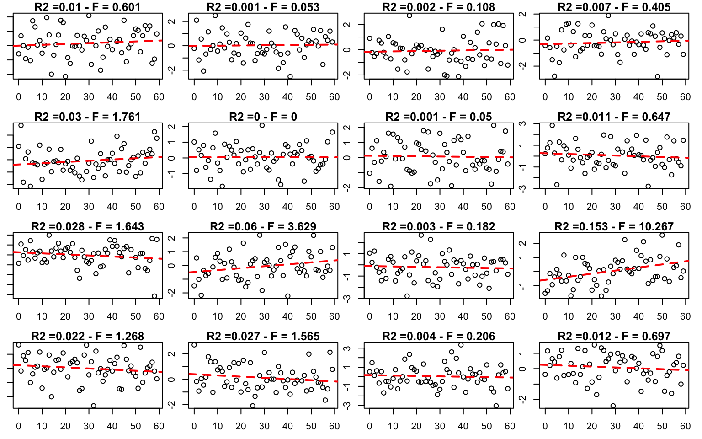

Si repetimos este ejercicio cienmíl veces, podemos encontrar cienmíl valores <span class="math inline">\\F\\</span> calculados y encontrar la distribución de <span class="math inline">\\F\\</span> bajo dicha **hipótesis**.

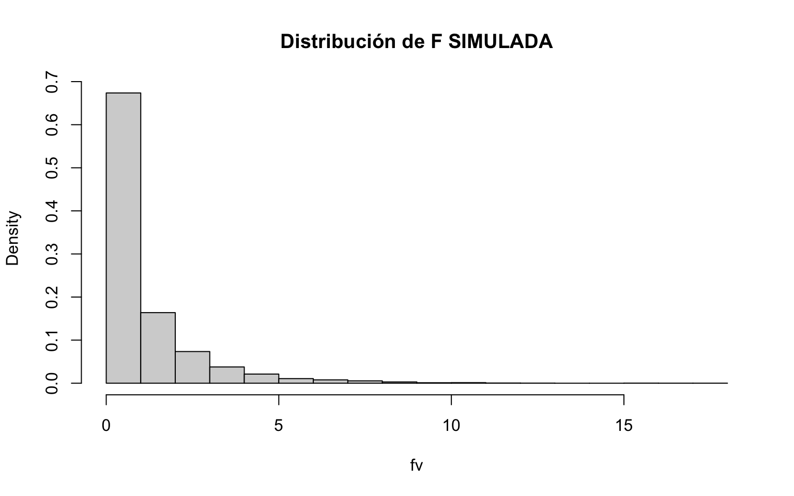

Como notamos es muy poco probable encontrar un valor tan grande para nuestro estadístico <span class="math inline">\\F\\</span> bajo el supuesto que las variables no están relacionadas como el que observamos en nuestra muestra. No es necesario encontrar manualmente (mediante simulación) la distribución de <span class="math inline">\\F\\</span>, ya que bajo la **hipótesis nula**, <span class="math inline">\\F\\</span> sigue una distribución estadística conocida, la distribución <span class="math inline">\\F\\</span>, con <span class="math inline">\\gl(SC_M)=1\\</span> en el numerador y <span class="math inline">\\gl(SC_E)=n-2=59-2=57\\</span> en el denominador:

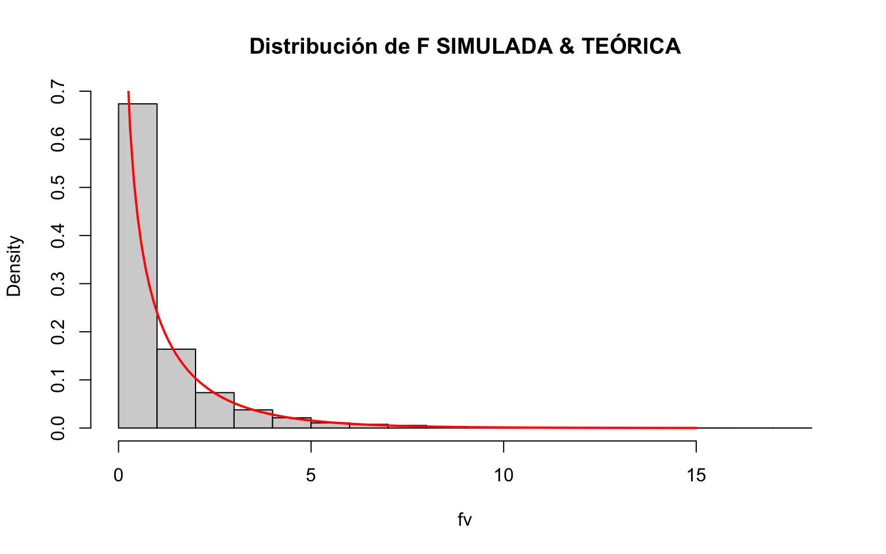

Y con esta hacer inferencia (cálculo de <span class="math inline">\\p\\</span> valor).

</div>

</div>

<div id="validación" class="section level2">

## Validación

Para la validación del modelo, debemos aplicar diferentes estrategias según sea el caso del supuesto que estemos evaluando:

``` r
par(mfrow=c(2,2))
plot(reg)
```

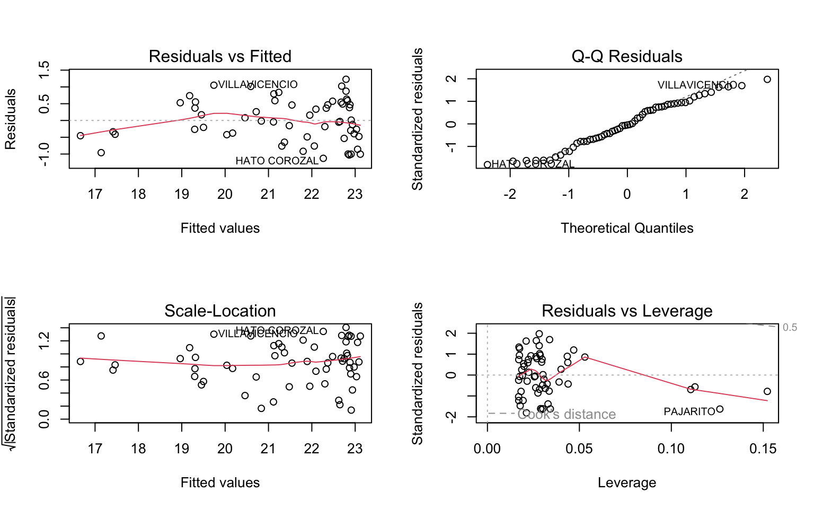

``` r
par(mfrow=c(1,1))
```

1.  Del gráfico de Residuales vs valores ajustados, esperamos patrones aleatorios, esto es sinónimo de homocedasticidad o varianza constante en los errores.

2.  Del gráfico Q-Q plot esperamos un comportamiento uno a uno sobre la recta, este gráfico compara percentiles teóricos de una distribución normal, con los obtenidos en los errores por el modelo, si logramos obtener que todos los puntos están sobre la recta, podemos asumir que cumplimos el supuesto de normalidad del error.

3.  Del gráfico Scale-Location obtenemos una conclusión similar al primero, que no haya tendencia en el gráfico (una línea horizontal sin pendiente) y que los puntos alrededor de esta línea no presenten patrón alguno.

4.  Del último gráfico podemos hacer un análisis de influencias, puntos que se encuentren en la parte derecha de este gráfico, son probablemente datos que podrían estar afectando la calidad del modelo, y debería contemplarse la posibilidad de excluir estos puntos del modelo. Esto se logra, comparando los modelos con y sin estos posibles datos influyentes.

5.  Finalmente para evaluar la autocorrelación de los errores de forma gráfica, el gráfico de errores vs ajustados de la observaciones debe mantener el mismo componente aleatorio que hemos visto en los supuestos anteriores.

</div>

<div id="uso" class="section level2">

## Uso

Finalmente, cuando el modelo ha sido probado y ha cumplido con todos los supuestos, solo en ese momento podemos hacer uso del mismo.

Suponga que se tiene una predicción de la presión para alguno de los municipios para el día siguiente con un valor de 1013.5; cuál sería el valor esperado de Punto de Rocío dado este valor de presión.

``` r
predict(reg, newdata = data.frame(Presion = 1013.5))
```

    ##        1 
    ## 19.87916

Por lo tanto el punto de rocío dado ese valor en la presión para algún municipio de la región Orinoquia en particular es de 19.8

</div>

</div>

<div id="regresión-lineal-múltiple" class="section level1">

# Regresión Lineal Múltiple

La regresión lineal múltiple, es la generalización de la regresión lineal simple, en este caso trabajaremos con más una variable indendiente, por lo cuál nuestro modelo quedara establecido como:

<span class="math display">\\y_i = \beta_0 + \beta_1 x\_{i1} + \beta_2 x\_{i2} + \cdots + \beta_p x\_{ip} + \epsilon_i\\</span>

O escrito de forma matricial:

<span class="math display">\\\vec{y} = X\vec{\beta}+\vec{\epsilon}\\</span>

La verificación de supuestos y la estimación del modelo es análoga al modelo simple.

En este caso el estimador de mínimos cuadrados para <span class="math inline">\\\vec{\beta}\\</span> queda determinado por:

<span class="math display">\\\hat{\vec{\beta}} = (X^tX)^{-1}X^t\vec{y}\\</span>

Siempre y cuando exista la matriz inversa <span class="math inline">\\(X^tX)^{-1}\\</span>. Esta matriz existe si los regresores son *linealmente independientes*, esto significa, que ninguna columna de la matriz <span class="math inline">\\X\\</span> es combinación lineal de las demás columnas. Lo cuál introduce un nuevo supuesto a nuestro modelo de regresión:

5.  *Multicolinealidad:* La multicolinealidad implica una dependencia casi lineal entre los regresores, los cuales son las columnas de la matriz <span class="math inline">\\X\\</span>, por lo que es claro que una dependencia lineal exacta causaría una matriz <span class="math inline">\\X^tX\\</span> singular. La presencia de dependencias casi lineales puede influir en forma dramática sobre la capacidad de estimar coeficientes de regresión.

<div id="ejercicio-2" class="section level2">

## Ejercicio 2

Ejecute una regresión lineal múltiple buscando explicar el punto de rocío en función de la presión y la temperatura.

``` r
options(ggrepel.max.overlaps = Inf)

data5 <- data3 %>% 
  dplyr::select(c("Presion", "Punto_de_Rocio", "Temperatura"))
```

``` r
mod <- lm(Punto_de_Rocio ~ Presion + Temperatura, data=data5)
summary(mod)
```

    ## 
    ## Call:
    ## lm(formula = Punto_de_Rocio ~ Presion + Temperatura, data = data5)
    ## 
    ## Residuals:
    ##      Min       1Q   Median       3Q      Max 
    ## -1.20677 -0.41941 -0.03965  0.30865  1.28171 
    ## 
    ## Coefficients:
    ##             Estimate Std. Error t value Pr(>|t|)   
    ## (Intercept) 689.6638   200.9254   3.432  0.00113 **
    ## Presion      -0.6703     0.1955  -3.429  0.00114 **
    ## Temperatura   0.4145     0.1265   3.278  0.00180 **
    ## ---
    ## Signif. codes:  0 '***' 0.001 '**' 0.01 '*' 0.05 '.' 0.1 ' ' 1
    ## 
    ## Residual standard error: 0.5829 on 56 degrees of freedom
    ## Multiple R-squared:  0.8998, Adjusted R-squared:  0.8963 
    ## F-statistic: 251.5 on 2 and 56 DF,  p-value: < 2.2e-16

Como se puede observar, la mejora en el ajuste del modelo al agregar una nueva variable es bastante claro, mejoramos tanto el <span class="math inline">\\R^2\\</span> como el <span class="math inline">\\R^2\_{adj}\\</span>; con lo cuál podemos pensar que el modelo logró ajustrarse mejor a la nuestra variable respuesta.

Para entender un poco mejor como funciona en un espacio de 3 dimensiones este nuevo modelo de regresión lineal, graficaremos a continuación las estimaciones como un plano proyectado en este nuevo espacio:

``` r
mesh_size <- .5
margin    <- 0

x_min <- min(data5$Presion) - margin
x_max <- max(data5$Presion) - margin
y_min <- min(data5$Temperatura) - margin
y_max <- max(data5$Temperatura) - margin
xrange <- seq(x_min, x_max, mesh_size)
yrange <- seq(y_min, y_max, mesh_size)
xy <- meshgrid(x = xrange, y = yrange)
xx <- xy$X
yy <- xy$Y
dim_val <- dim(xx)
xx1 <- matrix(xx, length(xx), 1)
yy1 <- matrix(yy, length(yy), 1)
final <- data.frame(cbind(xx1, yy1))
colnames(final)<- c("Presion", "Temperatura")

pred <- mod %>%
  predict(final)

pred <- matrix(pred, dim_val[1], dim_val[2])

plot_ly(data5, x = ~Presion, y = ~Temperatura, z = ~Punto_de_Rocio ) %>% 
  add_markers(size = 5) %>% 
  add_surface(x=xrange, y=yrange, z=pred, alpha = 0.65, type = 'mesh3d', name = 'pred_surface')
```

<div id="htmlwidget-a4ce77b2409dc64b87c0" class="plotly html-widget html-fill-item" style="width:768px;height:480px;">

</div>

</div>

<div id="ejercicio-3" class="section level2">

## Ejercicio 3

Verifique los nuevos supuestos de este modelo de regresión con nuevas variables explicativas.

``` r
par(mfrow=c(2,2))
plot(mod)
```

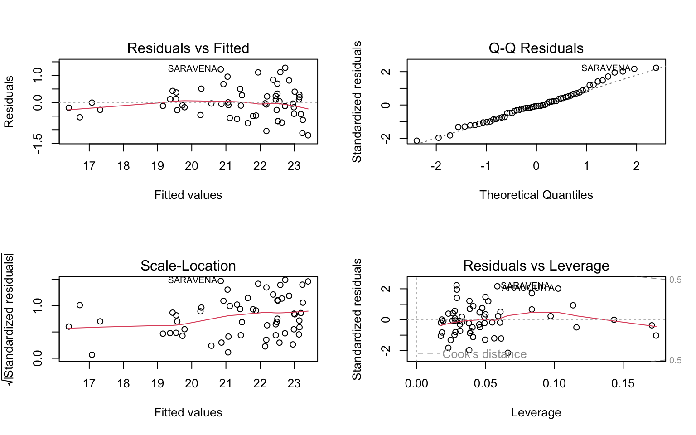

``` r
par(mfrow=c(1,1))
```

</div>

<div id="evaluación-de-multicolinealidad" class="section level2">

## Evaluación de multicolinealidad

Finalmente para evaluar la multicolinealidad en el modelo podemos acudir a dos metodologías que podrían dar indicios de estos problemas:

1.  Matriz de Correlación: Encontrar correlaciones lineales con valores cercanos a un valor de 1 (o -1) puede dar indicios de problemas de multicolinealidad en nuestro modelo:

``` r
cor(data5 %>% dplyr::select(-Punto_de_Rocio))
```

    ##                Presion Temperatura
    ## Presion      1.0000000  -0.9552992
    ## Temperatura -0.9552992   1.0000000

2.  Factores de inflación de varianza: Esta metodología permite detectar multicolinealidad en nuestro modelo determinando si las varianzas de los coeficientes de regresión están *infladas* por problemas de multicolinealidad. Los detalles técnicos de esta metodología se pueden consultar en Montgomery, D., Peck, E. A., & Vining, G. G. (2006).

``` r
vif(mod)
```

    ##     Presion Temperatura 
    ##    11.44119    11.44119

Existe una regla empírica que establece que valores superiores a 10 en este indicador, demuestran problemas de multicolinealidad. El paso a seguir, debería ser extraer dichas variables o correr un modelo de regresión tipo Ridge o Lasso que puedan resolver de otra forma este conflicto entre variables explicativas.

</div>

</div>

<div id="bibliografía" class="section level1">

# Bibliografía

1.  Holmes, T. H. (2004). Ten categories of statistical errors: a guide for research in endocrinology and metabolism. American Journal of Physiology-Endocrinology and Metabolism, 286(4), E495-E501. Disponible en <https://journals.physiology.org/doi/full/10.1152/ajpendo.00484.2003>

2.  Montgomery, D., Peck, E. A., & Vining, G. G. (2006). Introducción al análisis de regresión lineal. México: Limusa Wiley.

</div>

</div>
