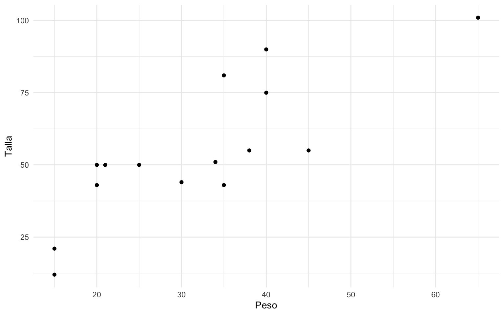
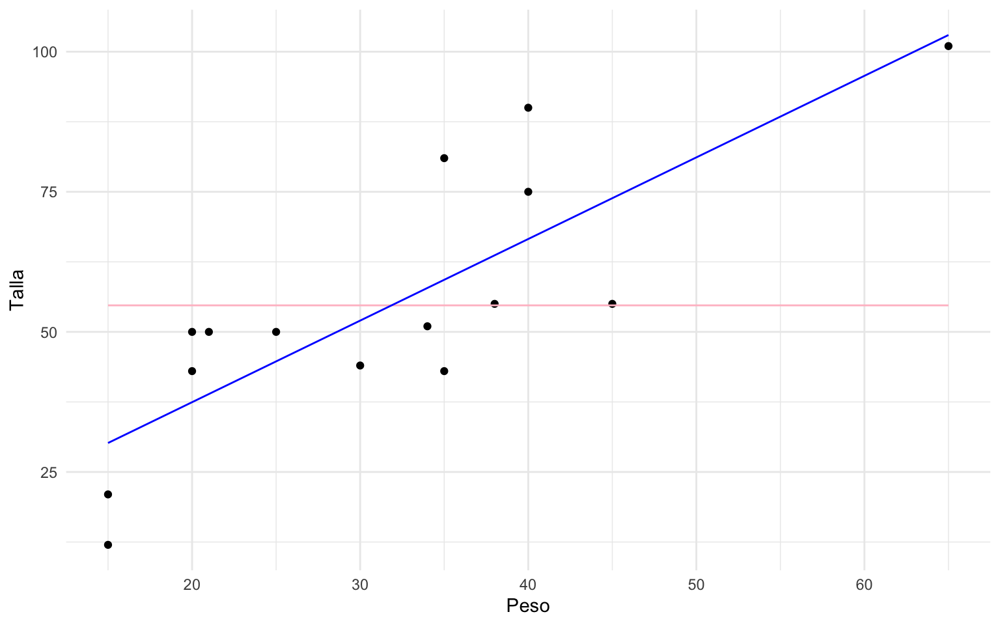
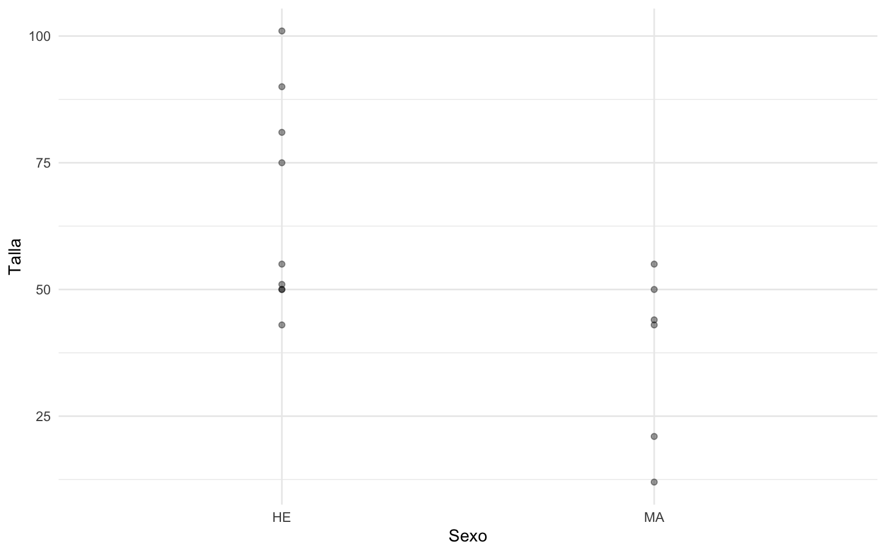
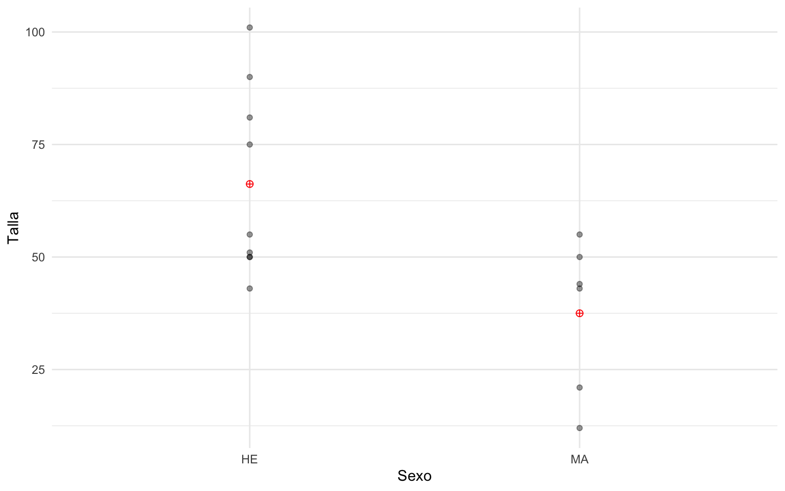

# Dependencias

Para la ejecución de este cuaderno, debe instalar con anterioridad los siguientes paquetes desde la consola de R o usando el menú Tools\>Install Packages en RStudio:

- `install.packages("tidyverse")`.
- `install.packages("rmdformats")`.

# Objetivo y alcance

**Objetivo**: En este notebook se pretende dar una introducción al análisis de varianza, pasando por la motivación, desarrollo de modelos y generación de resultados a partir de su análisis.

**Alcance**: siga el desarrollo del cuaderno, ejecute los comandos contenidos y desarrolle los ejercicios propuestos.

# Introducción

Incialmente se invocarán las librerías necesarias

```{r}
library("tidyverse")
```

Vamos a aprender respecto al análisis de varianza, una técnica estadística que se fundamenta fuertemente en el análisis de regresión. Repasaremos rápidamente los conceptos del análisis de regresión mediante un conjunto de datos genérico y añadiremos algunas definiciones importantes en el camino para el análisis de varianza: un total de 15 criaturas han sido medidas en peso y talla, obteniendo los siguientes resultados:

```{r}
# Variable respuesta y (talla)
y_tall = c(21,50,43,81,75,50,44,55,43,12,50,55,51,90,101)
# Covariable x1 (peso)
x_peso = c(15,25,20,35,40,20,30,45,35,15,21,38,34,40,65)
# Datos unificados
df     = tibble(y_tall,x_peso)
n      = nrow(df)
# Gráfico de datos
gg1 = df %>% ggplot(aes(x=x_peso,y=y_tall)) + 
             geom_point() + theme_minimal() +
             labs(y='Talla',x='Peso')
gg1
```



Dos modelos fundamentales fueron detallados en la clase pasada:

```{r}
# Modelo simple O REDUCIDO (sin covariable)
msimple     = mean(y_tall)
y_hat1      = rep(msimple,n)
df$y_hat1   = y_hat1
# Variación/Error total en los datos
msimple_SCT = sum((df$y_tall - df$y_hat1)**2)

# Modelo lineal
mlineal     = lm(y_tall ~ x_peso,data=df)
y_hat2      = mlineal$fitted.values
df$y_hat2   = y_hat2
# Variación/Error resultante al ajustar mlineal
mlineal_SCE = sum((df$y_tall - df$y_hat2)**2)

# Reducción en la variación total al ajustar mlineal
mlineal_SCM = msimple_SCT-mlineal_SCE

# Gráfico de modelos
gg2 = gg1 + geom_line(aes(x=x_peso,y=y_hat1),colour = "pink") +
            geom_line(aes(x=x_peso,y=y_hat2),colour = "blue")
gg2
```



Dos cosas debemos destacar del modelo ajustado:

- Evidentemente la variable peso influencia la talla de las criaturas (por cada incremento unitario de peso se espera cerca de un aumento en 1.5 unidades de talla).

- La variación o error total en los datos (llamado suma de cuadrados total, o <span class="math inline">\\SCT\\</span>) corresponde a la variación total al asumir el modelo reducido. Al considerar la covariable mediante el modelo lineal disminuímos este error, la nueva variación la llamamos la suma de cuadrados del error, o <span class="math inline">\\SCE\\</span>. La diferencia entre <span class="math inline">\\SCT\\</span> y <span class="math inline">\\SCE\\</span> corresponde a la variabilidad explicada por el modelo (llamada suma de cuadrados del modelo, o <span class="math inline">\\SCM\\</span>).

# Grados de libertad y estadístico F

Dos medidas resumen fundamentales fueron calculadas anteriormente: <span class="math inline">\\R^2\\</span> (utilidad de la(s) covariable(s) en la predicción de la variable respuesta) y <span class="math inline">\\F\\</span> (significancia de la(s) covariable(s) en el modelo, respondiendo a la pregunta ¿es la relación observada debida a un mecanismo aleatorio?). Ambas medidas pueden ser calculadas manualmente o mediante el modelo ajustado:

```{r}
# Cálculo de R2
r2_calc     = (msimple_SCT-mlineal_SCE)/msimple_SCT
r2_calc
```

```{r}
summary(mlineal)$r.squared
```

En la clase pasada se mencionaron brevemente los denominados *grados de libertad* para el cálculo del estadístico <span class="math inline">\\F\\</span>. En su momento la explicación fue omitida, pues el objetivo principal fue mostrar que tanto <span class="math inline">\\R^2\\</span> como <span class="math inline">\\F\\</span> miden “la misma cosa”: la bondad del modelo ajustado.

```{r}
# Cálculo de F 
F_calc     = ((msimple_SCT-mlineal_SCE)/(2-1))/(mlineal_SCE/(n-2))
F_calc 
```

```{r}
anova(mlineal)$"F value"[1]
```

Puede parecer redundante el estadístico <span class="math inline">\\F\\</span> y el <span class="math inline">\\R^2\\</span>, pues miden algo similar. La diferencia primordial se encuentra en los números que dividen cada suma de cuadrados. Estos números son llamados los **grados de libertad** de cada suma de cuadrados. Detallando respecto a los grados de libertad. Piense como ejemplo que cuenta con 3 números desconocidos, pero conoce que su promedio es igual a un número determinado, por ejemplo cero. ¿cuáles son esos posibles números?. Algunas opciones a continuación:

- -1,0,1.
- -5,1,4.
- 10,-8,-2.
- …

Tiene bastante libertad en la selección de los tres números en este caso. Ahora, suponga que conoce uno de los números, y este es igual a 2. Sabiendo que el promedio es igual a cero ¿cuáles pueden ser los números restantes?

- **-2**,6,-4
- **-2**,-8,10
- **-2**,4,-2
- …

Al conocer que uno de los números es igual a -2, perdió libertad en la elección de los demás números, y dado un número, el otro está dado de antemano. Sin embargo, todavía tiene múltiples opciones!. Si supone finalmente que conoce dos de los números: -2 y -5, y sabiendo que el promedio de los tres números es igual a cero ¿cuál puede ser el número restantes?

- **-2**,**-5**,7

Tiene que ser igual a 7, de otra forma, el promedio no puede ser igual a cero. Es decir que al encontrar el promedio con tres números usted cuenta con un total de dos (=3-1) grados de libertad, el tercero es perdido al estimar el parámetro. En nuestro contexto:

- Podemos pensar cada uno de los totales descritos (<span class="math inline">\\SCT\\</span>,<span class="math inline">\\SCE\\</span>,<span class="math inline">\\SCM\\</span>) como una suma, o un promedio, a ser estimado.

- Para la <span class="math inline">\\SCT\\</span> estamos en el mismo caso ejemplificado anteriormente, pero ahora con <span class="math inline">\\n\\</span> números. Tenemos entonces que <span class="math inline">\\SCT\\</span> tiene <span class="math inline">\\n-1\\</span> grados de libertad. En nuestro ejemplo, <span class="math inline">\\15-1=14\\</span> gl para <span class="math inline">\\SCT\\</span>.

- En la <span class="math inline">\\SCE\\</span> necesitamos un total de <span class="math inline">\\p=2\\</span> parámetros (pendiente e intercepto) a ser estimados en el cálculo de los errores del modelo. Por lo cual tenemos <span class="math inline">\\n-p=n-2\\</span> grados de libertad. En nuestro ejemplo, <span class="math inline">\\15-2=13\\</span> gl para <span class="math inline">\\SCE\\</span>.

- Como vimos, <span class="math inline">\\SCM = SCT - SCE\\</span>, se tiene de la misma forma <span class="math inline">\\gl(SCM) = gl(SCT) - gl(SCE) = (n-1) - (n-p) = p-1\\</span>, en nuestro caso, <span class="math inline">\\p-1 = 2-1 = 1\\</span>.

Finalmente, el estadístico <span class="math inline">\\F\\</span> se calcula como

<span class="math display">\\ F = \frac{SCM/gl(SCM)}{SCE/gl(SCE)} \\</span>

El estadístico <span class="math inline">\\F\\</span> resulta en una razón que mide la mejora **relativa** del modelo respecto al modelo reducido. Todos los atributos del estadístico son calculados fácilmente desde R dado un modelo ajustado:

```{r}
anova(mlineal)
```

Esta tabla corresponde al análisis de varianza, y determina la significancia (importancia) de todas las variables en el modelo ajustado. En contraste al <span class="math inline">\\R^2\\</span>, esta es una prueba estadística que permite determinar en este ejercicio que la (única) variable del modelo es significativa. El análisis de varianza no es más que una tabla que resume la variabilidad de los datos, particionando el error o variabilidad total (<span class="math inline">\\SCT\\</span>) en la variabilidad remanente en el modelo (<span class="math inline">\\SCE\\</span>) y la variabilidad explicada por el modelo (<span class="math inline">\\SCM\\</span>), que junto al estadístico <span class="math inline">\\F\\</span>, determinan si la variabilidad explicada por el modelo de regresión es significativamente mejor a la de un modelo reducido (en el que las dos, o más, variables no se encuentran relacionadas).

# Motivación

Asumimos que nuestras dos variables se relacionan a través de una línea recta, al ser ambas variables del tipo cuantitativo. Sin embargo, ¿qué sucede si en lugar de ello tuviera una característica cualitativa para explicar la variable de interés?. El análisis de varianza tradicionalmente se enmarca en este problema de regresión bivariado cualitativo/cuantitativo. Sin embargo, como vimos anteriormente, este se presenta en un contexto mucho más general.

# Continuación del ejemplo. Criaturas extrañas

Supongamos que se cuenta, en lugar del peso, el sexo de la criatura, siendo ‘MA’ macho y ‘HE’ hembra. Esto bajo el mismo objetivo: encontrar la relación esperada entre la covariable sexo y la variable respuesta talla:

```{r}
df$Sexo = c('MA','HE','HE','HE','HE','HE','MA','MA','MA','MA','MA','HE','HE','HE','HE')
df2 = df %>% select(y_tall,Sexo)

gg3 = df2 %>% ggplot(aes(x=Sexo,y=y_tall)) + 
              geom_point(alpha=0.4) + 
              theme_minimal() + labs(y='Talla')
gg3
```



## Analogía con regresión lineal simple

Se evidencia una diferencia entre los dos sexos: si conocemos que una criatura es hembra, esperamos que su talla sea mayor, si conocemos que es macho, su talla será probablemente menor. En el caso de regresión lineal simple, la relación funcional era resumida mediante una línea recta como <span class="math inline">\\y_i = \beta_0 + \beta_1x_i+\epsilon_i\\</span> para cada sujeto, y mediante mínimos cuadrados, logramos estimar los parámetros, con estos procedimos a determinar la significancia del modelo. ¿Cómo se resume matemáticamente la relación encontrada para la variable sexo?, esto nos permitiría usar las herramientas anteriores para cuantificar la significancia de la relación observada. Vamos a ajustar un modelo reducido (sin covariable), para cada uno de los sexos:

```{r}
df_ma = df2 %>% filter(Sexo=='MA')
df_he = df2 %>% filter(Sexo=='HE')
msimple_ma = mean(df_ma$y_tall)
msimple_he = mean(df_he$y_tall)

msimple_s  = tibble(Sexo=c('MA','HE'),Talla=c(msimple_ma,msimple_he)) 

gg3 + geom_point(data=msimple_s,aes(x=Sexo,y=Talla),
                 col='red',size=2,shape=10)
```



En rojo se destaca la línea de regresión para cada sexo, que en este caso, es igual a un punto en la escala de talla. Anteriormente, en el caso de la regresión lineal simple, se encontraron dos parámetros (intercepto y pendiente) para estimar relación entre las variables mediante una línea recta: dado un punto de peso <span class="math inline">\\x\\</span>, tenemos la talla esperada de <span class="math inline">\\\hat{\beta_0} + \hat{\beta_1}x\\</span>. En este caso, los promedios obtenidos son iguales a:

```{r}
msimple_s
```

Por lo cual, si <span class="math inline">\\x\\</span>=‘Macho’, espero que <span class="math inline">\\y\\</span>=37.5, mientras que si <span class="math inline">\\x\\</span>=‘Hembra’, se espera que <span class="math inline">\\y\\</span>=66.22. Formalmente, mediante el uso de variables auxiliares que se “activan” para el sexo correspondiente, se tiene para un macho arbitrario el valor esperado de la talla bajo el modelo reducido correspondiente como:

<span class="math display">\\ y_i = 1 \times 37.5 + 0 \times 66.22 + \epsilon_i \\</span>

Y para una hembra arbitraria:

<span class="math display">\\ y_i = 0 \times 37.5 + 1 \times 66.22 + \epsilon_i \\</span> Organizamos por facilidad en la interpretación el conjunto de datos por sexo y talla. Note que esto no representa ningún cambio en la explicación presentada:

```{r}
df2 = df2 %>% arrange(desc(Sexo),y_tall)
df2
```

Tenemos un total de 9 hembras y 6 machos en el conjunto de datos. Para cada uno de los machos, obtenemos lo siguiente:

<span class="math display">\\ 12 = y_1 = 1 \times 37.5 + 0 \times 66.22 + \epsilon_1 \\</span> Hasta

<span class="math display">\\ 55 = y_6 = 1 \times 37.5 + 0 \times 66.22 + \epsilon_6 \\</span> Y para las 9 hembras:

<span class="math display">\\ 43 = y_7 = 0 \times 37.5 + 1 \times 66.22 + \epsilon_7 \\</span>

Hasta

<span class="math display">\\ 101 = y\_{15} = 0 \times 37.5 + 1 \times 66.22 + \epsilon\_{15} \\</span>

Así podemos reconfigurar el conjunto de datos con dos columnas numéricas **indicadoras** que muestren el sexo de cada criatura:

```{r}
df2$MA_ID = ifelse(df2$Sexo=='MA',1,0)
df2$HE_ID = ifelse(df2$Sexo=='HE',1,0)
df2 %>% select(Sexo,MA_ID,HE_ID)
```

**La representación matricial para las columnas MA_ID y HE_ID es denominada matriz diseño. Es importante notar que esta categorización de las variables no usualmente usada en los paquetes estadísticos, sin embargo, es útil para visualizar cómo transformamos una variable categórica en una matriz de datos que puede ser usada en posteriores procedimientos estadísticos.**

## Ajuste del modelo con variable categórica

Calculemos cuánto reduce la variabilidad de talla el conocer el sexo del sujeto (note que la variabilidad total de la variable respuesta sigue siendo `msimple_SCT`):

```{r}
m_sexo_SCE1    = sum((df_ma$y_tall - msimple_ma)**2)
m_sexo_SCE2    = sum((df_he$y_tall - msimple_he)**2)

r2_calc_sexo = (msimple_SCT - (m_sexo_SCE1+m_sexo_SCE2)) / (msimple_SCT)
r2_calc_sexo
```

```{r}
mcategorico  = lm(y_tall~ Sexo,df2)
summary(mcategorico)$r.squared
```

Veamos ahora las características del modelo ajustado, enfocado en la estimación de los parámetros

```{r}
summary(mcategorico)$coefficients
```

La matriz diseño realmente usada para el modelo esta configurada por un vector de unos y una variable indicadora del sexo de las criaturas, a esto se le llama **modelo de efectos de tratamiento**: al introducir la variable Sexo en `lm()`, esta representa el intercepto como el promedio de la categoría hembra (categoría de referencia, o categoría tratamiento), mientras que la pendiente es igual a la diferencia entre los promedios de la categoría de referencia y la categoría restante (igual a <span class="math inline">\\-28.722\\</span> en este caso, y es llamado el **efecto del tratamiento**). El modelo ajustado es el siguiente

<span class="math display">\\ y_i = \hat{\beta}\_0 + \hat{\beta}\_1 I(x_i)+\epsilon_i = 66.22 -28.722 \times I(x_i)+\epsilon_i \\</span>

Dónde <span class="math inline">\\I(x_i)\\</span> es la variable indicadora para el sexo ‘macho’ de las criaturas, igual a:

<span class="math display">\\ I(x_i)= \begin{cases} 1 \text{, si } x_i = Macho\\ 0 \text{, si } x_i = Hembra \end{cases}\\</span>

Esta es la diferencia más importante respecto al anova visto para regresión lineal con covariable continua. Es necesario reconfigurar la variable de entrada para poder ejecutar el análisis, afortunadamente R lo hace por nosotros. Note además que la estimación de los parámetros sigue siendo dada mediante mínimos cuadrados, que en este caso, no es tan sencillo de visualizar como en la regresión anterior. Sin embargo, los estimadores por mínimos cuadrados en cada sexo son las medias de la variable talla.

Finalmente, observe que los valores ajustados bajo el modelo en efecto corresponden a las medias de cada uno de los grupos:

```{r}
y_hat3          = mcategorico$fitted.values
df2$y_hat3      = y_hat3
df2
```

## Resumen de la variabilidad observada en los datos

Como podemos observar, las características del modelo lineal simple ahora han sido extendidas al escenario en el que la covariable de interés es categórica, por lo cual, podemos calcular el estadístico <span class="math inline">\\F\\</span> para el modelo ajustado:

```{r}
# Valores ajustados bajo el modelo
mcategorico_SCE = sum((df2$y_tall - df2$y_hat3)**2)
mcategorico_SCM = msimple_SCT-mcategorico_SCE

# Cálculo de F 
F_calc          = (mcategorico_SCM/(2-1))/(mcategorico_SCE/(n-2))
F_calc 
```

```{r}
anova(mcategorico)
```

Note finalmente que el número de clases, en este caso dos, puede ser extendida sin mayor inconveniente.

# Ejemplo temperatura

Para nuestro conjunto de datos ORI, el cual contiene información de variables meteorológicas medidas en diferentes puntos de la región Orinoquía de Colombia, quisiéramos determinar si la velocidad del viento es significativamente diferente para diferentes pronósticos del clima. Ya sabemos que podemos utilizar un modelo de regresión con variable discreta, y mediante ANOVA (análisis de varianza), determinar si añadir el pronóstico representa una mejora significativa respecto a un modelo reducido (sin covariables), para explicar la temperatura. Los datos:

```{r}
data       = read.csv('ORI.csv', sep=";")
```

Recordemos que esta base de datos contiene información de variables meteorológicas medidas en diferentes puntos de la región Orinoquía de Colombia. Cada observación en la base, corresponde a la medición en algún punto del día en algún municipio de la región para las variables:

- Temperatura
- Velocidad del viento
- Dirección del viento
- Presión
- Punto de Rocio
- Cobertura total nubosa
- Humedad

Utilizaremos únicamente las variables de pronóstico y velocidad. De manera semejante a la sesión anterior, vamos a transformar nuestros datos:

```{r}
var<-c("Municipio","Velocidad_del_Viento","Pronostico")
Mode <- function(x) {
  ux <- unique(x)
  ux[which.max(tabulate(match(x, ux)))]
}

data2 <- data %>% 
         dplyr::select(all_of(var)) %>% 
         group_by(Municipio) %>% 
         summarise(VelocidadViento = median(Velocidad_del_Viento),
                   PronosticoFrecuente = Mode(Pronostico)) %>% 
         ungroup()  %>% 
         remove_rownames %>% 
         drop_na(any_of("Municipio")) %>% 
         column_to_rownames(var="Municipio")
dt2    <- data2 %>% filter(PronosticoFrecuente%in%c('Nublado','Parcialmente Nublado'))
```

## Ejercicio 1

Realice un gráfico de dispersión para la variable ‘VelocidadViento’, para cada grupo de pronóstico frecuente y añada el valor promedio de la variable (recuerde los gráficos vistos hoy en clase) ¿parece haber diferencia en la velocidad del viento para los pronósticos observados del clima?:

## Ejercicio 2

Ajuste un modelo de regresión lineal simple para explicar la velocidad del viento usando la variable de pronóstico frecuente. ¿A qué es igual el R2 del modelo ajustado? ¿Cómo interpreta la pendiente y el intercepto del modelo?

## Ejercicio 3

Determine mediante una prueba estadística apropiada si los pronósticos modales del conjunto de datos representan una mejora significativa al explicar la velocidad del viento, esto bajo un modelo de regresión lineal simple.

# Ejemplo complementario

El análisis de varianza compete mucho más que la estimación de un modelo lineal y la significancia de sus parámetros. Este modelo tiene supuestos subyacentes así como el modelo de regresión lineal, además permite comparaciones múltiples entre los llamados ‘tratamientos’ en esta lección. Se invita al estudiante a revisar recursos adicionales, entre ellos la detallada descripción de [stats and R](https://statsandr.com/blog/anova-in-r/) en el ANOVA.

# Bibliografía

1.  Kuehl, R. O. (2000.) Design of Experiments: Statistical Principles of Research Design and Analysis., Duxbury Press, 423-468.

2.  Montgomery, D., Peck, E. A., & Vining, G. G. (2006). Introducción al análisis de regresión lineal. México: Limusa Wiley.

